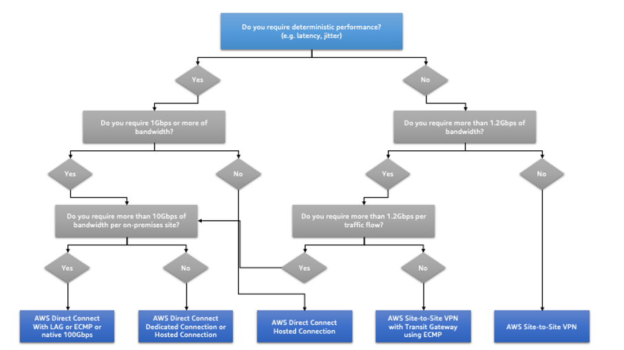

# PERF04-BP03 Choose appropriate dedicated connectivity or VPN

for your workload

When hybrid connectivity is required to connect on-premises and
cloud resources, provision adequate bandwidth to meet your
performance requirements. Estimate the bandwidth and latency
requirements for your hybrid workload. These numbers will drive your
sizing requirements.

**Common anti-patterns:**

- You only evaluate VPN solutions for your network encryption
  requirements.
- You do not evaluate backup or redundant connectivity options.
- You do not identify all workload requirements (encryption,
  protocol, bandwidth, and traffic needs).

**Benefits of establishing this best
practice:** Selecting and configuring appropriate
connectivity solutions will increase the reliability of your
workload and maximize performance. By identifying workload
requirements, planning ahead, and evaluating hybrid solutions, you
can minimize expensive physical network changes and operational
overhead while increasing your time-to-value.

**Level of risk exposed if this best practice
is not established:** High

## Implementation guidance

Develop a hybrid networking architecture based on your bandwidth
requirements. [AWS Direct Connect](https://aws.amazon.com/directconnect/ "https://aws.amazon.com/directconnect/") allows you to connect your
on-premises network privately with AWS. It is suitable when you
need high-bandwidth and low-latency while achieving consistent
performance. A VPN connection establishes secure connection over
the internet. It is used when only a temporary connection is
required, when cost is a factor, or as a contingency while waiting
for resilient physical network connectivity to be established when using AWS Direct Connect.

If your bandwidth requirements are high, you might consider
multiple AWS Direct Connect or VPN services. Traffic can be load
balanced across services, although we don't recommend load
balancing between AWS Direct Connect and VPN because of the latency
and bandwidth differences.

### Implementation steps

- Estimate the bandwidth and latency requirements of your
  existing applications.
  - For existing workloads that are moving to AWS, leverage the
    data from your internal network monitoring systems.
  - For new or existing workloads for which you don’t have
    monitoring data, consult with the product owners to
    determine adequate performance metrics and provide a good
    user experience.

- Select dedicated connection or VPN as your connectivity
  option. Based on all workload requirements (encryption,
  bandwidth, and traffic needs), you can either choose AWS Direct Connect or [AWS VPN](https://aws.amazon.com/vpn/ "https://aws.amazon.com/vpn/") (or both). The
  following diagram can help you choose the appropriate
  connection type.
  - [AWS Direct Connect](https://aws.amazon.com/directconnect/ "https://aws.amazon.com/directconnect/") provides dedicated connectivity to the
    AWS environment, from 50 Mbps up to 100 Gbps, using either
    dedicated connections or hosted connections. This gives you
    managed and controlled latency and provisioned bandwidth so
    your workload can connect efficiently to other environments.
    Using AWS Direct Connect partners, you can have end-to-end
    connectivity from multiple environments, providing an
    extended network with consistent performance. AWS offers
    scaling direct connect connection bandwidth using either
    native 100 Gbps, link aggregation group (LAG), or BGP
    equal-cost multipath (ECMP).
  - The AWS [Site-to-Site VPN](https://aws.amazon.com/vpn/ "https://aws.amazon.com/vpn/") provides a managed VPN service supporting internet protocol security (IPsec). When a VPN connection is created, each VPN connection includes two tunnels for high availability.

- Follow AWS documentation to choose an appropriate
  connectivity option:
  - If you decide to use AWS Direct Connect, select the
    appropriate bandwidth for your connectivity.
  - If you are using an AWS Site-to-Site VPN across multiple
    locations to connect to an AWS Region, use
    an [accelerated
    Site-to-Site VPN connection](../../../vpn/latest/s2svpn/accelerated-vpn.md "../../../vpn/latest/s2svpn/accelerated-vpn.md") for the opportunity
    to improve network performance.
  - If your network design consists of IPSec VPN connection
    over [AWS Direct Connect](https://aws.amazon.com/directconnect/ "https://aws.amazon.com/directconnect/"), consider using Private IP VPN to
    improve security and achieve
    segmentation. [AWS Site-to-Site Private IP VPN](https://aws.amazon.com/blogs/networking-and-content-delivery/introducing-aws-site-to-site-vpn-private-ip-vpns/ "https://aws.amazon.com/blogs/networking-and-content-delivery/introducing-aws-site-to-site-vpn-private-ip-vpns/") is deployed on top of
    transit virtual interface (VIF).
  - [AWS Direct Connect SiteLink](https://aws.amazon.com/blogs/aws/new-site-to-site-connectivity-with-aws-direct-connect-sitelink/ "https://aws.amazon.com/blogs/aws/new-site-to-site-connectivity-with-aws-direct-connect-sitelink/") allows creating
    low-latency and redundant connections between your data
    centers worldwide by sending data over the fastest path
    between [AWS Direct Connect locations](https://aws.amazon.com/directconnect/locations/ "https://aws.amazon.com/directconnect/locations/"), bypassing AWS Regions.

- Validate your connectivity setup before deploying to
  production. Perform security and performance testing to
  assure it meets your bandwidth, reliability, latency, and
  compliance requirements.
- Regularly monitor your connectivity performance and usage
  and optimize if required.

_Deterministic performance flowchart_

## Resources

**Related documents:**

- [Networking Products with AWS](https://aws.amazon.com/products/networking/ "https://aws.amazon.com/products/networking/")
- [AWS Transit Gateway](../../../vpc/latest/tgw/what-is-transit-gateway.md "../../../vpc/latest/tgw/what-is-transit-gateway.md")
- [VPC Endpoints](../../../vpc/latest/privatelink/concepts.md "../../../vpc/latest/privatelink/concepts.md")
- [Building
  a Scalable and Secure Multi-VPC AWS Network
  Infrastructure](../../../whitepapers/latest/building-scalable-secure-multi-vpc-network-infrastructure/welcome.md "../../../whitepapers/latest/building-scalable-secure-multi-vpc-network-infrastructure/welcome.md")
- [Client
  VPN](../../../vpn/latest/clientvpn-admin/what-is.md "../../../vpn/latest/clientvpn-admin/what-is.md")

**Related videos:**

- [AWS re:Invent 2023 – Building hybrid network connectivity with AWS](https://www.youtube.com/watch?v=Fi4me2vPwrQ "https://www.youtube.com/watch?v=Fi4me2vPwrQ")
- [AWS re:Invent 2023 – Secure remote connectivity to AWS](https://www.youtube.com/watch?v=yHEhrkGdnj0 "https://www.youtube.com/watch?v=yHEhrkGdnj0")
- [AWS re:Invent 2022 – Optimizing performance with Amazon CloudFront](https://www.youtube.com/watch?v=LkyifXYEtrg "https://www.youtube.com/watch?v=LkyifXYEtrg")
- [AWS re:Invent 2019 – Connectivity to AWS and hybrid AWS network architectures](https://www.youtube.com/watch?v=eqW6CPb58gs "https://www.youtube.com/watch?v=eqW6CPb58gs")
- [AWS re:Invent 2020 – AWS Transit Gateway Connect](https://www.youtube.com/watch?v=_MPY_LHSKtM&t=491s "https://www.youtube.com/watch?v=_MPY_LHSKtM&t=491s")

**Related examples:**

- [AWS Transit Gateway and Scalable Security Solutions](https://github.com/aws-samples/aws-transit-gateway-and-scalable-security-solutions "https://github.com/aws-samples/aws-transit-gateway-and-scalable-security-solutions")
- [AWS Networking Workshops](https://networking.workshop.aws/ "https://networking.workshop.aws/")
