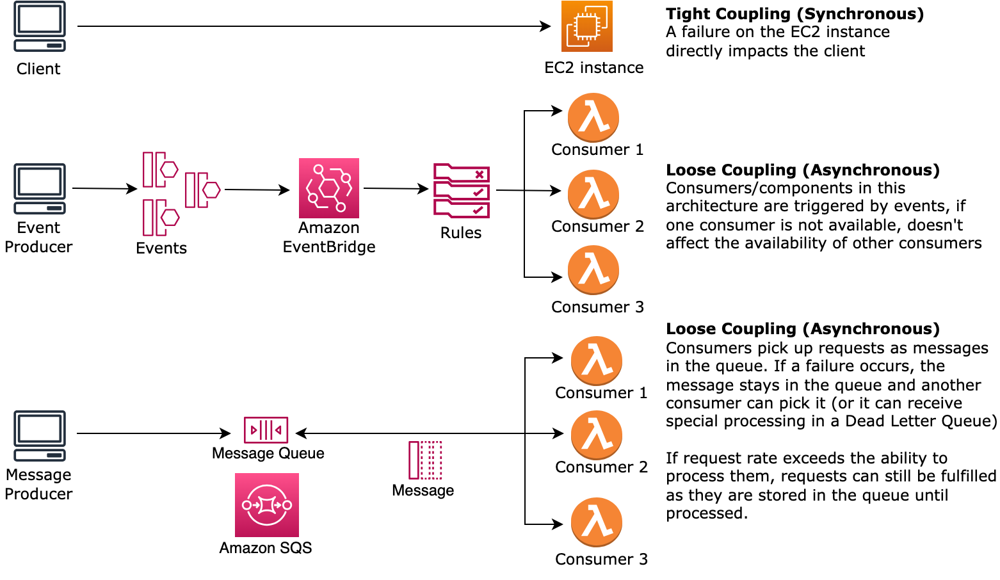

# REL04-BP02 Implement loosely coupled dependencies

Dependencies such as queuing systems, streaming systems, workflows,
and load balancers are loosely coupled. Loose coupling helps isolate
behavior of a component from other components that depend on it,
increasing resiliency and agility.

Decoupling dependencies, such as queuing systems, streaming systems, and workflows, help minimize the impact of changes or failure on a system. This separation isolates a component's behavior from affecting others that depend on it, improving resilience and agility.

In tightly coupled systems, changes to one component can necessitate changes in other components that rely on it, resulting in degraded performance across all components. _Loose_ coupling breaks this dependency so that dependent components only need to know the versioned and published interface. Implementing loose coupling between dependencies isolates a failure in one from impacting another.

Loose coupling allows you to modify code or add features to a component while minimizing risk to other components that depend on it. It also allows for granular resilience at a component level where you can scale out or even change underlying implementation of the dependency.

To further improve resiliency through loose coupling, make component
interactions asynchronous where possible. This model is suitable for
any interaction that does not need an immediate response and where
an acknowledgment that a request has been registered will suffice.
It involves one component that generates events and another that
consumes them. The two components do not integrate through direct
point-to-point interaction but usually through an intermediate
durable storage layer, such as an Amazon SQS queue, a streaming data
platform such as Amazon Kinesis, or AWS Step Functions.

_Figure 4: Dependencies such as queuing systems and load
balancers are loosely coupled_

Amazon SQS queues and AWS Step Functions are just two ways to
add an intermediate layer for loose coupling. Event-driven
architectures can also be built in the AWS Cloud using Amazon EventBridge, which can abstract clients (event producers) from the
services they rely on (event consumers). Amazon Simple Notification Service (Amazon SNS) is an effective solution when you need
high-throughput, push-based, many-to-many messaging. Using Amazon SNS topics, your publisher systems can fan out messages to a large
number of subscriber endpoints for parallel processing.

While queues offer several advantages, in most hard real-time
systems, requests older than a threshold time (often seconds) should
be considered stale (the client has given up and is no longer
waiting for a response), and not processed. This way more recent
(and likely still valid requests) can be processed instead.

**Desired outcome:** Implementing loosely coupled dependencies allows you to minimize the surface area for failure to a component level, which helps diagnose and resolve issues. It also simplifies development cycles, allowing teams to implement changes at a modular level without affecting the performance of other components that depend on it. This approach provides the capability to scale out at a component level based on resource needs, as well as utilization of a component contributing to cost-effectiveness.

**Common anti-patterns:**

- Deploying a monolithic workload.
- Directly invoking APIs between workload tiers with no capability
  of failover or asynchronous processing of the request.
- Tight coupling using shared data. Loosely coupled systems should avoid sharing data through shared databases or other forms of tightly coupled data storage, which can reintroduce tight coupling and hinder scalability.
- Ignoring back pressure. Your workload should have the ability to slow down or stop incoming data when a component can't process it at the same rate.

**Benefits of establishing this best
practice:** Loose coupling helps isolate behavior of a
component from other components that depend on it, increasing
resiliency and agility. Failure in one component is isolated from
others.

**Level of risk exposed if this best practice
is not established:** High

## Implementation guidance

Implement loosely coupled dependencies. There are various solutions that allow you to build loosely coupled applications. These include services for implementing fully managed queues, automated workflows, react to events, and APIs among others which can help isolate behavior of components from other components, and as such increasing resilience and agility.

- **Build event-driven architectures:** [Amazon EventBridge](../../../eventbridge/latest/userguide/eb-what-is.md "../../../eventbridge/latest/userguide/eb-what-is.md") helps you build loosely coupled and distributed event-driven architectures.
- **Implement queues in distributed systems:** You can use [Amazon Simple Queue Service (Amazon SQS)](../../../AWSSimpleQueueService/latest/SQSDeveloperGuide/welcome.md "../../../AWSSimpleQueueService/latest/SQSDeveloperGuide/welcome.md") to integrate and decouple distributed systems.
- **Containerize components as microservices:** [Microservices](https://aws.amazon.com/microservices/ "https://aws.amazon.com/microservices/") allow teams to build applications composed of small independent components which communicate over well-defined APIs. [Amazon Elastic Container Service (Amazon ECS)](../../../AmazonECS/latest/developerguide/Welcome.md "../../../AmazonECS/latest/developerguide/Welcome.md"), and [Amazon Elastic Kubernetes Service (Amazon EKS)](../../../eks/latest/userguide/what-is-eks.md "../../../eks/latest/userguide/what-is-eks.md") can help you get started faster with containers.
- **Manage workflows with Step Functions:** [Step Functions](https://aws.amazon.com/step-functions/getting-started/ "https://aws.amazon.com/step-functions/getting-started/") help you coordinate multiple AWS services into flexible workflows.
- **Leverage publish-subscribe (pub/sub) messaging architectures:** [Amazon Simple Notification Service (Amazon SNS)](../../../sns/latest/dg/welcome.md "../../../sns/latest/dg/welcome.md") provides message delivery from publishers to subscribers (also known as producers and consumers).

### Implementation steps

- Components in an event-driven architecture are initiated by events. Events are actions that happen in a system, such as a user adding an item to a cart. When an action is successful, an event is generated that actuates the next component of the system.
  - [Building Event-driven Applications with Amazon EventBridge](https://aws.amazon.com/blogs/compute/building-an-event-driven-application-with-amazon-eventbridge/ "https://aws.amazon.com/blogs/compute/building-an-event-driven-application-with-amazon-eventbridge/")
  - [AWS re:Invent 2022 - Designing Event-Driven Integrations using Amazon EventBridge](https://www.youtube.com/watch?v=W3Rh70jG-LM "https://www.youtube.com/watch?v=W3Rh70jG-LM")

- Distributed messaging systems have three main parts that need to be implemented for a queue based architecture. They include components of the distributed system, the queue that is used for decoupling (distributed on Amazon SQS servers), and the messages in the queue. A typical system has producers which initiate the message into the queue, and the consumer which receives the message from the queue. The queue stores messages across multiple Amazon SQS servers for redundancy.
  - [Basic Amazon SQS architecture](../../../AWSSimpleQueueService/latest/SQSDeveloperGuide/sqs-basic-architecture.md "../../../AWSSimpleQueueService/latest/SQSDeveloperGuide/sqs-basic-architecture.md")
  - [Send Messages Between Distributed Applications with Amazon Simple Queue Service](https://aws.amazon.com/getting-started/hands-on/send-messages-distributed-applications/ "https://aws.amazon.com/getting-started/hands-on/send-messages-distributed-applications/")

- Microservices, when well-utilized, enhance maintainability and boost scalability, as loosely coupled components are managed by independent teams. It also allows for the isolation of behaviors to a single component in case of changes.
  - [Implementing Microservices on AWS](../../../whitepapers/latest/microservices-on-aws/microservices-on-aws.md "../../../whitepapers/latest/microservices-on-aws/microservices-on-aws.md")
  - [Let's Architect! Architecting microservices with containers](https://aws.amazon.com/blogs/architecture/lets-architect-architecting-microservices-with-containers/ "https://aws.amazon.com/blogs/architecture/lets-architect-architecting-microservices-with-containers/")

- With AWS Step Functions you can build distributed applications, automate processes, orchestrate microservices, among other things. The orchestration of multiple components into an automated workflow allows you to decouple dependencies in your application.
  - [Create a Serverless Workflow with AWS Step Functions and AWS Lambda](https://aws.amazon.com/tutorials/create-a-serverless-workflow-step-functions-lambda/ "https://aws.amazon.com/tutorials/create-a-serverless-workflow-step-functions-lambda/")
  - [Getting Started with AWS Step Functions](https://aws.amazon.com/step-functions/getting-started/ "https://aws.amazon.com/step-functions/getting-started/")

## Resources

**Related documents:**

- [Amazon EC2: Ensuring Idempotency](../../../AWSEC2/latest/APIReference/Run_Instance_Idempotency.md "../../../AWSEC2/latest/APIReference/Run_Instance_Idempotency.md")
- [The
  Amazon Builders' Library: Challenges with distributed
  systems](https://aws.amazon.com/builders-library/challenges-with-distributed-systems/ "https://aws.amazon.com/builders-library/challenges-with-distributed-systems/")
- [The
  Amazon Builders' Library: Reliability, constant work, and a
  good cup of coffee](https://aws.amazon.com/builders-library/reliability-and-constant-work/ "https://aws.amazon.com/builders-library/reliability-and-constant-work/")
- [What
  Is Amazon EventBridge?](../../../eventbridge/latest/userguide/what-is-amazon-eventbridge.md "../../../eventbridge/latest/userguide/what-is-amazon-eventbridge.md")
- [What
  Is Amazon Simple Queue Service?](../../../AWSSimpleQueueService/latest/SQSDeveloperGuide/welcome.md "../../../AWSSimpleQueueService/latest/SQSDeveloperGuide/welcome.md")
- [Break up with your monolith](https://pages.awscloud.com/break-up-your-monolith.html "https://pages.awscloud.com/break-up-your-monolith.html")
- [Orchestrate Queue-based Microservices with AWS Step Functions and Amazon SQS](https://aws.amazon.com/tutorials/orchestrate-microservices-with-message-queues-on-step-functions/ "https://aws.amazon.com/tutorials/orchestrate-microservices-with-message-queues-on-step-functions/")
- [Basic Amazon SQS architecture](../../../AWSSimpleQueueService/latest/SQSDeveloperGuide/sqs-basic-architecture.md "../../../AWSSimpleQueueService/latest/SQSDeveloperGuide/sqs-basic-architecture.md")
- [Queue-Based Architecture](../high-performance-computing-lens/queue-based-architecture.md "../high-performance-computing-lens/queue-based-architecture.md")

**Related videos:**

- [AWS New York
  Summit 2019: Intro to Event-driven Architectures and Amazon EventBridge (MAD205)](https://youtu.be/tvELVa9D9qU "https://youtu.be/tvELVa9D9qU")
- [AWS re:Invent
  2018: Close Loops and Opening Minds: How to Take Control of Systems, Big and Small ARC337 (includes loose coupling,
  constant work, static stability)](https://youtu.be/O8xLxNje30M "https://youtu.be/O8xLxNje30M")
- [AWS re:Invent
  2019: Moving to event-driven architectures (SVS308)](https://youtu.be/h46IquqjF3E "https://youtu.be/h46IquqjF3E")
- [AWS re:Invent 2019: Scalable serverless event-driven applications using Amazon SQS and Lambda](https://www.youtube.com/watch?v=2rikdPIFc_Q "https://www.youtube.com/watch?v=2rikdPIFc_Q")
- [AWS re:Invent 2022 - Designing event-driven integrations using Amazon EventBridge](https://www.youtube.com/watch?v=W3Rh70jG-LM "https://www.youtube.com/watch?v=W3Rh70jG-LM")
- [AWS re:Invent 2017: Elastic Load Balancing Deep Dive and Best Practices](https://www.youtube.com/watch?v=9TwkMMogojY "https://www.youtube.com/watch?v=9TwkMMogojY")
