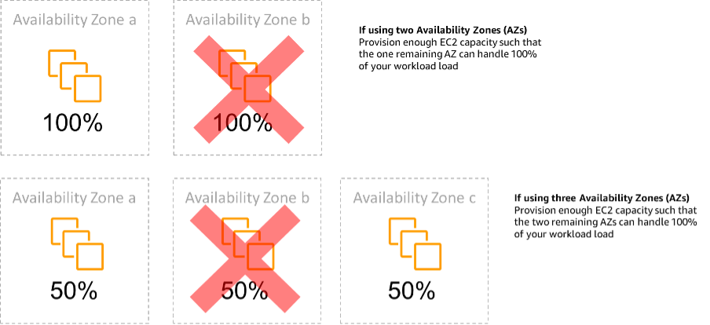

# REL11-BP05 Use static stability to prevent bimodal

behavior

Workloads should be statically stable and only operate in a single
normal mode. Bimodal behavior is when your workload exhibits
different behavior under normal and failure modes.

For example, you might try and recover from an Availability Zone
failure by launching new instances in a different Availability Zone.
This can result in a bimodal response during a failure mode. You
should instead build workloads that are statically stable and
operate within only one mode. In this example, those instances
should have been provisioned in the second Availability Zone before
the failure. This static stability design verifies that the workload
only operates in a single mode.

**Desired outcome:** Workloads do not exhibit bimodal behavior during normal and failure
modes.

**Common anti-patterns:**

- Assuming resources can always be provisioned regardless of the
  failure scope.
- Trying to dynamically acquire resources during a failure.
- Not provisioning adequate resources across zones or Regions until a
  failure occurs.
- Considering static stable designs for compute resources only.

**Benefits of establishing this best
practice:** Workloads running with statically stable designs are capable of
having predictable outcomes during normal and failure events.

**Level of risk exposed if this best practice
is not established:** Medium

## Implementation guidance

Bimodal behavior occurs when your workload exhibits different
behavior under normal and failure modes (for example, relying on
launching new instances if an Availability Zone fails). An example
of bimodal behavior is when stable Amazon EC2 designs provision enough
instances in each Availability Zone to handle the workload load if
one AZ were removed. ELB or Amazon Route 53
health would check to shift a load away from the impaired
instances. After traffic has shifted, use AWS Auto Scaling to
asynchronously replace instances from the failed zone and launch
them in the healthy zones. Static stability for compute deployment
(such as EC2 instances or containers) results in the highest
reliability.

_Static stability of EC2 instances across
Availability Zones_

This must be weighed against the cost for this model and the
business value of maintaining the workload under all resilience
cases. It's less expensive to provision less compute capacity and
rely on launching new instances in the case of a failure, but for
large-scale failures (such as an Availability Zone or Regional
impairment), this approach is less effective because it relies on
both an operational plane, and sufficient resources being
available in the unaffected zones or Regions.

Your solution should also weigh reliability against the costs
needs for your workload. Static stability architectures apply to a
variety of architectures including compute instances spread across
Availability Zones, database read replica designs, Kubernetes
(Amazon EKS) cluster designs, and multi-Region failover architectures.

It is also possible to implement a more statically stable design
by using more resources in each zone. By adding more zones, you
reduce the amount of additional compute you need for static
stability.

An example of bimodal behavior would be a network timeout that
could cause a system to attempt to refresh the configuration state
of the entire system. This would add an unexpected load to another
component and might cause it to fail, resulting in other
unexpected consequences. This negative feedback loop impacts the
availability of your workload. Instead, you can build systems that
are statically stable and operate in only one mode. A statically
stable design would do constant work and always refresh the
configuration state on a fixed cadence. When a call fails, the
workload would use the previously cached value and initiate an
alarm.

Another example of bimodal behavior is allowing clients to bypass
your workload cache when failures occur. This might seem to be a
solution that accommodates client needs but it can significantly
change the demands on your workload and is likely to result in
failures.

Assess critical workloads to determine what workloads require
this type of resilience design. For those that are deemed
critical, each application component must be reviewed. Example
types of services that require static stability evaluations are:

- **Compute**: Amazon EC2, EKS-EC2,
  ECS-EC2, EMR-EC2
- **Databases**: Amazon Redshift, Amazon RDS,
  Amazon Aurora
- **Storage**: Amazon S3 (Single Zone),
  Amazon EFS (mounts), Amazon FSx (mounts)
- **Load balancers:** Under certain
  designs

### Implementation steps

- Build systems that are statically stable and operate in
  only one mode. In this case, provision enough instances in
  each Availability Zone or Region to handle the workload
  capacity if one Availability Zone or Region were removed.
  A variety of services can be used for routing to healthy
  resources, such as:
  - [Cross
    Region DNS Routing](../../../whitepapers/latest/real-time-communication-on-aws/cross-region-dns-based-load-balancing-and-failover.md "../../../whitepapers/latest/real-time-communication-on-aws/cross-region-dns-based-load-balancing-and-failover.md")
  - [MRAP
    Amazon S3 MultiRegion Routing](../../../AmazonS3/latest/userguide/MultiRegionAccessPointRequestRouting.md "../../../AmazonS3/latest/userguide/MultiRegionAccessPointRequestRouting.md")
  - [AWS Global Accelerator](https://aws.amazon.com/global-accelerator/ "https://aws.amazon.com/global-accelerator/")
  - [Amazon Application Recovery Controller](../../../r53recovery/latest/dg/what-is-route53-recovery.md "../../../r53recovery/latest/dg/what-is-route53-recovery.md")

- Configure
  [database
  read replicas](https://aws.amazon.com/rds/features/multi-az/ "https://aws.amazon.com/rds/features/multi-az/") to account for the loss of a single
  primary instance or a read replica. If traffic is being
  served by read replicas, the quantity in each Availability
  Zone and each Region should equate to the overall need in
  case of the zone or Region failure.
- Configure critical data in Amazon S3 storage that is designed to
  be statically stable for data stored in case of an
  Availability Zone failure. If
  [Amazon S3
  One Zone-IA](https://aws.amazon.com/about-aws/whats-new/2018/04/announcing-s3-one-zone-infrequent-access-a-new-amazon-s3-storage-class/ "https://aws.amazon.com/about-aws/whats-new/2018/04/announcing-s3-one-zone-infrequent-access-a-new-amazon-s3-storage-class/") storage class is used, this should not
  be considered statically stable, as the loss of that zone
  minimizes access to this stored data.
- [Load
  balancers](../../../elasticloadbalancing/latest/application/disable-cross-zone.md "../../../elasticloadbalancing/latest/application/disable-cross-zone.md") are sometimes configured incorrectly or
  by design to service a specific Availability Zone. In this
  case, the statically stable design might be to spread a
  workload across multiple AZs in a more complex design. The
  original design may be used to reduce interzone traffic
  for security, latency, or cost reasons.

## Resources

**Related Well-Architected best
practices:**

- [Availability
  Definition](../reliability-pillar/availability.md "../reliability-pillar/availability.md")
- [REL11-BP01
  Monitor all components of the workload to detect
  failures](../reliability-pillar/rel_withstand_component_failures_notifications_sent_system.md "../reliability-pillar/rel_withstand_component_failures_notifications_sent_system.md")
- [REL11-BP04
  Rely on the data plane and not the control plane during
  recovery](../reliability-pillar/rel_withstand_component_failures_avoid_control_plane.md "../reliability-pillar/rel_withstand_component_failures_avoid_control_plane.md")

**Related documents:**

- [Minimizing
  Dependencies in a Disaster Recovery Plan](https://aws.amazon.com/blogs/architecture/minimizing-dependencies-in-a-disaster-recovery-plan/ "https://aws.amazon.com/blogs/architecture/minimizing-dependencies-in-a-disaster-recovery-plan/")
- [The
  Amazon Builders' Library: Static stability using Availability
  Zones](https://aws.amazon.com/builders-library/static-stability-using-availability-zones "https://aws.amazon.com/builders-library/static-stability-using-availability-zones")
- [Fault
  Isolation Boundaries](../../../whitepapers/latest/aws-fault-isolation-boundaries/appendix-a---partitional-service-guidance.md "../../../whitepapers/latest/aws-fault-isolation-boundaries/appendix-a---partitional-service-guidance.md")
- [Static
  stability using Availability Zones](https://aws.amazon.com/builders-library/static-stability-using-availability-zones "https://aws.amazon.com/builders-library/static-stability-using-availability-zones")
- [Multi-Zone RDS](https://aws.amazon.com/rds/features/multi-az/ "https://aws.amazon.com/rds/features/multi-az/")
- [Minimizing
  Dependencies in a Disaster Recovery Plan](https://aws.amazon.com/blogs/architecture/minimizing-dependencies-in-a-disaster-recovery-plan/ "https://aws.amazon.com/blogs/architecture/minimizing-dependencies-in-a-disaster-recovery-plan/")
- [Cross
  Region DNS Routing](../../../whitepapers/latest/real-time-communication-on-aws/cross-region-dns-based-load-balancing-and-failover.md "../../../whitepapers/latest/real-time-communication-on-aws/cross-region-dns-based-load-balancing-and-failover.md")
- [MRAP
  Amazon S3 MultiRegion Routing](../../../AmazonS3/latest/userguide/MultiRegionAccessPointRequestRouting.md "../../../AmazonS3/latest/userguide/MultiRegionAccessPointRequestRouting.md")
- [AWS Global Accelerator](https://aws.amazon.com/global-accelerator/ "https://aws.amazon.com/global-accelerator/")
- [Amazon Application Recovery Controller](../../../r53recovery/latest/dg/what-is-route53-recovery.md "../../../r53recovery/latest/dg/what-is-route53-recovery.md")
- [Single
  Zone Amazon S3](https://aws.amazon.com/about-aws/whats-new/2018/04/announcing-s3-one-zone-infrequent-access-a-new-amazon-s3-storage-class/ "https://aws.amazon.com/about-aws/whats-new/2018/04/announcing-s3-one-zone-infrequent-access-a-new-amazon-s3-storage-class/")
- [Cross
  Zone Load Balancing](../../../elasticloadbalancing/latest/application/disable-cross-zone.md "../../../elasticloadbalancing/latest/application/disable-cross-zone.md")

**Related videos:**

- [Static
  stability in AWS: AWS re:Invent 2019: Introducing The Amazon
  Builders' Library (DOP328)](https://youtu.be/sKRdemSirDM?t=704 "https://youtu.be/sKRdemSirDM?t=704")
