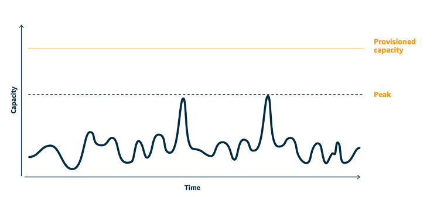
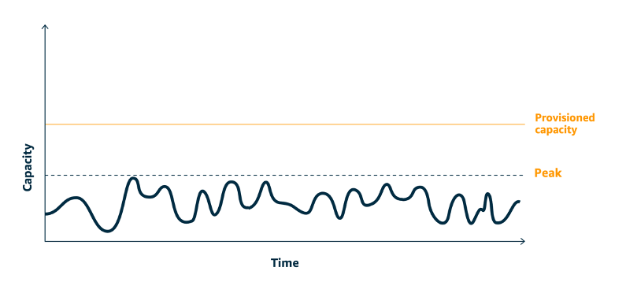

# SUS02-BP06 Implement buffering or throttling to flatten the demand curve

Buffering and throttling flatten the demand curve and reduce the provisioned capacity required for your workload.

**Common anti-patterns:**

- You process the client requests immediately while it is not needed.
- You do not analyze the requirements for client requests.

**Benefits of establishing this best practice:** Flattening the demand curve reduce the required provisioned capacity for the workload. Reducing the provisioned capacity means less energy consumption and less environmental impact.

**Level of risk exposed if this best practice
is not established:** Low

## Implementation guidance

Flattening the workload demand curve can help you to reduce the provisioned capacity for a workload and reduce its environmental impact. Assume a workload with the demand curve shown in below figure. This workload has two peaks, and to handle those peaks, the resource capacity as shown by orange line is provisioned. The resources and energy used for this workload is not indicated by the area under the demand curve, but the area under the provisioned capacity line, as provisioned capacity is needed to handle those two peaks.

_Demand curve with two distinct peaks that require high provisioned capacity._

You can use buffering or throttling to modify the demand curve and smooth out the peaks, which means less provisioned capacity and less energy consumed. Implement throttling when your clients can perform retries. Implement buffering to store the request and defer processing until a later time.

_Throttling's effect on the demand curve and provisioned capacity._

**Implementation steps**

- Analyze the client requests to determine how to respond to them. Questions to consider include:
  - Can this request be processed asynchronously?
  - Does the client have retry capability?

- If the client has retry capability, then you can implement throttling, which tells the source that if it cannot service the request at the current time, it should try again later.
  - You can use [Amazon API Gateway](https://aws.amazon.com/api-gateway/ "https://aws.amazon.com/api-gateway/") to implement throttling.

- For clients that cannot perform retries, a buffer needs to be implemented to flatten the demand curve. A buffer defers request processing, allowing applications that run at different rates to communicate effectively. A buffer-based approach uses a queue or a stream to accept messages from producers. Messages are read by consumers and processed, allowing the messages to run at the rate that meets the consumers’ business requirements.
  - [Amazon Simple Queue Service (Amazon SQS)](https://aws.amazon.com/sqs/ "https://aws.amazon.com/sqs/") is a managed service that provides queues that allow a single consumer to read individual messages.
  - [Amazon Kinesis](https://aws.amazon.com/kinesis/ "https://aws.amazon.com/kinesis/") provides a stream that allows many consumers to read the same messages.

- Analyze the overall demand, rate of change, and required response time to right size the throttle or buffer required.

## Resources

**Related documents:**

- [Getting started with Amazon SQS](../../../AWSSimpleQueueService/latest/SQSDeveloperGuide/sqs-getting-started.md "../../../AWSSimpleQueueService/latest/SQSDeveloperGuide/sqs-getting-started.md")
- [Application integration Using Queues and Messages](https://aws.amazon.com/blogs/architecture/application-integration-using-queues-and-messages/ "https://aws.amazon.com/blogs/architecture/application-integration-using-queues-and-messages/")
- [Managing and monitoring API throttling in your workloads](https://aws.amazon.com/blogs/mt/managing-monitoring-api-throttling-in-workloads/ "https://aws.amazon.com/blogs/mt/managing-monitoring-api-throttling-in-workloads/")
- [Throttling a tiered, multi-tenant REST API at scale using API Gateway](https://aws.amazon.com/blogs/architecture/throttling-a-tiered-multi-tenant-rest-api-at-scale-using-api-gateway-part-1/ "https://aws.amazon.com/blogs/architecture/throttling-a-tiered-multi-tenant-rest-api-at-scale-using-api-gateway-part-1/")
- [Application integration Using Queues and Messages](https://aws.amazon.com/blogs/architecture/application-integration-using-queues-and-messages/ "https://aws.amazon.com/blogs/architecture/application-integration-using-queues-and-messages/")

**Related videos:**

- [AWS re:Invent 2022 - Application integration patterns for microservices](https://www.youtube.com/watch?v=GoBOivyE7PY "https://www.youtube.com/watch?v=GoBOivyE7PY")
- [AWS re:Invent 2023 - Smart savings: Amazon EC2 cost-optimization strategies](https://www.youtube.com/watch?v=_AHPbxzIGV0 "https://www.youtube.com/watch?v=_AHPbxzIGV0")
- [AWS re:Invent 2023 - Advanced integration patterns & trade-offs for loosely coupled systems](https://www.youtube.com/watch?v=FGKGdUiZKto "https://www.youtube.com/watch?v=FGKGdUiZKto")
