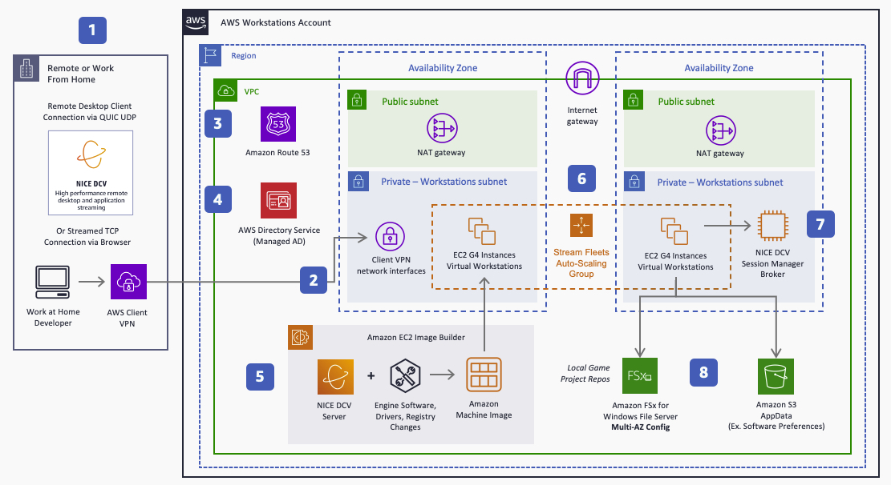

# Cloud game development: Workstations

Game development often involves distributed teams working
remotely from various locations, requiring access to shared
infrastructure and the ability to support collaborative,
geographically dispersed development. This trend towards a more
distributed game development process, including the use of
work-for-hire studios and remote work, necessitates the
implementation of robust technologies and workflows to
facilitate productivity, shared expertise, and agile development
practices.

The following reference architecture demonstrates how to use AWS
for hosting remote game development workstations using the Amazon DCV protocol.

_Stream game development from anywhere with Amazon DCV_

1. Amazon DCV is a streaming protocol that supports 4K, 60-FPS
   streaming. Developers using a browser connect through TCP
   connections, whereas desktop clients can use QUIC UDP over
   port 8443 for increased performance.
2. Developers use AWS Client VPN for a secure connection to
   network interfaces in the workstation subnets with source
   network address translation (SNAT).
3. Amazon Route 53 provides private DNS for the resources in
   the VPC as well as inbound and outbound DNS forwarding.
4. Directory Service provides managed Microsoft Active
   Directory to enable local game project storage mapped to
   individual users.
5. Workstations are created using an Amazon Machine Image (AMI)
   built with Image Builder. Images include Amazon DCV Server,
   developer software, registry changes, and drivers such as
   the NVIDIA gaming drivers or peripheral drivers. AWS Marketplace includes common AMIs used for workstations.
6. Fleets of workstations use graphics Amazon EC2 instance
   types that provide GPUs, and are scaled using EC2 Auto
   Scaling groups.
7. The Amazon DCV Session Manager Broker enables management of
   Amazon DCV sessions.
8. Local file storage of projects is hosted in Amazon FSx for Windows File Server. Developers commit to a separate CI/CD
   pipeline by pushing from local storage to source control.
