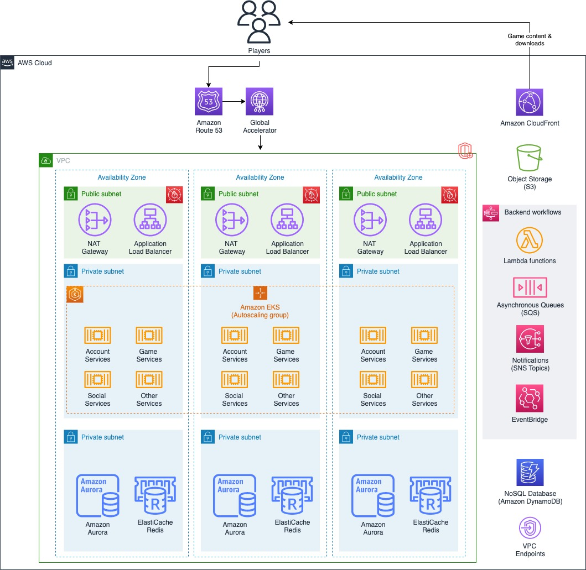

# Container-based game backend architecture

This section outlines a container-based game backend
architecture.

_Hosting a game backend using containers_

- Players access the game using game client software, which
  can be distributed to them through a gaming system, a
  digital storefront, or a direct download from a content
  delivery network (CDN), such as Amazon CloudFront. CDNs
  provide caching at edge locations to accelerate the
  performance for users downloading content. For example,
  CloudFront can be used to distribute the game client
  software to your players as well as the game assets and
  other content.
- AWS Global Accelerator provides traffic acceleration and
  customizable controls for routing traffic from player game
  clients to your load balancers as well as routing traffic
  across Regions for multi-Region and failover purposes. The
  custom domain names for your game backend REST APIs are
  configured in Amazon Route 53 to route traffic to Global Accelerator endpoints. Not shown in the diagram, AWS Shield Advanced can provide
  additional DDoS mitigation for your accelerator and game
  backend.
- NAT Gateway and Application Load Balancer are deployed to
  public subnets in each of the Availability Zones used by the
  game backend to provide high availability with the
  Region. AWS WAF is deployed on the Application Load Balancer
  to provide layer-7 web traffic filtering.
- The game backend is hosted as a collection of individual
  container-based microservices deployed into an Amazon EKS
  cluster in private subnets spread across Availability Zones
  for resiliency. Automatic scaling dynamically adjusts the
  capacity of the services and cluster nodes based on resource
  utilization, which is typically correlated with player
  demand. Whereas Cluster Autoscaler automatically adjusts the
  number of nodes in the cluster, the Horizontal Pod
  Autoscaler automatically scales the pods deployed into the
  cluster.
- Game and player data is stored in backend databases and
  caches that are deployed into private subnets across
  Availability Zones with replication between primary and
  replica nodes. Amazon Aurora is a popular choice for use
  cases such as player profiles, entitlements, and in-game
  purchasing, which can have more complex querying
  requirements and may benefit from the relational data
  modeling capabilities of MySQL and PostgreSQL.
  Amazon ElastiCache is useful for building high-performance
  leaderboards, pub/sub messaging, and for caching frequently
  accessed data to reduce latency and load on
  databases. Amazon DynamoDB is a fully managed NoSQL data
  store that is ideal for unpredictable access patterns and
  the ability to scale to virtually unlimited throughput for
  use cases such as player and game state data, session data,
  inventory and item stores, or use cases where you want a
  global database with minimal overhead.
- Asynchronous processing workflows should be used to perform
  work that can be done in the background, such as updating
  leaderboards or sending friend requests. Configure your game
  backend to push this type of work into Amazon SQS queues to
  scale as your game grows or consider using Amazon SNS topics
  to distribute the work between many consumer application
  queues for parallel processing. Use AWS Lambda
  functionsto perform the
  processing in an event-driven manner to reduce your compute
  infrastructure costs and management overhead. For workflows
  that are long-lived or require task coordination with
  multiple steps, consider orchestrating the entire workflow
  using AWS Step Functions. Amazon EventBridge can be used to
  initiate functions to respond to AWS service and custom
  application events.
