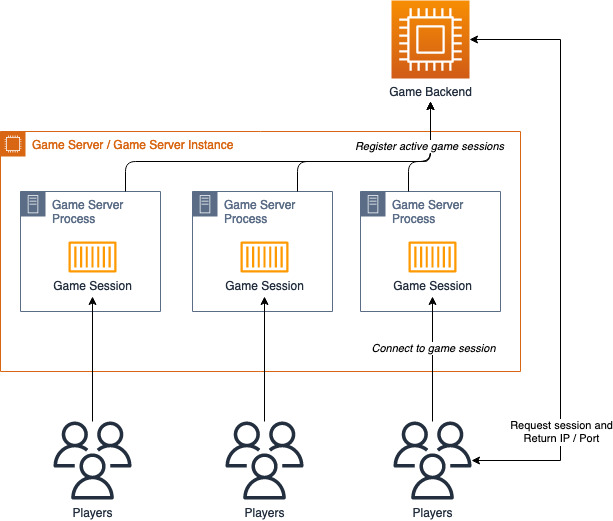

# Game server processes

The following diagram illustrates a typical game server
architecture. It describes the logical relationship between a
game server instance and the game server processes that host
game sessions.

_Logical game server architecture_

- An Amazon EC2 instance is used as a game server, also known
  as a game server instance. The game server hosts one or more
  game server processes, and each is running a copy of your
  game server build. Typically, multiple game server processes
  are running on a game server instance to utilize compute
  resources efficiently and reduce costs. When a game session
  is active and ready to host player sessions, its status is
  updated with the game backend (usually a matchmaking
  service) so that it can begin to be used to host players.
- The game backend can provide the player with the IP address
  and server port that is hosting a game session so that they
  can connect to play.
