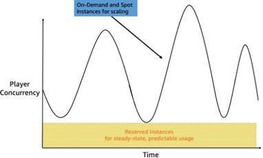

# GAMECOST02-BP03 Select the appropriate compute pricing option

to reduce costs

Run performance tests of your game server software across a
variety of instance types and compute options to determine which
option is most cost-effective for your game.

**Level of risk exposed if this best practice
is not established:** Medium

## Implementation guidance

In addition to efficiently utilizing the right EC2 instance types
for your workload, consider which of the available compute pricing
options is most suitable for your cost optimization goals. There
are several pricing options available, including On-Demand
Instances, Spot Instances, Reserved Instances, and Savings Plans.

[Savings Plans](https://aws.amazon.com/savingsplans "https://aws.amazon.com/savingsplans") (SPs) provide discounts for compute by making usage
commitments and are ideal for scenarios when you cannot forecast
your expected usage for a 1-year or 3-year period. They provide
discounts like Reserved Instances with the flexibility to apply
these discounts across Regions, instance family, operating system,
tenancy. They can also be applied to AWS Fargate, who can be a
game server hosting option for casual games or AWS Lambda who is
used as a great option for turn-based game that do not require
game servers. For more information, see
[Building
a serverless multi-player game that scales](https://aws.amazon.com/blogs/compute/building-a-serverless-multiplayer-game-that-scales/ "https://aws.amazon.com/blogs/compute/building-a-serverless-multiplayer-game-that-scales/").

Savings Plans are introduced during game launches to save costs
for game servers workloads that are contributing to EC2 instances
spend when the game is released to the audience. Savings Plans can
also be introduced post-launch when game operations team have a
better understanding of the player traffic after the game has been
running in production for an extended period.

Since Savings Plans provide regional flexibility, they are
particularly ideal to optimize game servers spend for games with
unpredictable usage across geographies.

For example, if your daily player usage pattern requires at least
20 servers to support your player base, but periodically requires
up to 40 servers, then consider purchasing Savings Plan
commitments to cover the 20 servers' baseline, because that usage
demand is predictable and consistent, and will result in maximum
utilization of the usage commitment that you have purchased.

Maximize the utilization of Savings Plans and augment them with
other purchase options that provide more flexibility for
unpredictable game server usage spikes, such as on-demand and Spot
Instances to achieve optimal savings.

Spot Instances are ideal for running game servers because they
offer the largest compute discounts, do not require usage
commitments, and they provide flexibility for unpredictable and
spiky workload types. However, Spot Instances can be interrupted,
so they are best suited for game server workloads with short game
session duration or situations where the tolerance for
interruption is higher.

For more information on guidance for running game servers using
Kubernetes on Amazon EKS with EC2 Spot Instances, see
[How
to run massively multiplayer games with EC2 Spot using Aurora
Serverless](https://aws.amazon.com/blogs/compute/how-to-run-massively-multiplayer-games-with-ec2-spot-using-aurora-serverless/ "https://aws.amazon.com/blogs/compute/how-to-run-massively-multiplayer-games-with-ec2-spot-using-aurora-serverless/").

Use
[Amazon EC2 Spot Instances](https://aws.amazon.com/ec2/spot/instance-advisor/ "https://aws.amazon.com/ec2/spot/instance-advisor/") to determine pools with the least chance
of interruption that will deliver maximum savings compared to
on-demand rates.

When using Spot, it is also recommended to run game server
workloads across multiple EC2 instance types and Availability
Zones in an AWS Region to diversify your usage of capacity and
reduce interruption risk.

Consider using Spot Instances in combination with On-Demand
Instances to minimize the impact of potential disruptions to
active game sessions and use capacity optimized allocations
strategy to further reduce the risk of interruption.

Refer to the
[Best
practices for Amazon EC2 Spot](../../../AWSEC2/latest/UserGuide/spot-best-practices.md "../../../AWSEC2/latest/UserGuide/spot-best-practices.md") for additional best
practices.
[Capacity
Rebalancing in Auto Scaling to replace at-risk Spot
Instances](../../../autoscaling/ec2/userguide/ec2-auto-scaling-capacity-rebalancing.md "../../../autoscaling/ec2/userguide/ec2-auto-scaling-capacity-rebalancing.md") can be used to proactively monitor and add
additional capacity when Spot Instances are at increased risk of
interruption.

[Amazon
GameLift FleetIQ](../../../gamelift/latest/fleetiqguide/gsg-intro.md "../../../gamelift/latest/fleetiqguide/gsg-intro.md") integrates with Spot Instances to optimize
the use of low-cost Spot Instances while reducing the risk of
interruptions. If you are hosting your game using GameLift, review
the GameLift documentation for choosing computing resources. For
more information, see
[Choose
compute resources for a managed fleet](../../../gameliftservers/latest/developerguide/gamelift-compute.md "../../../gameliftservers/latest/developerguide/gamelift-compute.md").

The following diagram provides an example to illustrate the use of
multiple compute pricing options for game server workloads:

_Hosting game servers with multiple EC2
pricing options_

In the diagram, the player concurrency fluctuates over time which
makes it difficult to manage utilization and achieve cost
optimization. To address this fluctuation, consider adopting a
mixture of different compute pricing options, using Savings Plans
for EC2 to meet the needs of your minimum usage requirements while
relying on EC2 On-Demand and EC2 Spot Instances to meet the needs
of your player demand.

### Implementation steps

- Use Savings Plans for predictable baseline usage, combining
  them with Spot and On-Demand Instances for flexibility and
  cost optimization during usage spikes.
- Use Spot Instances for game servers with short session
  durations or higher interruption tolerance, diversifying
  across instance types and Availability Zones to minimize
  risk.
- Implement tools like EC2 Spot Instances Advisor, Capacity
  Rebalancing, and GameLift FleetIQ to optimize Spot Instance
  usage and proactively manage interruptions.
