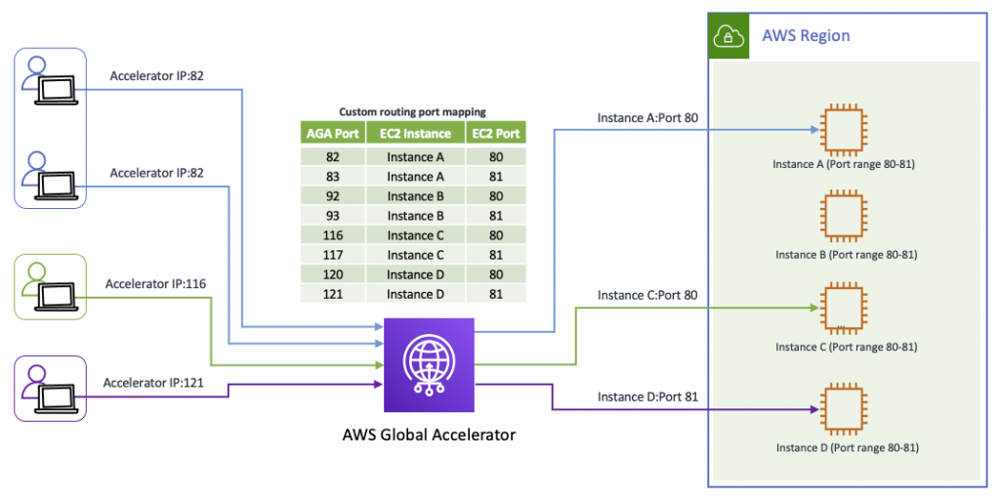

# GAMEPERF07-BP05 Use network acceleration technology to improve

performance across the internet

In addition to physically placing latency-sensitive game
infrastructure closer to players, you can also improve the player
experience by optimizing the network performance for your game.
AWS uses the BGP protocol to influence
[internet
routing](https://aws.amazon.com/blogs/architecture/internet-routing-and-traffic-engineering/ "https://aws.amazon.com/blogs/architecture/internet-routing-and-traffic-engineering/") to use the fastest path to our border network from
Internet Service Providers. If you operate your own network and
need more control and observability over routing behavior and BGP
advertisement, you can use private
[Peering](https://aws.amazon.com/peering/ "https://aws.amazon.com/peering/") or Direct Connect to route traffic from the internet to your
game running on AWS.

**Level of risk exposed if this best practice
is not established:** High

## Implementation guidance

Consider the following reference architecture to support improved
internet performance and responsiveness.

**Enhanced network performance for gaming
using Global Accelerator**

For a fully managed solution to network routing,
[AWS Global Accelerator](https://aws.amazon.com/global-accelerator "https://aws.amazon.com/global-accelerator") improves your application's network
performance using the AWS global network, which can be used to
accelerate your gameplay traffic, voice chat, and real-time
messaging traffic, as well as other latency-sensitive applications
while providing fast failover to your game servers. Global Accelerator
[custom
routing accelerators](https://aws.amazon.com/blogs/networking-and-content-delivery/introducing-aws-global-accelerator-custom-routing-accelerators/ "https://aws.amazon.com/blogs/networking-and-content-delivery/introducing-aws-global-accelerator-custom-routing-accelerators/") can be integrated with your
matchmaking service to provide deterministic routing of multiple
players to the same game session using static anycast IP addresses
and ports.

Your game development teams may be distributed around the world
and require performant access to shared content or assets. To
improve the performance for shared content stored in Amazon S3
buckets, you can setup bi-directional replication of your data
across Regions using
[S3
Cross-Region Replication](../../../AmazonS3/latest/userguide/replication.md "../../../AmazonS3/latest/userguide/replication.md") so that users can access data from
buckets closer to them. To simplify this access pattern, use
[S3
Multi-](../../../AmazonS3/latest/userguide/MultiRegionAccessPoints.md "../../../AmazonS3/latest/userguide/MultiRegionAccessPoints.md")
[Region
Access Points](../../../AmazonS3/latest/userguide/MultiRegionAccessPoints.md "../../../AmazonS3/latest/userguide/MultiRegionAccessPoints.md") which accelerates requests to S3 over the
global network using Global Accelerator. 

For more information, refer to
[Improving
the Player Experience by Leveraging AWS Global Accelerator and
Amazon GameLift FleetIQ](https://aws.amazon.com/blogs/gametech/improving-the-player-experience-by-leveraging-aws-global-accelerator-and-amazon-gamelift-fleetiq/ "https://aws.amazon.com/blogs/gametech/improving-the-player-experience-by-leveraging-aws-global-accelerator-and-amazon-gamelift-fleetiq/").

### Implementation steps

- Use AWS Global Accelerator to help improve network
  performance for gameplay traffic, voice chat, and real-time
  messaging, while facilitating fast failover to game servers.
- Configure Global Accelerator custom routing accelerators to
  integrate with your matchmaking service, enabling
  deterministic routing of players to game sessions using
  static anycast IPs.
- Enable S3 Cross-Region Replication to replicate shared
  content across Regions for distributed game development
  teams.
- Use S3 Multi-Region Access Points to accelerate S3 data
  access over the AWS global network for globally distributed
  users.
