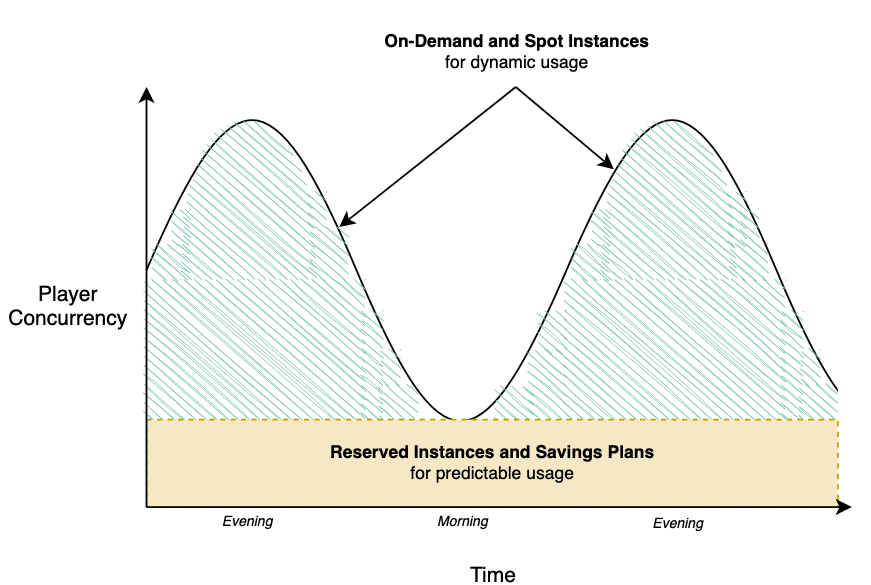
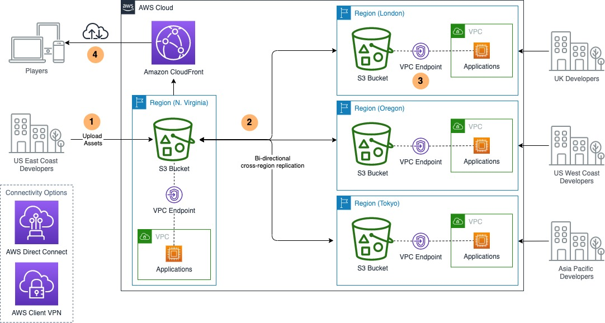

# Cost-effective resources

| GAMECOST01 • How are you choosing the right compute solution for your game servers? |
| ----------------------------------------------------------------------------------------- |
|                                                                                           |

One of most unique aspects of a game workload compared to other types of workloads is the game server, which is critical to the player experience. Because players connect to game servers from their game client to play a game session, it is also one of the biggest drivers of cost for operating a multiplayer game so it is important to make sure that you optimize how you utilize the compute infrastructure for your game to reduce costs.

**GAMECOST_BP01: Benchmark your game server on multiple compute types.**

During the initial planning and testing phase of game development, you should perform benchmarking to determine the appropriate type of compute to use for your game. Typically, session-based multiplayer and other types of low-latency games will use Amazon EC2 Instances for hosting game servers. Each EC2 instance type provides a mixture of compute resources that are optimized for different workload profiles. You should perform benchmarking of your game server code to determine what resources such as CPU, Memory or Network bandwidth that your game session utilizes and select the option that provides the right balance of performance at the lowest cost. Most of the popular commercially available game engines such as Unreal Engine, Unity, and Lumberyard provide performance profiling utilities that you can allow in the engine editor so that your game server builds will emit log and/or metric data to help you benchmark performance and resource utilization. This telemetry can help you evaluate and select the appropriate EC2 Instance types to use.

As part of benchmarking your game server across multiple EC2 instance types, you
should determine what type of operating system and processor requirements are needed to
run your game. For best cost optimization, it is recommended to run your game compute
infrastructure on Linux instances to eliminate the licensing costs that is incurred with
Windows. Additionally, [Graviton
instances](https://aws.amazon.com/ec2/graviton/ "https://aws.amazon.com/ec2/graviton/") are 64-bit Arm-based EC2 instances that can be used to run your game
servers, including [Unreal Engine dedicated servers](https://aws.amazon.com/blogs/gametech/compiling-unreal-engine-4-dedicated-servers-for-aws-graviton-ec2-instances/ "https://aws.amazon.com/blogs/gametech/compiling-unreal-engine-4-dedicated-servers-for-aws-graviton-ec2-instances/").

**GAMECOST_BP02. Optimize the number of game sessions hosted on each game server Instance to reduce costs.**

Optimize the number of game sessions hosted per server instance in order to achieve better compute utilization and reduce compute infrastructure costs.

To reduce costs, game developers should maximize the number of game sessions hosted
on the same physical or virtual server, also known as the packing density of their game
servers. This is achieved by increasing the number of game server processes that can be
simultaneously hosted on an EC2 instance. A single game server process should not
usually require the use of the entire resources available on the EC2 instance. This is
one of the most important ways to reduce compute costs for a game and requires the use
of software that can spawn and manage multiple server processes on the EC2 instance on
separate ports. For example, Amazon GameLift Servers has a [quota on the maximum number of game server
processes per instance](../../../general/latest/gr/gamelift.md "../../../general/latest/gr/gamelift.md"), which you should strive to utilize so that you can
reduce hosting costs. Refer to the documentation for Amazon GameLift Servers for details on the
current quota for maximum game server processes per instance.

As an alternative to deploying game server processes on virtual machines such as EC2
instances, it is becoming popular for game developers to run their game servers as
container-based applications using container orchestration platforms such as Amazon
Elastic Container Service (Amazon ECS) or Amazon Elastic Kubernetes Service (Amazon
EKS), or by [hosting the game server using
Fargate](https://aws.amazon.com/blogs/gametech/game-server-hosting-on-aws-fargate/ "https://aws.amazon.com/blogs/gametech/game-server-hosting-on-aws-fargate/"). Container platforms provide job scheduling functionality that can
automatically find an available container instance in the cluster to host your game
server container based on resource requirements and other placement logic that you
specify. However, as discussed in the reliability pillar of this lens, it is important
to consider how you will manage the scaling and player placement behavior in way that
doesn't disrupt active player sessions.

**GAMECOST_BP03. Select the appropriate compute pricing option to reduce costs.**

Run performance tests of your game server software across a variety of instance types
and compute options to determine which option is most cost-effective for your
game.

In addition to efficiently utilizing the right EC2 instance types for your workload,
consider which of the available compute pricing options is most suitable for your cost
optimization goals. There are several pricing options available, including On-Demand
Instances, Spot Instances, Reserved Instances, and Savings Plans.

Spot Instances are ideal for running game servers because they offer the largest
compute discounts, do not require usage commitments, and they provide flexibility for
unpredictable and spiky workload types. However, Spot Instances can be interrupted, so
they are best suited for game server workloads with short game session durations or
situations where the tolerance for interruption is higher. For example, the [Running Your Game Servers at Scale for up to 90% lower compute cost blog post](https://aws.amazon.com/blogs/compute/running-your-game-servers-at-scale-for-up-to-90-lower-compute-cost/ "https://aws.amazon.com/blogs/compute/running-your-game-servers-at-scale-for-up-to-90-lower-compute-cost/")
provides guidance for running game servers using Kubernetes on Amazon EKS with EC2 Spot
Instances. When using Spot, it is also recommended to run game server workloads across
multiple EC2 instance types and Availability Zones in an AWS Region to diversify your
usage of capacity and reduce interruption risk. It is also recommended to use Spot
Instances in combination with On-Demand Instances to minimize the impact of potential
disruptions to active game sessions, and to consider using capacity optimized
allocations strategy to further reduce the risk of interruption. Refer to the [Best
Practices for EC2 Spot](../../../AWSEC2/latest/UserGuide/spot-best-practices.md "../../../AWSEC2/latest/UserGuide/spot-best-practices.md") for additional best practices. [Amazon
EC2 Auto Scaling Capacity Rebalancing](../../../autoscaling/ec2/userguide/capacity-rebalance.md "../../../autoscaling/ec2/userguide/capacity-rebalance.md") can be used to proactively monitor and
add additional capacity when Spot Instances are at increased risk of interruption.
[Amazon GameLift Servers FleetIQ](../../../gamelift/latest/fleetiqguide/gsg-intro.md "../../../gamelift/latest/fleetiqguide/gsg-intro.md") integrates with Spot Instances to optimize the use of
low-cost Spot Instances while reducing the risk of interruptions. If you are hosting
your game using Amazon GameLift Servers, you should review the [Amazon GameLift Servers
documentation](../../../gamelift/latest/developerguide/gamelift-ec2-instances.md "../../../gamelift/latest/developerguide/gamelift-ec2-instances.md") for choosing computing resources.

[EC2 Reserved
Instances](https://aws.amazon.com/ec2/pricing/reserved-instances/ "https://aws.amazon.com/ec2/pricing/reserved-instances/") allow you to receive a discount for compute by making usage
commitment to a particular Region and instance type, and as an alternative to Reserved
Instances (RIs), [Savings Plans](https://aws.amazon.com/savingsplans "https://aws.amazon.com/savingsplans")
provide discounts similar to RIs with flexibility to apply the discounts across Regions,
instance family, operating system, tenancy, and can be applied to other compute services
such as Fargate and Lambda. Because Savings Plans provide regional flexibility, they are
particularly ideal in situations where your game has unpredictable usage across
geographies such as with new game launches. This provides a significant discount
compared to On-Demand pricing and is ideal for scenarios when you can forecast your
expected usage for a 1-year or 3-year period.

The flexibility to apply the discount across different compute services can be a
useful benefit to allow you to apply your commitment-based usage discount across the
infrastructure for your game servers running on EC2 instances, and your game backend
services which may be operating on other services such as Lambda. Unlike Spot Instances
which can be interrupted, Savings Plans and Reserved Instances are simply a billing
benefit and provide access the same usage characteristics as On-Demand capacity.
Typically, in game server workloads, Reserved Instances are introduced after a game has
been running in production for an extended period of time, at least several weeks or
months, where daily usage patterns are well understood. Since Reserved Instances and
Savings Plans require a usage commitment, it is recommended to maximize the utilization
of pre-purchased Reserved Instances and Savings Plans. They can be augmented with other
purchase options that provide more flexibility for unpredictable game server usage
spikes, such as On-Demand and Spot Instances.

For example, if your daily player usage pattern always requires at least 20 servers
to support your player base, but periodically requires up to 40 servers, then you should
consider purchasing 20 Reserved Instances or an equivalent Savings Plan commitment,
because that usage demand is predictable and consistent, and will result in maximum
utilization of the usage commitment that you have purchased. The additional capacity
that is required to support your players can be hosted using Spot and On-Demand
Instances.

The following diagram provides an example to illustrate the use of multiple compute pricing options for game server workloads.

_Hosting game servers with multiple EC2 pricing
options_
In the diagram, the player concurrency fluctuates over time which makes it difficult
to manage utilization and achieve cost optimization. To address this fluctuation,
consider adopting a mixture of different compute pricing options, using Reserved
Instances and EC2 Savings Plans to meet the needs of your minimum usage requirements
while relying on EC2 On-Demand and EC2 Spot Instances for dynamic usage.

| GAMECOST02 • How are you optimizing the data transfer costs for your game infrastructure? |
| ----------------------------------------------------------------------------------------------- |
|                                                                                                 |

Games can transfer a significant amount of data across the internet between your
players’ game client devices and your game infrastructure to provide the gameplay
experience, as well as between the components of your game infrastructure. For example,
data transfer occurs when players download game content updates to their game clients,
save their game progress state to the cloud, engage in real-time multiplayer game
sessions with their friends, and when your game infrastructure transfers data between
Regions and Availability Zones. It is important to understand where the data transfer
occurs in your game workload so that you can optimize your architecture choices to
reduce this data transfer cost. To optimize the data transfer costs for your game,
consider the following best practices.

**GAMECOST_BP04: Optimize the cost of data transfer across the internet.**

Implement solutions that reduce the cost of transferring data from your game backend to your players.

Use CloudFront to reduce the cost of content delivery and heavily used public-facing
web applications. Game content and assets that are stored in the cloud are typically
stored in Amazon S3 and delivered to the game client either directly from S3 or from web
servers hosted in Amazon EC2 that retrieve the content from Amazon S3 and deliver it to
clients. To reduce the data transfer costs of content downloads, consider using Amazon
CloudFront in front of your cloud storage to deliver content to users. Using CloudFront
can reduce the cost of data transfer because it costs less to deliver your content from
CloudFront points-of-presence than directly from Regions, and CloudFront does not charge
origin retrieval fees for AWS-based origins, such as Amazon EC2 and Amazon S3. If your
content is cacheable, CloudFront can be used to cache content closer to users which can
further reduce costs. CloudFront is also beneficial for placement in front of
public-facing web applications and services, even if caching is not used, since the cost
of data transfer between your servers and clients can be reduced by routing traffic
through the CloudWatch network. [CloudWatch](../../../AmazonCloudFront/latest/DeveloperGuide/monitoring-using-cloudwatch.md "../../../AmazonCloudFront/latest/DeveloperGuide/monitoring-using-cloudwatch.md") can be used to monitor your Amazon CloudFront usage. For use cases
where you use multiple content delivery networks (CDN), [CloudFront Origin
Shield](../../../AmazonCloudFront/latest/DeveloperGuide/origin-shield.md "../../../AmazonCloudFront/latest/DeveloperGuide/origin-shield.md") can provide an additional layer of caching to consolidate and reduce
the number of origin requests from different providers. For more best practices for
content delivery, refer to the [Content
Delivery for Games whitepaper](https://d1.awsstatic.com/whitepapers/content-delivery-for-games.pdf "https://d1.awsstatic.com/whitepapers/content-delivery-for-games.pdf").

[VPC Flow Logs](../../../vpc/latest/userguide/flow-logs.md "../../../vpc/latest/userguide/flow-logs.md")
can be used to monitor the network traffic in your environment and help you to identify the sources and destinations of traffic to help you optimize your data transfer costs.

**GAMECOST_BP05: Optimize costs to reduce data transfer between services, Availability Zones, and Regions.**

In addition to optimizing the data transfer between your game infrastructure and the
internet, you should also optimize the data transfer between the internal components of
your game infrastructure to reduce the amount of traffic sent between Availability Zones
in the same Region, and between Regions, which each incur data transfer costs.

Prioritize keeping internal traffic in the same Availability Zone as the application. To optimize data transfer in your game backend services, you can deploy your database and cache clusters with instances into multiple Availability Zones in a Region and configure your applications to prioritize reading data from instances that are in the same Availability Zone as the application server. Although this setup still incurs data transfer costs for the data replication between Availability Zones, this is recommended in use cases where applications heavily utilize databases and caches, such as read-heavy workloads that can achieve cost benefits from having local copies of the data in the same availability zone.

You should replicate copies of data to other Regions if there are
applications in those regions that require regular access to the data. It is more
cost-effective to replicate the data across Regions so that applications can
access a local copy of data as much as frequently as needed, rather than relying
on those applications to access data across regions which is not cost-effective at
scale, less performant, and requires more complex cross-Region networking
configurations in order to provide appropriate security controls.

For example, your game backend services might be deployed in the N. Virginia Region
with game servers deployed globally into multiple Regions closest to your players to
reduce gameplay latency. If your game servers need to access objects that are stored in
an S3 bucket or cache data in Amazon ElastiCache for Redis that is hosted in N.
Virginia, it is more cost effective to replicate the cache data to the Regions where the
game servers are located to reduce the ongoing data transfer cost for those servers to
retrieve the data. AWS offers features that make it easier to set up multi-Region
replication of data, such as [Amazon Aurora
global databases](../../../AmazonRDS/latest/AuroraUserGuide/aurora-global-database.md "../../../AmazonRDS/latest/AuroraUserGuide/aurora-global-database.md"), [Amazon ElastiCache
Global Datastore for Redis](../../../AmazonElastiCache/latest/red-ug/Redis-Global-Datastore.md "../../../AmazonElastiCache/latest/red-ug/Redis-Global-Datastore.md"), and [Amazon DynamoDB Global
Tables](../../../amazondynamodb/latest/developerguide/GlobalTables.md "../../../amazondynamodb/latest/developerguide/GlobalTables.md"). For use cases where objects stored in Amazon S3 needs to be frequently
accessed by applications that are hosted in another Region, consider using [Amazon S3
Cross-Region Replication (CRR)](../../../AmazonS3/latest/userguide/replication.md "../../../AmazonS3/latest/userguide/replication.md") to reduce cost. CRR can reduce costs by
automatically replicating copies of objects to destination buckets hosted in one or more
Regions where your applications are deployed. This configuration would still incur the
cost of replicating the object to another Region, but it would eliminate the data
transfer costs that would otherwise be incurred each time the cross-region application
retrieves the object from S3, since it would retrieve it from an S3 destination bucket
in the same Region.

It is recommended to use VPC endpoints to integrate with services to reduce data
traffic and processing charges through NAT Gateways. Similarly, for public facing
applications hosted in Public Subnets, traffic may not need to traverse a NAT Gateway
and can be configured to send outbound traffic directly to an internet gateway to avoid
the data processing and transfer costs of the NAT Gateway where it isn’t needed.

The following diagram illustrates an architecture that can be used to reduce
the cost of accessing data from applications hosted in other Regions that
require low latency access to shared datasets.

_Optimizing costs for accessing latency-sensitive game content from
global users_

1. Your game development teams may be globally distributed and require access to
   copies of the same content in Amazon S3. In this scenario, a game developer located
   in US East Coast can upload content to an Amazon S3 bucket either directly or from
   an application they are hosting in that Region.
2. **S3 Cross-Region Replication**
   is configured to replicate copies of objects to buckets in other Regions so that applications hosted in those Regions can retrieve objects from the local Region without needing to send requests across regions to access them. Replication can be configured to be bi-directional so that updates made in any of the other Regions can be updated in the rest of the Regions.
3. **VPC Endpoints** provides private access to Amazon S3
   from your VPC so that applications do not need to route traffic through a NAT
   Gateway, which could be used by other high throughput application traffic and can
   cause congestion. Game development teams such as other global studios, remote and
   contract workers can access copies of datasets by connecting to the region that is
   most performant for them. Use **Direct Connect** to
   set up a dedicated connection between your studio locations or data centers and
   Regions. Use **Client VPN** to provide remote workers
   with secure remote access to your VPCs.
4. Player game clients and other internet-based applications integrate with CloudFront, which provides content caching for objects stored in S3 and reduces the cost of data transfer for static and dynamic content over the internet.

[Multi-Region Access Points in Amazon S3](../../../AmazonS3/latest/userguide/MultiRegionAccessPoints.md "../../../AmazonS3/latest/userguide/MultiRegionAccessPoints.md") can be used to simplify this access
pattern for applications hosted in Regions where you do not host S3 buckets.
Applications can interact with a multi-Region access point which can determine the
lowest-latency bucket location to serve their request. Multi-Region Access Points have
an additional cost.

| GAMECOST03 • How are you optimizing the data storage costs for your game infrastructure? |
| ---------------------------------------------------------------------------------------------- |
|                                                                                                |

Games can generate large amounts of data that needs to be stored and made available to developers, players, and to the game itself. For example, you may be constantly generating new source code, game content, and assets that need to be stored, your players may be generating new user generated content, and your game clients and servers may be generating game analytics telemetry data that needs to be stored in a data lake and made available to analytics teams. Your game also generates structured data.

**GAMECOST_BP06. Choose the appropriate type of storage to reduce costs.**

Each type of data that you generate and store has unique characteristics that you should consider when determining the right storage solution to use for your workload.

Use **S3 Object Lifecycle Management** to store object
data in the most cost-effective storage class. Amazon S3 provides multiple [storage
classes](../../../AmazonS3/latest/userguide/storage-class-intro.md "../../../AmazonS3/latest/userguide/storage-class-intro.md") and [object lifecycle
management](../../../AmazonS3/latest/userguide/object-lifecycle-mgmt.md "../../../AmazonS3/latest/userguide/object-lifecycle-mgmt.md") to make it easy to setup simple and fine-grained policies to
automatically transition data between storage tiers to reduce costs. Instead of simply
storing all data in S3 standard storage class by default, consider setting up a
lifecycle configuration to transition data between tiers automatically over time, or use
S3 Intelligent-Tiering storage class for unknown or changing access patterns.
Alternatively, S3 Intelligent-Tiering can cost-effectively and automatically transition
data between tiers and is recommended as a default storage class since it provides cost
optimization without the need to manually setup lifecycle policies, and is now the
[best choice for small and short-lived objects](https://aws.amazon.com/blogs/aws/amazon-s3-intelligent-tiering-further-automating-cost-savings-for-short-lived-and-small-objects/ "https://aws.amazon.com/blogs/aws/amazon-s3-intelligent-tiering-further-automating-cost-savings-for-short-lived-and-small-objects/"). Common use cases for Amazon S3
include storage of game assets, static content, game logs, data lake storage, and
backups. For use cases where file systems are required, such for attaching shared file
systems to workstations during development, consider using [Amazon Elastic File System (Amazon EFS),
which provides different storage classes](../../../efs/latest/ug/storage-classes.md "../../../efs/latest/ug/storage-classes.md") and automatically grows and shrinks
as you add and remove files with no need for manage the infrastructure.
