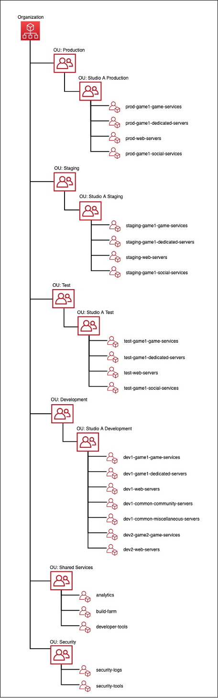

#

Prepare

| GAMEOPS01 • How do you define your game's live operations (LiveOps) strategy? |
| ---------------------------------------------------------------------------------- |
|                                                                                    |

**GAMEOPS_BP01: Use game objectives and business performance metrics to develop your live operations strategy.**

You should consult business stakeholders, such as game producers and publishing
partners, to determine objectives and performance metrics for a game. This can help you
to develop plans for how you will manage the game, including defining your maintenance
windows, software and infrastructure update schedules, and system reliability and
recoverability goals.

For example, you might define targets for player concurrency (CCU), daily and
monthly active user targets (DAU/MAU), infrastructure budget, financial targets, or
other performance metrics such as the frequency for release of new content and features,
or the frequency of in-game events and promotions to increase player engagement. These
objectives and metrics feed into decisions about the game design, release management,
observability, and support that is needed for efficient operations.

Your game might have an objective to release new content updates at least once each
month with no downtime during release. This information can help you to define your
release deployment strategy and coordinate the scheduling of required maintenance that
may require downtime at other times throughout the month and contribute towards your
availability SLA.

These metrics can also help you to determine at which stage of your game's lifecycle
you should incorporate a live operations team (Live Ops) to monitor game health, collect
direct game feedback, and build streamlined and automated release processes. For
example, a new game might wait until a certain scale is achieved, measured by active
player count, revenue, or another set of metrics, before setting up a dedicated live
operations team. An established game development studio might already have live
operations experience, perhaps for their other games, so they’d only need to on-board
the new game.

**GAMEOPS_BP02: Validate and test your existing game software before reusing it in your game**

Organizations tend to reuse existing components and source code (from a previous game)
to save on development time and cost. These legacy components and/or code may not be
subjected to a thorough review, or have detailed integration testing, and instead rely
on their past performance. While reuse helps improve productivity, it can also introduce
the risk of reintroducing past performance and stability issues into a new project.
Therefore, when reusing existing components and source code from previous games, robust
testing should be implemented.

For example, if the source code and components that were designed, written, and tested
for Game A are reused in Game B, they might not be able to handle all the conditions
that Game B requires. During a production incident, the developers might not have
sufficient knowledge to debug and fix that code/component, or the time to rewrite it to
alleviate their operational pain. If the original authors of the code are unavailable,
that can increase the time to implement appropriate fixes. It is recommended that if
previously used code or components had an issue, replacing or fixing them must be a
priority before they are used again, without waiting for them to impact operations
again.

| GAMEOPS02 • How do you structure your accounts for hosting your game environments? |
| ---------------------------------------------------------------------------------------- |
|                                                                                          |

**GAMEOPS_BP03: Adopt a multi-account strategy to isolate different games and applications into their own accounts.**

A game architecture deployed in AWS should use multiple accounts that are logically
organized to provide proper isolation, which reduces the blast radius of issues and
simplifies operations as your game infrastructure scales. AWS accounts that host game
infrastructure are typically grouped into the following logical environments:

- **Game development environments (Dev)**
  are used by developers for developing the software and systems for the game.
- **Test or QA environments**
  are used for performing integration testing, manual quality assurance (QA), and any other automated testing that must be conducted.
- **Staging or pre-production environments**
  are used for hosting final built software so that load testing and smoke testing can be conducted prior to launching to production.
- **Live or production environments**
  are used for hosting the live software and infrastructure and serving production traffic from players.
- **Shared services or tools environments**
  provide access to common platforms, software, and tools that are used by many different teams. For example, a central self-hosted source control repository and game build farm might be hosted in a shared services account.
- **Security environments**
  are used for consolidating centralized logs and security technologies that are used by teams that focus on cloud security.
  For game infrastructure on AWS, it is recommended to create separate accounts for
  each game environment (dev, test, staging, prod), as well as accounts for security,
  logging, and central shared services.

Typically, smaller game development studios that manage a limited number of
infrastructure resources, usually a few hundred servers or less, may desire to create
one AWS account for each of these environments, for example, one production account,
one development account, and one staging account. However, as your game infrastructure
or team size grows over time, this simplified model may not scale well. When setting up
these environments, it is important to consider that many AWS services share resource
and API-level [Service Quotas](../../../servicequotas/latest/userguide/intro.md "../../../servicequotas/latest/userguide/intro.md") for an entire
account within a particular Region. This must be considered when determining how to
logically organize accounts. AWS accounts only incur cost for consuming services
deployed into them. Therefore, this provides a way to effectively reduce resource
contention and service quotas, particularly as your game grows and more developers need
access to build and manage resources.

Based on our experience working with larger game development studios that typically
operate thousands of servers with hundreds of developers accessing resources, we
recommend to design a more fine-grained account structure where individual applications
supporting your game have their own development, test, staging, and production accounts
for each. Our experience supporting large and successful games shows that it is
difficult and time consuming to re-design your AWSmulti-account strategy after you
have launched your game due to the complexity in planning and migrating live systems.
Consider your future scaling needs when determining the right multi-account structure.

[AWS Organizations](https://aws.amazon.com/organizations/ "https://aws.amazon.com/organizations/") can be used
to set up a hierarchy and grouping of AWS accounts, and define [organizational units](../../../organizations/latest/userguide/orgs_manage_ous.md "../../../organizations/latest/userguide/orgs_manage_ous.md") (OUs) to apply common OU-level policies to them through
[service control
policies](../../../organizations/latest/userguide/orgs_manage_policies_scps.md "../../../organizations/latest/userguide/orgs_manage_policies_scps.md") (SCPs). AWS Organizations helps you centrally manage and govern
your environment as you grow and scale your resources. You can programmatically create
new accounts and allocate resources, group accounts to organize your workflows, apply
policies to accounts or groups for governance, and simplify billing by using a single
payment method for all of your accounts. Additionally, Organizations is integrated with
other services so that you can define central configurations, security mechanisms, audit
requirements, and resource sharing across accounts in your organization.

[AWS Control Tower](https://aws.amazon.com/controltower/ "https://aws.amazon.com/controltower/") provides the
easiest way to set up and govern a secure, multi-account environment, called a landing
zone. Control Tower creates your landing zone using AWS Organizations, bringing
ongoing account management and governance as well as implementation best practices based
on AWS’s experience working with thousands of customers as they move to the cloud.
[AWS Config](https://aws.amazon.com/config/ "https://aws.amazon.com/config/"), [AWS Trusted Advisor](https://aws.amazon.com/premiumsupport/technology/trusted-advisor/ "https://aws.amazon.com/premiumsupport/technology/trusted-advisor/"), and
[Security Hub](https://aws.amazon.com/security-hub/ "https://aws.amazon.com/security-hub/") are services that
provide with an aggregated or centralized view of your account’s hygiene.

Such isolation allows you to set up custom or individual permissions and guardrails to
each game environment. Production accounts should have all the necessary guardrails,
access restrictions, monitoring and alerting, and security tools, while non-production
accounts may not require the same level of guardrails and permissions. Non-production
environments can be automated to shutdown resources after hours and save costs.
Separation of accounts at this level of granularity makes it easier to monitor
infrastructure costs for each of the environments supporting a game.

The following is an example of a multi-account structure for a game company using
AWS Organizations, and organizational units (OUs) to logically group AWS accounts
into separate environments and studios. In this example, OUs are used to group together
accounts based on their environment, and then based on the studio that operates the
environment. This demonstrates how you can create a nested hierarchy to allow separate
applications and games to be deployed into their own accounts, which can be useful if
you develop and operate multiple games. Refer to the documentation and whitepapers
provided in the resources section of this pillar to learn about additional strategies
that you can consider for organizing your multi-account strategy.

_Example of account structure for game environments_

**GAMEOPS_BP04: Organize infrastructure resources using resource tagging.**

To effectively manage and track your [infrastructure resources](../../../whitepapers/latest/cost-optimization-laying-the-foundation/tagging.md "../../../whitepapers/latest/cost-optimization-laying-the-foundation/tagging.md") in AWS, it is recommended to use proper [resource tagging](../../../general/latest/gr/aws_tagging.md "../../../general/latest/gr/aws_tagging.md")
and [grouping](../../../ARG/latest/userguide/welcome.md "../../../ARG/latest/userguide/welcome.md")
that can help identify each resource’s owner, project, app, cost-center, and other data.
Tagged resources can be grouped together, using[resource groups](../../../ARG/latest/userguide/welcome.md "../../../ARG/latest/userguide/welcome.md"), which assists with
operational support.

As a best practice, you should define [tagging
policies](../../../organizations/latest/userguide/orgs_manage_policies_tag-policies.md "../../../organizations/latest/userguide/orgs_manage_policies_tag-policies.md"). Typical strategies include resource tags for identifying the
resource owner, such as team name or individual name, the name of the game/app/project
name, the studio name, environment (such as dev, test, prod, staging, or common), and
the role of the resource (such as, database server, web server, dedicated game server,
app server, or cache server). You can add any other tags to help with business and IT
needs. [AWS Config](https://aws.amazon.com/config/ "https://aws.amazon.com/config/") can also help to
enforce a [tagging policy](../../../config/latest/developerguide/required-tags.md "../../../config/latest/developerguide/required-tags.md") at
resource creation and update time. Tags and resource groups are available from the
AWS Management Console, the AWS CLI, and API operations.

| GAMEOPS03 • How do you manage game deployments? |
| -------------------------------------------------- |
|                                                    |

**GAMEOPS_BP05: Adopt a deployment strategy that minimizes impact to players.**

You should incorporate a deployment strategy for your game software and infrastructure
that minimizes the amount of downtime that keeps players out of your game. While certain
types of updates might require installing new updates to the game client, the game
backend should be designed to minimize or eliminate the need for downtime during
deployments.

One of the most important steps to consider when developing a game deployment
strategy is to determine how your game infrastructure will be managed. It is a best
practice to manage your game infrastructure using an infrastructure as code (IaC) tool
such as [AWS CloudFormation](https://aws.amazon.com/cloudformation/ "https://aws.amazon.com/cloudformation/") or
[Terraform by Hashicorp](https://www.terraform.io/ "https://www.terraform.io/") to reduce human
errors during environment preparation. Infrastructure templates can be deployed and
tested in automated pipelines, which allows you to create consistency in the
configuration of different game environments.

There are several deployment strategies that can be used for a game:

**Rolling substitution:** The primary objective of a
rolling substitution for deployment is to perform the release without shutting down the
game and without impacting any players. It is important that the upgrade or changes that
are to be performed are backward compatible and will work adjacent to the previous
versions of the system.

As the name suggests, in this deployment the server instances are incrementally
replaced (substituted or rolled-out) by instances running the updated version. This
rolling substitution can be performed in a few different ways. For example, to implement
rolling updates to a fleet of dedicated game servers, a typical approach involves
creating a new Auto Scaling group of EC2 instances that contain the new game server
build version deployed onto them, and then gradually routing players into game sessions
hosted on this new fleet of servers. If there is an associated game client update that
is required as a prerequisite in order to use the new game server build, then you must
include a validation check to ensure that only players that have this new game client
update installed are routed into these game sessions.

Server fleets (for example, EC2 Auto Scaling groups) containing the old game server
build version are only removed from service after they are drained of all active player
sessions in a graceful manner, typically by setting up per-server metrics that allow
game operations teams to automate this process. Alternatively, to reduce the amount of
infrastructure and time to conduct a rolling deployment, an approach can be performed
where existing production instances are removed from service, updated with the new game
server build, and then placed back into the production fleet. This approach reduces the
amount of infrastructure that is required, but it also increases risk since the number
of available live game servers for players is reduced as servers are being replaced.

This model can also be used for performing rolling deployments to backend services such as databases, caches, and application servers that don't host gameplay. As long as these services are deployed in a highly-available manner with multiple clustered instances, then the complexity of deployments to these services should be less than deployments to dedicated game servers.

**Blue/green deployment:** The primary objective of a
blue/green deployment in a game is to minimize downtime while also allowing safe
rollback to the previous deployment if any issues are identified. It is suitable for
deployments where two versions of the game backend are compatible and can serve players
simultaneously. In the blue/green deployment strategy, two identical environments (blue
and green) are set up and the existing game version is labeled as blue, while the new
game version that is the deployment target is labeled as green. When the green
environment is ready for migration, you can configure your routing layer to flip the
traffic over to the green environment while keeping the old environment (blue) available
for a period of time in case failback is needed. In this scenario, the routing updates
might require updating the matchmaking service to configure it to begin sending game
sessions to the new fleet, or in the case of game backend services this could be
updating DNS records in Route 53 for your service or [shifting application load balancer weights](https://aws.amazon.com/blogs/aws/new-application-load-balancer-simplifies-deployment-with-weighted-target-groups/ "https://aws.amazon.com/blogs/aws/new-application-load-balancer-simplifies-deployment-with-weighted-target-groups/") to send traffic to your new target
group.

One of the drawbacks of the blue/green deployment strategy is the inherent cost of
the standby environment due to the additional infrastructure that is required while
performing the deployment. An option to mitigate this additional infrastructure cost is
to consider adopting a variant of blue/green deployment where new game software is
deployed onto the same servers that are already deployed into production. In this
scenario, a new green server process can be started with the new software alongside the
existing blue server process, with the cut over happening between server processes
rather than between completely separate physical infrastructure. This approach can also
speed up game deployments across a large amount of infrastructure by removing the need
to wait for new servers to be launched in the cloud. Refer to the [Blue/Green Deployments on AWS](../../../whitepapers/latest/blue-green-deployments/welcome.md "../../../whitepapers/latest/blue-green-deployments/welcome.md") whitepaper to learn more about best practices
for this deployment approach.

**Canary deployment:**
Canary deployment is of particular interest to game developers, as the strategy can be applied to release an early alpha/beta build of a game, or a game feature like a new game mode/map/challenge to a restricted or small set of players in-production. Such a deployment is called a canary. The release may have additional tracking and reporting, so when real players play that game/feature, their game play telemetry is collected and analyzed for anomalies/issues. For new features, the players are not always notified about this, and the game telemetry is the primary source used to determine if players are experiencing issues, and if the release should be rolled-back. At the same time, if no significant issues are identified, the feature can then be further rolled-out to more players for additional data. If the players are notified, then they can be asked to provide regular feedback about their experience. Such test activity would ideally be coordinated by a live operations team.

As a strategy, canary deployment can also be used for standard releases, to gradually
make a new feature available to the players. A potential advantage over the standard
blue/green environment is that a full-scale second environment does not need to be set
up. The capacity of the new scaled-down environment determines how many players are to
be onboarded to the new feature. Before adding more players, the capacity has to be
scaled appropriately. Even if this customized blue/green technique is expected to cost
comparatively lesser than standard blue/green, it is still estimated to incur cost that
may be higher than the rolling substitution technique of canary deployments.

It is recommended to run only a single canary on a production environment, and to
focus it for its data and feedback. If multiple canaries are deployed, it complicates
troubleshooting and isolating of issues in production, and impairs the quality of the
datasets and feedback being collected.

A variation in the canary is when one or more experiments (generally UI tests) are
run via targeted deployments, where one set of the game backend servers serve one
version of a feature, and another same sized set serve another version of the same
feature. No additional/special infrastructure is spun up for this, and only the chosen
backend servers receive these updates. The outcome of the experiments is to observe how
players react to each of the versions of the same feature, and if there is a consensus
of overall like or dislike, and to observe if there are any issues identified with its
usability or functionality, and other such intended results. Such strategic experiments
are also called A/B tests, and the overall process is called **A/B
testing**. On completion of these experiments, any necessary test data is
collected before reverting to the current version of the game backend system on the
servers used for the tests.

**Legacy traditional deployment:** In the traditional style
of deployment, during a scheduled maintenance window the game is shut down and all
connected players are dropped or drained before all server instances within the game
backend are updated with the latest code builds. This deployment impacts all players
each time it is performed, and the players must be notified ahead of the schedule. As a
result, this model results in the most player impact and should be avoided whenever
possible. After the game update is deployed, the game can be smoke tested prior to
opening up the game to the players, who would be waiting for the game to reopen. This
can cause a spike of traffic when all players try to login and play within a short
period of time. Therefore, if the game is not designed to handle such spikes of traffic,
you can choose to gradually allow players back into the game in batches. Alternatively,
you can opt to over-provision the infrastructure to sustain the opening spike of
traffic, and eventually after the game traffic settles, resources can be scaled down. It
is recommended that this type of deployment be conducted during off-peak hours when the
number of players is at its lowest. Frequently scheduled maintenance, as well as
extended maintenance, inherently carries a risk of player attrition and potential loss
of revenue. Players also expect changes after a new release and can lose trust in the
game once returning after a period of downtime.

**GAMEOPS_BP06: Pre-scale infrastructure required to support peak requirements**

You should scale infrastructure ahead of large-scale game events to make sure that you
can handle the sudden increase in player demand.

In addition to new game launches, live games typically run in-game events, promotions,
new content, and season releases as examples of ways to sustain and improve player
engagement. Such activities experience a high volume of player traffic for the duration
of the event or promotion. The business expects to hit or surpass their intended targets
for the event, and the game infrastructure must sustain and support them through it. It
is important to prepare your infrastructure ahead of time to be able to support the
anticipated player load that you will experience during large scale events. To prepare,
game operations teams should coordinate with stakeholders in sales and marketing to
estimate the projected demand that will be generated in an upcoming event by looking at
past player concurrency, engagement metrics, and sales data. If the event is for a new
game launch, game operations teams should work with these stakeholders to identify
realistic projections for what scale they anticipate. While it may be difficult to
predict how successful a game will become, it is important that everyone understands
what the expectations are for success so that the infrastructure can be scaled and
tested to support those goals.

Many games choose to launch in stages, starting with a soft-launch by opening the game to a small number of players, and then organically scaling the players at every stage, prior to a full public launch. During the soft-launch period, it is recommended to monitor, identify, track, and resolve any issues while refining your projections for the public launch.

To properly estimate infrastructure requirements, you should collect data through load and performance tests run against your game backends running on production, or a production-like staging environment, prior to the game launch. Multiple rounds of these tests should be run to simulate different conditions of the game, and validate that the backend is able to withstand the load under all conditions. To achieve this, developers can write game play bots that traverse various workflows in the game, and emulate different conditions. It is imperative that these tests inspect all the different system layers of the game backend so that each layer and component is tested and the details are recorded. The data collected from these tests is used for the provision planning for the game launch.

Single points of failure (SPOF) should be removed, when possible, by making the
application more highly available and fault tolerant. Use load tests to find any SPOFs
by emulating failures at different upstream and downstream layers, and verifying game
and other component behavior.

Along with the necessary estimated infrastructure to be provisioned for the game
launch, or in-game event or promotion preparations, the system should also be set up to
automatically scale on-demand. Scaling event thresholds must be defined, configured, and
monitored to allow the game backend to scale to sustain a high volume of player traffic.
For variable traffic, pre-provisioning is best because there may not be enough time to
scale-out. Manual scaling might be required during initial game launches that drive
higher than anticipated demand faster than automated systems can scale resources.

On AWS, organizations should request higher [Service Quotas](../../../general/latest/gr/aws_service_limits.md "../../../general/latest/gr/aws_service_limits.md") for the
services that they use in the game backend. Service Quotas are set up for all accounts
to safeguard customers from inadvertently standing up or scaling more infrastructure
than intended. There is no cost for higher quotas until additional resources are
consumed. When a game running in an account hits the upper limit of the configured
service quota in that Region, the service throttles all the requests beyond the
provisioned quota, and any burst provisions. Throttles can cause unintended or
unexpected errors, and impair the player experience. It is essential to monitor, track,
and regularly review service quota thresholds for all the services used by the game
in-production to avoid throttling. When the usage crosses a tolerable service quota
threshold, an increase in the quota can be requested by raising an [Support
Case](../../../awssupport/latest/user/getting-started.md "../../../awssupport/latest/user/getting-started.md") from the Console Support Center, after logging in to the affected
account, or via the [Support API](../../../awssupport/latest/APIReference/Welcome.md "../../../awssupport/latest/APIReference/Welcome.md").

If you are launching a game hosted on Amazon GameLift Servers, review the [pre-launch checklists](../../../gamelift/latest/developerguide/gamelift_quickstart_customservers_launch.md "../../../gamelift/latest/developerguide/gamelift_quickstart_customservers_launch.md") to help you prepare.

**GAMEOPS_BP07: Conduct performance engineering and load testing before launch by simulating player behavior**

To prepare for a launch, you should develop gameplay simulations that can be tested at
scale against your infrastructure to ensure that you can scale to meet your peak usage
requirements.

Performance engineering is the process of monitoring multiple key operational metrics
of an app to discover optimization opportunities that can further improve the app’s
performance. This is an iterative process that starts with testing, followed by
optimizing code, its dependencies, associated processes, its host operating system, and
the underlying infrastructure.

To conduct a deeper analysis of the app’s performance, it is recommended to integrate an Application Performance Monitoring (APM) or debugging tool in the app code that can isolate issues and reduce troubleshooting time by tracking its behavior for anomalies across all flows of the app. APM tools are also able to identify slow performing methods and external operations.

[AWS X-Ray](https://aws.amazon.com/xray/ "https://aws.amazon.com/xray/") helps developers with their
performance engineering activities, like identifying performance bottlenecks and
analyzing and debugging production errors. You can use X-Ray to understand how your
application and its underlying services are performing, and identify and troubleshoot
the root cause of performance issues and errors. Through numerous rounds of load tests,
in which the app and its infrastructure is gradually loaded with synthetic player
traffic, various system bottle-necks, app errors, exceptions, OS problems, and other
issues are identified that may have not been found during other Quality Assurance (QA)
tests.

To simulate artificial player traffic, you need bots that emulate the game client
flows and transact with the game backend to simulate real-world player behavior.
Generally, this data is captured through game play logs and data generated by human QA
tests, as well as through real-world limited scale alpha or beta tests where real
players are invited to play the game.

It is also recommended to perform load testing and inject different kinds of failures
in the game backend during these various load tests to check how the system behaves for
each failure. It is important to record the system’s behavior in an operational runbook
to assist in troubleshooting possible failures in the future. It is important to have
human testers test the game against the same environment that is being load tested while
it is being load tested. Humans can catch something during the load test that bots or
other metrics do not.

For critical events like game launches, and even major in-game events or promotions,
[AWS Infrastrucure Event
Management (IEM).](https://aws.amazon.com/premiumsupport/programs/iem/ "https://aws.amazon.com/premiumsupport/programs/iem/") is available. An IEM offers architectural and operational
guidance, along with operational support during the preparation and deployment of your
planned event like a game launch, or a major in-game event, promotion, or migration.
Through the IEM process, assists in assessing operational readiness of your system,
identifying and mitigating risks, and deploying your event confidently with all
additional experts.

[AWS Fault Injection Simulator](https://aws.amazon.com/fis/ "https://aws.amazon.com/fis/") is a fully
managed service for running fault injection experiments on that makes it easier to
improve an application’s performance, observability, and resiliency. Fault injection
experiments are used in chaos engineering, which is the practice of stressing an
application in testing or production environments by creating disruptive events, such as
sudden increase in CPU or memory consumption, observing how the system responds, and
implementing improvements. Fault injection experiment helps teams create the real-world
conditions needed to uncover the hidden bugs, monitoring blind spots, and performance
bottlenecks that are difficult to find in distributed systems.
