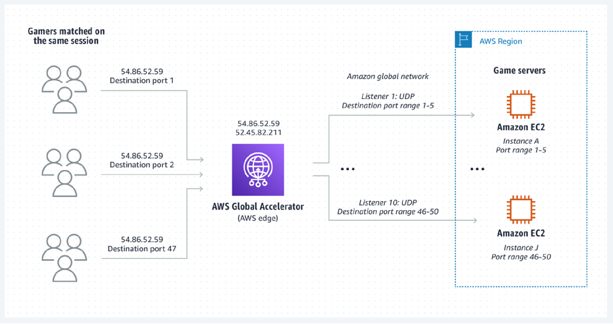

# Selection

| GAMEPERF01 — How do you determine which geographic regions to host your game infrastructure? |
| ----------------------------------------------------------------------------------------------- |
|                                                                                                 |

**GAMEPERF_BP01 — Review feedback from players and business stakeholders.**

For an initial game launch, you should determine where to deploy infrastructure based on discussions with your business stakeholders, such as publishing teams who can help you determine where the game is expected to be made available to players, and where they are focusing their pre-launch marketing and advertising efforts.

Your business stakeholders should also have mechanisms to stimulate demand to help
gain a better understanding of player reception and viability. For example, these teams
will have mechanisms such as game pre-orders, marketing events and campaigns, public
email lists for players to register interest before launch, and other approaches to
establish relevant signals to help them determine where the game will likely have the
most players at launch. The game may also use a pre-determined regional roll out
strategy with which you can play test and soft-launch to further help you determine
Regional player demand.

**GAMEPERF_BP02 - Design an approach that supports placing latency-sensitive game infrastructure close to players to improve performance.**

When first launching a game, you may not yet have enough information about your player base to adequately know where best to deploy infrastructure closest to the players that are most interested in playing your game. This is a common challenge, and you should prepare for this scenario by designing an architecture that allows you to rapidly adjust your hosting strategy to deploy servers where they are needed closer to players. It is typical for game developers to regularly assess their game infrastructure deployment as a recurring activity post-launch in order to incrementally invest in improvements over time with an iterative approach.

A best practice is to use infrastructure-as-code templates, such as AWS
CloudFormation or Terraform, for the configuration of your infrastructure such as VPCs,
subnet configurations, and any dependencies required to launch critical game services so
that you can refer to these templates, quickly customize them if needed, and deploy them
into locations where additional infrastructure is needed to support your players.

You should also make sure you understand how your current deployment strategy could be evolved to allow future expansion. For example, make sure to consider the size of the subnets you are creating for the hosting of game servers and be sure they are large enough to accommodate growth. You should also consider how game servers deployed across multiple locations will connect to your game backend, which may be hosted in a central location or in multiple locations, and may require additional configuration to support private connectivity. These considerations should be continuously evaluated over time so that you can make changes to your game hosting strategy as your game's requirements evolve over time or your player requirements change.

When determining how many game hosting locations to use for your game, you should consider the following factors:

- **Quality of player experience improvement:**
  How much of a player experience improvement can you introduce by adding additional game hosting locations? What is the incremental performance gain that you can achieve by doing so? How will you measure this performance improvement?
- **Which player populations to prioritize:**
  How many players can you improve the experience for if you add additional game hosting locations? Which player populations, or geographic locations, will you prioritize?
- **Downstream impacts of change:**
  If you change your game hosting strategy, how will this influence your matchmaking wait times for players? Does the match size, or number of players required in order to form a game session, impact your ability to build sizable player populations in different parts of the world if you introduce change?
  Each of these considerations should be evaluated as you determine where you add or
  remove game hosting locations. For example, you may choose to prioritize improving the
  experience for players in geographic locations with the least performant gameplay
  experience, or for players who express the most vocal feedback publicly or to your
  community management teams. You might also choose to factor the player monetization into
  your priorities, for example by focusing attention on improving the experience for
  players in geographic locations that generate a significant source of revenue for your
  game, or have the potential to generate incremental revenue if you introduce performance
  improvements.

In addition to hosting infrastructure in AWS Regions, you can use [Local
Zones](https://aws.amazon.com/about-aws/global-infrastructure/localzones/ "https://aws.amazon.com/about-aws/global-infrastructure/localzones/"), which are an extension of an AWS Region, to host your game servers
and other latency sensitive applications such as voice chat servers closer to your
players. You might also choose to run game development infrastructure in Local Zones to
improve the experience for your game development teams. For example, you can use Local
Zones to address use cases such as hosting replicas of your self-managed source control
servers closer to your game developers, and to offer game development virtual
workstations and content storage to users using Amazon EC2 instances, EBS volumes, and
Amazon FSx file systems deployed into one or more Local Zones near your development
studios without requiring you to host the infrastructure on-premises.

You can also extend the capabilities of into your existing on-premises data centers
and co-location facilities by using [Outposts](https://aws.amazon.com/outposts/ "https://aws.amazon.com/outposts/"), which is a fully managed service that provides access to the same
services and APIs using purpose-built racks and rack-mountable server options. This can
help you to create a consistent deployment model across Regions, Local Zones, and
Outposts deployed in your facilities. If you are building games using containers and
want the flexibility to adopt a hybrid deployment architecture using open-source
software that can be deployed on your own infrastructure, you can use [ECS Anywhere](https://aws.amazon.com/ecs/anywhere/ "https://aws.amazon.com/ecs/anywhere/"), or [EKS Anywhere](https://aws.amazon.com/eks/eks-anywhere/ "https://aws.amazon.com/eks/eks-anywhere/") if you want to operate a Kubernetes-based
infrastructure.

**GAMEPERF_BP03 - Use network acceleration technology to improve performance across the internet.**

_Enhanced network performance for gaming using Global
Accelerator_
In addition to physically placing latency-sensitive game infrastructure closer to
players, you can also improve the player experience by optimizing the network
performance for your game. Use technologies that can improve your game infrastructure's
connectivity to the networks, or internet service providers (ISPs), that your players
are connecting to your game from. Network acceleration improves performance by
optimizing the networking path that is used to route player traffic from their game
client across the internet to your game infrastructure, including your game servers and
game backend services. For example, [AWS Global Accelerator](https://aws.amazon.com/global-accelerator "https://aws.amazon.com/global-accelerator") is a networking service that improves your
application's network performance using the global network, which can be used to
accelerate your gameplay traffic, voice chat, and real-time messaging traffic, as well
as other latency-sensitive applications. Global Accelerator [custom routing accelerators](https://aws.amazon.com/blogs/networking-and-content-delivery/introducing-aws-global-accelerator-custom-routing-accelerators/ "https://aws.amazon.com/blogs/networking-and-content-delivery/introducing-aws-global-accelerator-custom-routing-accelerators/") can be integrated with your matchmaking service
to provide deterministic routing of multiple players to the same game session IP address
and port.

Your game development teams may be distributed around the world and require
performant access to shared content or assets. To improve the performance for shared
content stored in Amazon S3 buckets, you can setup bi-directional replication of your
data across regions using [S3 Cross-Region Replication](../../../AmazonS3/latest/userguide/replication.md "../../../AmazonS3/latest/userguide/replication.md")
so that users can access data from buckets closer to them. To simplify this access
pattern, use [S3 Multi-Region Access
Points](../../../AmazonS3/latest/userguide/MultiRegionAccessPoints.md "../../../AmazonS3/latest/userguide/MultiRegionAccessPoints.md") which accelerates requests to S3 over the global network using Global
Accelerator. For more information, refer to [Improving the Player Experience by Leveraging Global Accelerator and Amazon GameLift Servers
FleetIQ](https://aws.amazon.com/blogs/gametech/improving-the-player-experience-by-leveraging-aws-global-accelerator-and-amazon-gamelift-fleetiq/ "https://aws.amazon.com/blogs/gametech/improving-the-player-experience-by-leveraging-aws-global-accelerator-and-amazon-gamelift-fleetiq/").

| GAMEPERF02 — How do you prevent game sessions from over-utilizing resources and impacting other players running on the same game server instance? |
| ---------------------------------------------------------------------------------------------------------------------------------------------------- |
|                                                                                                                                                      |

**GAMEPERF_BP04 - Monitor game server processes to detect issues.**

You might run multiple game server processes per instance to efficiently utilize the
resources on your game server instances. If so, you should make sure to design your
architecture so that an individual game server process hosting a game session cannot
cause adverse impact to other game sessions hosted on the same game server
instance.

Implement monitoring of the limited resources available to your game server instances
so that you can generate alerts when individual game server processes are breaching
pre-determined resource budget thresholds. When thresholds are breached, you may want to
configure your game server software to dump relevant system and game server logs out to
durable storage, such as a central logging solution, so that your game server engineers
can investigate this behavior. Additionally, your game server instance should be
configured to report metrics from each of the game server processes running on the
instance so that you can monitor these individual game server processes in addition to
the overall metrics for the game server instance. For example, Amazon GameLift Servers provides metrics
for [monitoring game
sessions](../../../gamelift/latest/developerguide/monitoring-cloudwatch.md "../../../gamelift/latest/developerguide/monitoring-cloudwatch.md"), which can be augmented with custom game-specific metrics and logs
collected using the [Amazon
CloudWatch Agent](../../../AmazonCloudWatch/latest/monitoring/Install-CloudWatch-Agent.md "../../../AmazonCloudWatch/latest/monitoring/Install-CloudWatch-Agent.md") which you can configure on your game server instance. Your
metrics can be viewed in CloudWatch or exported to other tools such as [Amazon Managed Grafana](https://aws.amazon.com/grafana/ "https://aws.amazon.com/grafana/") which is integrated
with Single Sign-On to make it easier to access metrics by users who may not have access
to the Management Console. Refer to the following best practices for [managing logs and metrics using Amazon GameLift Servers](../../../gamelift/latest/developerguide/gamelift_quickstart_customservers_metrics.md "../../../gamelift/latest/developerguide/gamelift_quickstart_customservers_metrics.md"), which also provides support for
viewing individual [game session
logs](../../../gamelift/latest/apireference/API_GetGameSessionLogUrl.md "../../../gamelift/latest/apireference/API_GetGameSessionLogUrl.md").

**GAMEPERF_BP05 - Performance test your game server with simulated and real gameplay scenarios.**

You should conduct performance testing and evaluate various gameplay scenarios to
determine whether the game server process handles the utilization of fixed resources
appropriately, such as EC2 instance memory, CPU, and network bandwidth.

You should create simulated gameplay tests with bots that can mirror common gameplay
paths and behaviors of your players so that you can determine how your game server
processes handle this under different usage scenarios. For example, you can implement a
solution, such as [Distributed Load
Testing on AWS](https://aws.amazon.com/solutions/implementations/distributed-load-testing-on-aws/ "https://aws.amazon.com/solutions/implementations/distributed-load-testing-on-aws/") that you can customize to run game client simulations or game
client builds to generate gameplay scenarios. Run internal play tests and use QA teams
to stress test the various features of your game so that you can develop confidence that
your game is designed to perform optimally. [AWS Device Farm](https://aws.amazon.com/device-farm/ "https://aws.amazon.com/device-farm/") can be used to perform mobile and web testing for your iOS,
Android, and browser games.

| GAMEPERF03 — How do you select the appropriate compute solution for your game? |
| --------------------------------------------------------------------------------- |
|                                                                                   |

**GAMEPERF_BP06 - Benchmark your game performance across multiple compute types.**

For game server workloads, there is no one-size-fits-all approach to identifying the
optimal compute solution for hosting your game server. A common choice for game server
is to use the compute-optimized EC2 instances, because this instance family is optimized
for workloads like game servers that are computationally intensive. Alternatively, if
your game requires a significant amount of memory in order to implement specific
features, the memory-optimized instances may be most suitable.

For use cases where your workload utilizes significant network resources, consider
implementing instances that are network-optimized which is typically indicated by the
use of an "`n`" in the instance name. Games are sensitive to latency and
dropped packets, so it is recommended to use EC2 enhanced networking to improve the
network performance of your game servers. Enhanced networking uses single root I/O
virtualization (SR-IOV) to provide high-performance networking capabilities on [supported
instance types](../../../AWSEC2/latest/UserGuide/enhanced-networking.md#supported_instances "../../../AWSEC2/latest/UserGuide/enhanced-networking.md#supported_instances") . SR-IOV is a method of device virtualization that provides
higher I/O performance and lower CPU utilization when compared to traditional
virtualized network interfaces. Enhanced networking provides higher bandwidth, higher
packet per second (PPS) performance, and consistently lower inter-instance latencies.
Enhanced networking with Elastic Network Adapter is available for most recent EC2
instance types.

If your game performs similarly across multiple EC2 instance types, then you should consider using multiple instance types to host your game servers so that you can monitor performance over time and perform further optimization after you have hosted enough production game sessions to be able to identify performance trends over time. Remember that your resource requirements may change over time as you add new features into your game that require different allocation of resources. You can
[configure EC2 Auto Scaling groups](../../../autoscaling/ec2/userguide/asg-purchase-options.md "../../../autoscaling/ec2/userguide/asg-purchase-options.md")
to use multiple instance types, or you can use separate Auto Scaling groups to host game server instances that run separate instance types which may make it easier to manage correlation and aggregation of metrics.

You should also evaluate how your game performs on different types of processors such as Intel-based instances, AMD-based instances, and ARM-based Graviton instances.

You should also benchmark how your game performance is impacted when it is hosted
using containers and Lambda functions. For use cases where long-lived game server
processes are not required, such as asynchronous games and for game backend services,
you should consider using a serverless architecture with Lambda which can simplify
management and operations for game operations teams, as well as allow you to more
quickly deploy your game globally to many AWS Regions. For serverless best practices,
refer to the [Serverless
Applications Lens - Well-Architected Framework](../serverless-applications-lens/welcome.md "../serverless-applications-lens/welcome.md"). For more information, refer to
[Choose the right compute strategy for your global game servers](https://aws.amazon.com/blogs/gametech/choose-the-right-compute-strategy-for-your-global-game-servers/ "https://aws.amazon.com/blogs/gametech/choose-the-right-compute-strategy-for-your-global-game-servers/").

**GAMEPERF_BP07 - Use graphics instances for game development virtual workstations.**

Game designers, engineers, artists, QA, and other personnel may require the use of
virtual workstations. To support these use cases, use graphics-optimized instances,
which are denoted with an instance name starting with "`g`", as are built
using GPUs that are purpose-built to support graphics use cases such as game development
and game streaming.

Evaluate and benchmark performance across different graphics-optimized instance types
using the same tools that your end users typically require. For example, offers a
variety of graphics-optimized instances that come with different GPUs from manufacturers
such as AMD and NVIDIA. When benchmarking these instances, make sure that your software
is compatible with the GPU and associated drivers that are supported. For graphical
artist use cases, consider [Amazon Nimble
Studio](https://aws.amazon.com/nimble-studio "https://aws.amazon.com/nimble-studio") which provides access to cloud-based virtual workstations, file storage
and tools needed for operating a cloud-based studio.

If you are developing your own custom virtual workstation using EC2, you must
consider how end users will access these virtual workstations. While many options exist
for connectivity, consider using [NICE
DCV](https://aws.amazon.com/hpc/dcv/ "https://aws.amazon.com/hpc/dcv/"), a high-performance remote display protocol for connecting to remote
desktops from a locally installed client software or web browser, which is no cost and
is available in the [AWS
Marketplace](https://aws.amazon.com/marketplace/seller-profile?id=74eff437-1315-4130-8b04-27da3fa01de1 "https://aws.amazon.com/marketplace/seller-profile?id=74eff437-1315-4130-8b04-27da3fa01de1") as an Amazon Machine Image (AMI) with NICE DCV server
pre-installed.

For more information, refer to the following:

- [Virtual workstations on powered by NVIDIA Quadro technology](https://aws.amazon.com/blogs/media/virtual-workstations-on-aws-powered-by-nvidia-quadro-technology/ "https://aws.amazon.com/blogs/media/virtual-workstations-on-aws-powered-by-nvidia-quadro-technology/")
- [Game Production in the Cloud - Workstations: Stream Game Development from anywhere with NICE DCV](https://d1.awsstatic.com/architecture-diagrams/ArchitectureDiagrams/game-production-in-the-cloud-workstations-ra.pdf "https://d1.awsstatic.com/architecture-diagrams/ArchitectureDiagrams/game-production-in-the-cloud-workstations-ra.pdf")
- [Stream a remote environment with NICE DCV over QUIC UDP for a 4K monitor at 60 FPS](https://aws.amazon.com/blogs/gametech/stream-remote-environment-nice-dcv-quic-udp-4k-monitor-60-fps/ "https://aws.amazon.com/blogs/gametech/stream-remote-environment-nice-dcv-quic-udp-4k-monitor-60-fps/")
- [Putting bitrates
  into perspective](https://aws.amazon.com/blogs/hpc/putting-bitrates-into-perspective/ "https://aws.amazon.com/blogs/hpc/putting-bitrates-into-perspective/")

**GAMEPERF_BP08 - Push non-latency-sensitive compute tasks to
asynchronous workflows.**

When you are optimizing the performance for your game, it is important to keep in mind that not all interactions between the client and the game backend must be performed in a synchronous manner. You should consider each feature from the perspective of the player experience and determine whether or not certain interactions require synchronous communications, which are blocking and resource intensive, or whether those features can be implemented in an asynchronous manner. Ensure that when you implement network calls, you are doing so using an asynchronous non-blocking approach. Additionally, your game backend should also be configured to perform work in an efficient manner by offloading tasks to queues and prioritizing fast responses to clients where possible.

For example, updating a leaderboard at the end of a player session can be implemented asynchronously so that the client does not need to wait for the leaderboard update to complete. Instead, implement this asynchronously on the game client, and also consider designing your backend service to push these types of operations into queues, such as Amazon SQS. With this architecture, your backend should be configured to accept the request, enqueue it in SQS which durably stores messages for asynchronous processing, and promptly reply back to the client. When the leaderboard update is completed, the backend can send an update to the game client so that the player's view of the leaderboard is updated. Alternatively, the player can simply visit your game's leaderboard screen to retrieve the latest data, which can issue a web request to your backend to retrieve the latest data from cache.

For more information, refer to the following documentation:

- [Understanding Asynchronous Messaging for Microservices](https://aws.amazon.com/blogs/compute/understanding-asynchronous-messaging-for-microservices/ "https://aws.amazon.com/blogs/compute/understanding-asynchronous-messaging-for-microservices/")
- [Lambda - Using service integrations and asynchronous processing](../../../lambda/latest/operatorguide/integrations-asynchronous.md "../../../lambda/latest/operatorguide/integrations-asynchronous.md")
