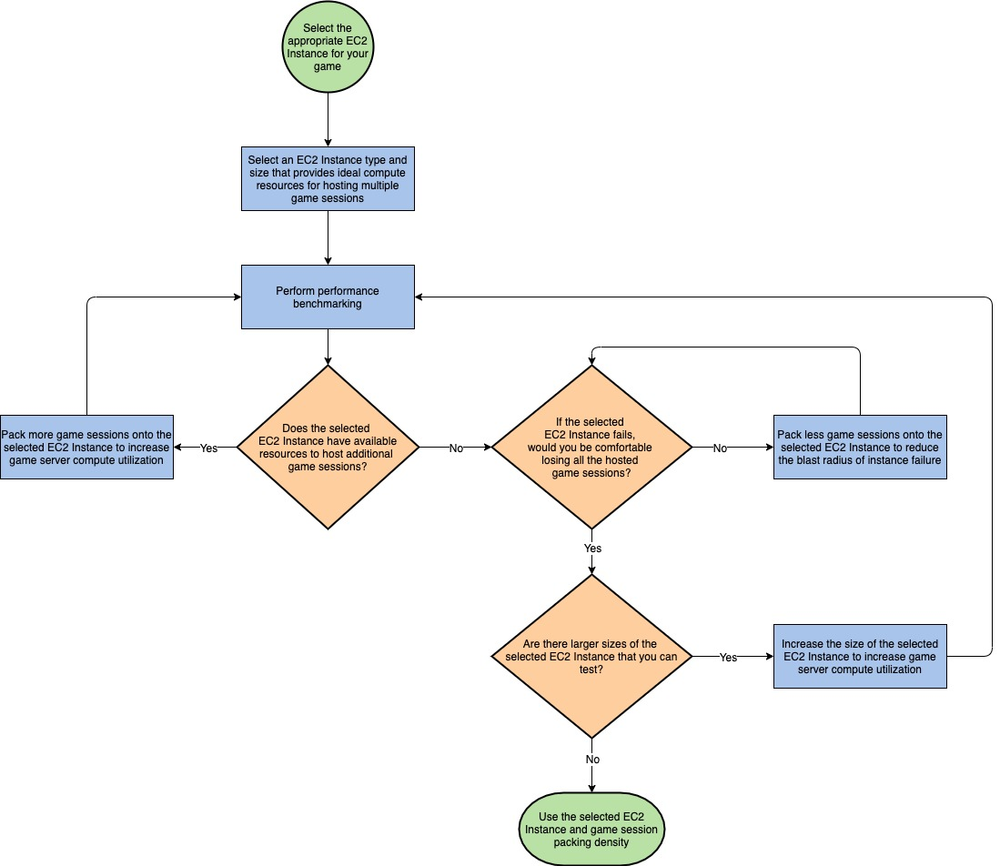

# Failure management

| GAMEREL02 — How do you minimize the impact of infrastructure failures on active players? |
| ---------------------------------------------------------------------------------------- | --------------------------------------------------------------------------------------------------------------------------------------------------------------------------------------------------------------------------------------------------------------------------------------------------------------------------------------------------------------------------------------------------------------------------------------------------------------------------------------------------------------------------------------------------------------------------------------------------------------------------------------------------------------------------------------------------------------------------------------------------------------------------------------------------------------------------------------------------------------------------------------------------------------------------------------------------------------------------------------------------------------------------------------------------------------------------------------------------------------------------------------------------------------------------------------------------------------------------------------------------------------------------------------------------------------------------------------------------------------------------------------------------------------------------------------------------------------------------------------------------------------------------------------------------------------------------------------------------------------------------------------------------------------------------------------------------------------------------------------------------------------------------------------------------------------------------------------------------------------------------------------------------------------------------------------------------------------------------------------------------------------------------------------------------------------------------------------------------------------------------------------------------------------------------------------------------------------------------------------------------------------------------------------------------------------------------------------------------------------------------------------------------------------------------------------------------------------------------------------------------------------------------------------------------------------------------------------------------------------------------------------------------------------------------------------------------------------------------------------------------------------------------------------------------------------------------------------------------------------------------------------------------------------------------------------------------------------------------------------------------------------------------------------------------------------------------------------------------------------------------------------------------------------------------------------------------------------------------------------------------------------------------------------------------------------------------------------------------------------------------------------------------------------------------------------------------------------------------------------------------------------------------------------------------------------------------------------------------------------------------------------------------------------------------------------------------------------------------------------------------------------------------------------------------------------------------------------------------------------------------------------------------------------------------------------------------------------------------------------------------------------------------------------------------------------------------------------------------------------------------------------------------------------------------------------------------------------------------------------------------------------------------------------------------------------------------------------------------------------------------------------------------------------------------------------------------------------------------------------------------------------------------------------------------------------------------------------------------------------------------------------------------------------------------------------------------------------------------------------------------------------------------------------------------------------------------------------------------------------------------------------------------------------------------------------------------------------------------------------------------------------------------------------------------------------------------------------------------------------------------------------------------------------------------------------------------------------------------------------------------------------------------------------------------------------------------------------------------------------------------------------------------------------------------------------------------------------------------------------------------------------------------------------------------------------------------------------------------------------------------------------------------------------------------------------------------------------------------------------------------------------------------------------------------------------------------------------------------------------------------------------------------------------------------------------------------------------------------------------------------------------------------------------------------------------------------------------------------------------------------------------------------------------------------------------------------------------------------------------------------------------------------------------------------------------------------------------------------------------------------------------------------------------------------------------------------------------------------------------------------------------------------------------------------------------------------------------------------------------------------------------------------------------------------------------------------------------------------------------------------------------------------------------------------------------------------------------------------------------------------------------------------------------------------------------------------------------------------------------------------------------------------------------------------------------------------------------------------------------------------------------------------------------------------------------------------------------------------------------------------------------------------------------------------------------------------------------------------------------------------------------------------------------------------------------------------------------------------------------------------------------------------------------------------------------------------------------------------------------------------------------------------------------------------------------------------------------------------------------------------------------------------------------------------------------------------------------------------------------------------------------------------------------------------------------------------------------------------------------------------------------------------------------------------------------------------------------------------------------------------------------------------------------------------------------------------------------------------------------------------------------------------------------------------------------------------------------------------------------------------------------------------------------------------------------------------------------------------------------------------------------------------------------------------------------------------------------------------------------------------------------------------------------------------------------------------------------------------------------------------------------------------------------------------------------------------------------------------------------------------------------------------------------------------------------------------------------------------------------------------------------------------------------------------------------------------------------------------------------------------------------------------------------------------------------------------------------------------------------------------------------------------------------------------------------------------------------------------------------------------------------------------------------------------------------------------------------------------------------------------------------------------------------------------------------------------------------------------------------------------------------------------------------------------------------------------------------------------------------------------------------------------------------------------------------------------------------------------------------------------------------------------------------------------------------------------------------------------------------------------------------------------------------------------------------------------------------------------------------------------------------------------------------------------------------------------------------------------------------------------------------------------------------------------------------------------------------------------------------------------------------------------------------------------------------------------------------------------------------------------------------------------------------------------------------------------------------------------------------------------------------------------------------------------------------------------------------------------------------------------------------------------------------------------------------------------------------------------------------------------------------------------------------------------------------------------------------------------------------------------------------------------------------------------------------------------------------------------------------------------------------------------------------------------------------------------------------------------------------------------------------------------------------------------------------------------------------------------------------------------------------------------------------------------------------------------------------------------------------------------------------------------------------------------------------------------------------------------------------------------------------------------------------------------------------------------------------------------------------------------------------------------------------------------------------------------------------------------------------------------------------------------------------------------------------------------------------------------------------------------------------------------------------------------------------------------------------------------------------------------------------------------------------------------------------------------------------------------------------------------------------------------------------------------------------------------------------------------------------------------------------------------------------------------------------------------------------------------------------------------------------------------------------------------------------------------------------------------------------------------------------------------------------------------------------------------------------------------------------------------------------------------------------------------------------------------------------------------------------------------------------------------------------------------------------------------------------------------------------------------------------------------------------------------------------------------------------------------------------------------------------------------------------------------------------------------------------------------------------------------------------------------------------------------------------------------------------------------------------------------------------------------------------------------------------------------------------------------------------------------------------------------------------------------------------------------------------------------------------------------------------------------------------------------------------------------------------------------------------------------------------------------------------------------------------------------------------------------------------------------------------------------------------------------------------------------------------------------------------------------------------------------------------------------------------------------------------------------------------------------------------------------------------------------------------------------------------------------------------------------------------------------------------------------------------------------------------------------------------------------------------------------------------------------------------------------------------------------------------------------------------------------------------------------------------------------------------------------------------------------------------------------------------------------------------------------------------------------------------------------------------------------------------------------------------------------------------------------------------------------------------------------------------------------------------------------------------------------------------------------------------------------------------------------------------------------------------------------------------------------------------------------------------------------------------------------------------------------------------------------------------------------------------------------------------------------------------------------------------------------------------------------------------------------------------------------------------------------------------------------------------------------------------------------------------------------------------------------------------------------------------------------------------------------------------------------------------------------------------------------------------------------------------------------------------------------------------------------------------------------------------------------------------------------------------------------------------------------------------------------------------------------------------------------------------------------------------------------------------------------------------------------------------------------------------------------------------------------------------------------------------------------------------------------------------------------------------------------------------------------------------------------------------------------------------------------------------------------------------------------------------------------------------------------------------------------------------------------------------------------------------------------------------------------------------------------------------------------------------------------------------------------------------------------------------------------------------------------------------------------------------------------------------------------------------------------------------------------------------------------------------------------------------------------------------------------------------------------------------------------------------------------------------------------------------------------------------------------------------------------------------------------------------------------------------------------------------------------------------------------------------------------------------------------------------------------------------------------------------------------------------------------------------------------------------------------------------------------------------------------------------------------------------------------------------------------------------------------------------------------------------------------------------------------------------------------------------------------------------------------------------------------------------------------------------------------------------------------------------------------------------------------------------------------------------------------------------------------------------------------------------------------------------------------------------------------------------------------------------------------------------------------------------------------------------------------------------------------------------------------------------------------------------------------------------------------------------------------------------------------------------------------------------------------------------------------------------------------------------------------------------------------------------------------------------------------------------------------------------------------------------------------------------------------------------------------------------------------------------------------------------------------------------------------------------------------------------------------------------------------------------------------------------------------------------------------------------------------------------------------------------------------------------------------------------------------------------------------------------------------------------------------------------------------------------------------------------------------------------------------------------------------------------------------------------------------------------------------------------------------------------------------------------------------------------------------------------------------------------------------------------------------------------------------------------------------------------------------------------------------------------------------------------------------------------------------------------------------------------------------------------- |
|                                                                                          | You should monitor game server failure metrics and the impact of these failures on player behavior over time so that you can adjust your game server hosting strategy to meet your game's reliability requirements. Game server infrastructure that is determined to be degraded should be removed from service immediately if it is impacting players, or proactively replaced when there are no active player sessions hosted on the server. For scenarios where games are hosted as REST APIs, system reliability can be managed similar to traditional web application architectures on where traffic can be load balanced across multiple servers in a distributed manner to mitigate the risk of server failures. For real-time synchronous gameplay, a game session is usually hosted on a game server process running on a virtual machine, or game server instance, since gameplay state needs to be maintained in a performant manner and replicated to all connected game clients. This implementation means that a player's experience is tightly coupled to the performance and reliability of the game server process that hosts their game session. This type of architecture makes managing the reliability of game servers more complex than traditional approaches. To mitigate the impact of a game server failure, you can configure your game to continuously perform asynchronous updates of a player's game state to a highly-available cache or database such as [Amazon ElastiCache for Redis](https://aws.amazon.com/elasticache/redis/ "https://aws.amazon.com/elasticache/redis/"), or [Amazon MemoryDB for Redis](https://aws.amazon.com/memorydb/ "https://aws.amazon.com/memorydb/"), respectively. If a server failure occurs, the player's last saved game state can be fetched from the external data store and their session can be restored on a new game server instance. However, this approach adds additional cost and complexity to manage this external state, and may not be suitable for fast-paced or competitive games where the state changes are so frequent and happening at such a significant scale that introducing even a performant in-memory cache data store would result in replication lag that is too significant to be useful to restore a session from. For games of this nature, the optimal approach is to accept the loss of the server and send the player back to a game lobby to find another session or you can automatically redirect them into another game session. You should make sure to capture as much useful log data about what caused the server disruption so that you can investigate the issue later. Amazon GameLift Servers provides guidance for [debugging fleet issues](../../../gamelift/latest/developerguide/fleets-creating-debug.md "../../../gamelift/latest/developerguide/fleets-creating-debug.md"), and provides the ability to [remotely access Amazon GameLift Servers fleet instances](../../../gamelift/latest/developerguide/fleets-remote-access.md "../../../gamelift/latest/developerguide/fleets-remote-access.md") . **GAMEREL_BP03 - Implement loose coupling of game features to handle failures with minimal impact to player experience.** Decoupling components refers to the concept of designing server components so that they can operate as independently as possible. Some aspects of gaming are difficult to decouple since data needs to be as up-to-date as possible to provide a good in-game experience for players. However, many components and gaming tasks can be decoupled. For example, leaderboards and stats services are not critical to the gameplay experience, and the reads and writes to these services can be performed asynchronously from the game. You should consider how to develop features in your game that can be disabled automatically or by an administrator if issues are detected, as well as configure upstream services that depend on the feature to be able to gracefully handle the failure. For example, if specific player data is not properly loading within your game client, you should consider whether this data is critical to the gameplay experience. If not, configure the game client to gracefully handle this failure without disrupting the experience for the player, optioning to retry fetching this data at a later time when the player revisits the screen. Employ logic such as timeouts, retries, and backoff to handle errors and failures. Timeouts keep systems from hanging for unreasonably long periods. Retries can provide high availability of transient and random errors. Define non-critical components which can be loosely coupled to critical components. Loose coupling allows systems to be more resilient since failure in one component does not cascade to others. When game features do not require stateful connections to your game servers or backend, you should implement stateless protocols to scale dynamically and easily recover from transient failures. Develop your non-critical components where it can be loosely coupled with stateless protocols using an HTTP/JSON API. It is also recommended to implement network calls from the game client to be asynchronous and non-blocking to minimize the impact to players from slow-performing game features or other dependent services. To further improve resiliency through loose coupling, use a messaging service such as a queuing, streaming, or a topic-based system between components that can be handled asynchronously. This model is suitable for any interaction that does not require an immediate response or where an acknowledgment that a request has been registered is sufficient. This solution involves one component that generates events and another that consumes them. The two components will not integrate through direct point-to-point interaction but through an intermediate such as a durable storage or queuing layer. This also helps to improve system’s reliability by preserving messages when processing fails. Selection of an appropriate messaging service is key, since various messaging services have different characteristics such as ordering and delivery mechanisms. Design operations to be idempotent so the chosen message system delivers messages at least once. As am example, consider a typical game use case where your game needs to track player playtime, stats, or other relevant data which can lead to a high write-throughput use case at times of peak player concurrency. To implement a reliable architecture, consider whether the use case requires read-after-write consistency as perceived by the player. Typically, scenarios such as these are suitable for asynchronous processing and can be achieved by implementing a write-queueing pattern where the requests are ingested into a scalable and durable message queue such as Amazon SQS, and can be inserted into your backend database in batches using a consumer service, such as a Lambda function. This approach is more reliable than synchronous communication between multiple distributed components including the player's game client, your backend web and application servers, and your internal database system. It also reduces costs because the backend database does not need to be scaled to meet peak write throughput since the consumer processing from the write queue can be used to slow down this ingestion rate as needed. For more information, refer to the following documentation:  • [Build highly scalable and reliable workloads using microservice architecture](../reliability-pillar/design-your-workload-service-architecture.md "../reliability-pillar/design-your-workload-service-architecture.md")  • [Integrating microservice by using Serverless services](../../../prescriptive-guidance/latest/modernization-integrating-microservices/welcome.md "../../../prescriptive-guidance/latest/modernization-integrating-microservices/welcome.md")  • [Asynchronous messaging for microservices](https://aws.amazon.com/blogs/compute/understanding-asynchronous-messaging-for-microservices/ "https://aws.amazon.com/blogs/compute/understanding-asynchronous-messaging-for-microservices/")  • [Introduction to Scalable Game Development Patterns on](https://d1.awsstatic.com/whitepapers/aws-scalable-gaming-patterns.pdf "https://d1.awsstatic.com/whitepapers/aws-scalable-gaming-patterns.pdf") **GAMEREL_BP04 - Monitor infrastructure failures over time to measure impact on player behavior.** Ensure that your game server process and game server instance metrics are being monitored to determine the root cause of issues. In addition to monitoring CPU and memory, you can also setup monitoring for network metrics related to [network limitations of EC2 instances](../../../AWSEC2/latest/UserGuide/monitoring-network-performance-ena.md "../../../AWSEC2/latest/UserGuide/monitoring-network-performance-ena.md") to alert you of issues such as exceeding bandwidth, packets-per-second, or other network-level issues that may indicate your server resources are under provisioned. For game servers hosted using Amazon GameLift Servers, consider monitoring [metrics](../../../gamelift/latest/developerguide/monitoring-cloudwatch.md "../../../gamelift/latest/developerguide/monitoring-cloudwatch.md") such `GameServerInterruptions` and `InstanceInterruptions` which can help you understand how limitations in Spot instance availability are impacting your game servers deployed using Spot, and `ServerProcessAbnormalTerminations` can be used to detect abnormal terminations in your game server processes. It is recommended to maintain historical metrics data of your game server reliability. Use this historical data for reporting purposes and join it with other datasets in order to uncover potential trends to assess the impact on player behavior over time that may be due to game server issues. Amazon CloudWatch does not retain metrics indefinitely, and the [storage resolution of metrics](../../../AmazonCloudWatch/latest/APIReference/API_GetMetricStatistics.md "../../../AmazonCloudWatch/latest/APIReference/API_GetMetricStatistics.md") is increased over time, so you should consider exporting these metrics to cost-effective long-term storage such as Amazon S3. You can configure [CloudWatch Metric Streams](https://aws.amazon.com/blogs/aws/cloudwatch-metric-streams-send-aws-metrics-to-partners-and-to-your-apps-in-real-time/ "https://aws.amazon.com/blogs/aws/cloudwatch-metric-streams-send-aws-metrics-to-partners-and-to-your-apps-in-real-time/") to automatically deliver your metrics from CloudWatch to your own S3 bucket where they can be stored long-term in a storage tier such as S3 Intelligent-Tiering and eventually archived using Amazon S3 Glacier. By placing your metrics in Amazon S3, they are readily available to be joined with other datasets in your data lake for interactive querying with [Amazon Athena](https://aws.amazon.com/athena/ "https://aws.amazon.com/athena/"). For more information, refer to the following documentation:  • [Use Amazon EC2 instance-level network performance metrics](https://aws.amazon.com/blogs/networking-and-content-delivery/amazon-ec2-instance-level-network-performance-metrics-uncover-new-insights/ "https://aws.amazon.com/blogs/networking-and-content-delivery/amazon-ec2-instance-level-network-performance-metrics-uncover-new-insights/")  • [CloudWatch Metric Streams](https://aws.amazon.com/blogs/aws/cloudwatch-metric-streams-send-aws-metrics-to-partners-and-to-your-apps-in-real-time/ "https://aws.amazon.com/blogs/aws/cloudwatch-metric-streams-send-aws-metrics-to-partners-and-to-your-apps-in-real-time/") **GAMEREL_BP05: Adjust the number of game sessions hosted on each game server instance to reduce blast radius.** Establish a risk tolerance level for the number of players that you would be comfortable with being impacted if a game server experienced an infrastructure or software issue. Use this information to help you determine the maximum number of game sessions that you are comfortable hosting per game server instance. When it comes to determining the amount of game sessions to host on a server instance, game developers typically start by focusing on cost, but it is important to consider the impact of this decision on reliability when designing your game architecture. While it is important to increase density of game sessions hosted per game server to improve the utilization of infrastructure, you want to ensure that you are comfortable with the blast radius of a potential failure of a single game server instance. If a single instance fails, all of the game server processes hosting active game sessions on that instance would be lost, so the number of players that experience a disruption should be tolerable based on your requirements. If your game requires large match sizes, such as with Battle Royale or other MMO style games, you might not have much flexibility to reduce the number of players hosted in a single game session since the style of game requires it and this requirement is more of a game design and player experience decision than an infrastructure decision. It is important to remember that typically the costs of EC2 instances scale linearly as you increase in size within a particular instance type, such as moving from a `2xlarge` to `4xlarge`. Therefore, to improve reliability and reduce the impact of a single game server instance failure, you should consider increasing the number of game server instances that are hosting your game sessions. For example, as an alternative to hosting 50 game sessions on a `4xlarge` EC2 instance, you can reduce the number of players impacted by a potential instance failure if you split those 50 game sessions evenly between two `2xlarge` EC2 instances with 25 game sessions hosted on each instance. In most cases, the compute cost of these two deployment architectures is the same, but even if the costs weren't the same, it is still important to consider how this type of a change in game server hosting strategy can change the impact to players from a potential game server failure. It is also important to note that this approach assumes that the game server processes that host your game sessions each use a fixed amount of pre-allocated resources on the game server that can be evenly divided in this manner. The following diagram provides an example process that you can use to help you to determine the number of a game sessions to host per game server instance.  _Example of how to determine the number of game sessions to host per game server instance_ **GAMEREL_BP06: Distribute game infrastructure across multiple Availability Zones and regions to improve resiliency** To minimize the impact of localized infrastructure failures on your players, you should distribute your infrastructure deployment uniformly across enough independent locations to be able to withstand unexpected failures while still having enough capacity to meet the needs of your player demand. When deploying your game infrastructure, it is recommended to uniformly distribute your capacity across multiple Availability Zones in a Region so that you can withstand disruptions to one or more Availability Zones without disrupting the player experience. Game backend services such as web applications should be load balanced across multiple Availability Zones or should be built using managed service such as AWS Lambda and Amazon API Gateway which provide Regional high availability by design. Similarly, components that maintain state such as caches, databases, message queues, and storage solutions should all be designed to provide durable persistence of data across multiple Availability Zones, which is provided by design in services such as Amazon S3, DynamoDB, and Amazon SQS, and can be configured in other services. When designing your game server hosting architecture for resiliency, you should deploy your fleets of game servers uniformly across all Availability Zones within an AWS Region to maximize your access to all available compute capacity in the Region as well as reduce the blast radius of availability zone failures. For example, you can configure [Amazon EC2 Auto Scaling](../../../autoscaling/ec2/userguide/auto-scaling-benefits.md "../../../autoscaling/ec2/userguide/auto-scaling-benefits.md") to use all Availability Zones. If an EC2 instance becomes unhealthy, EC2 Auto Scaling can replace the instance, as well as launch instances into other Availability Zones if one or more of the Availability Zones becomes unavailable. It is a best practice to deploy your game infrastructure into multiple Regions in order to maximize high availability. While you are encouraged to do this for your game backend services to achieve high availability, this recommendation is especially important for your game servers. In a multiplayer game for example, your infrastructure capacity for game servers is likely to outpace the capacity needs for your other services, since game servers are used to host long-lived game sessions with players. Many games choose to shard players into logical game Regions such as North America East, North America West, Europe, Asia Pacific and so on. To simplify the player experience and make it easier for you to utilize global infrastructure to host games, you should consider de-coupling the name of your player-facing game Regions, such as "North America West", from the underlying cloud provider region or data center location that is physically hosting the game servers, which might include the Oregon (`us-west-2`) and N. California (`us-west-1`) Regions, along with other infrastructure such as [Local Zones](https://aws.amazon.com/about-aws/global-infrastructure/localzones/ "https://aws.amazon.com/about-aws/global-infrastructure/localzones/") or your own data centers that are all hosting game server instances supporting that player game Region. When designing your matchmaking service, you should deploy a multi-Region architecture with separate software deployments across regions. Decouple your matchmaking service deployment from the fleets that host your game server instances so that you can route players to a game server in any Region regardless of which regional deployment of your matchmaking service handled the matchmaking request. Design logic in your matchmaking implementation to favor the game server regions that meet your latency and other rules, with the ability to fallback to routing players to other regions if your fleets are low on capacity or there are other regional infrastructure disruptions. For more information, refer to the following documentation:  • [Best practices for Amazon GameLift Servers game session queues](../../../gamelift/latest/developerguide/queues-best-practices.md "../../../gamelift/latest/developerguide/queues-best-practices.md")  • [Amazon GameLift Servers Multi-Region fleets](https://aws.amazon.com/blogs/gametech/amazon-gamelift-is-now-easier-to-manage-fleets-across-regions/ "https://aws.amazon.com/blogs/gametech/amazon-gamelift-is-now-easier-to-manage-fleets-across-regions/") |
