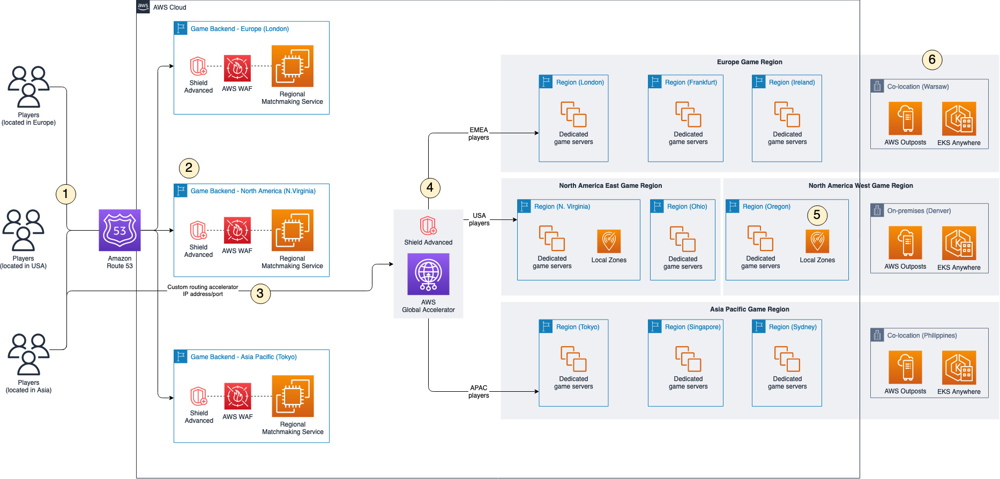

# Multi-Region and hybrid architecture for

low-latency games

This section describes a multi-Region and hybrid architecture for low-latency
games.

_Reducing latency with network acceleration and game servers deployed
globally_

1. Players in a globally available game can originate from anywhere. When a player
   requests a game session or match, their game client sends a request to the game
   backend service registered with **Amazon Route
   53**.
2. The game backend is deployed in multiple AWS Regions closest to player
   populations. Each game backend includes a Regional matchmaking service that finds a
   game session from across the game Regions. Although a player's matchmaking request is
   processed by a Regional matchmaking service near them, the matchmaking service is
   capable of routing a player to a game session in any game Region, if necessary. This
   action improves resiliency and performance. Additionally, each game backend service
   uses **AWS WAF** and **Shield
   Advanced** to provide layer-7 web filtering and bot control, and
   protections against distribution denial of service (DDoS). You have many options for
   how you build your game backend service, such as serverless, containers, EC2
   instances, or hosting the game backend service in your own data centers.
3. To improve the experience for players by reducing network latency and jitter, a
   custom routing accelerator is deployed using **AWS Global Accelerator**, which automatically optimizes the routing of traffic from
   the game client to the game server. You configure the [custom
   routing accelerator](../../../global-accelerator/latest/dg/about-custom-routing-how-it-works.md "../../../global-accelerator/latest/dg/about-custom-routing-how-it-works.md") to map Global Accelerator listener ports to your game
   server's EC2 instance port. The game client connects to the Global Accelerator IP and
   port that deterministically routes the players to the correct game server IP and port
   that is hosting the game session.
4. Your game includes player-friendly logical game Regions that represent a collection
   of game server hosting locations that are geographically close to each other, such as
   _North America_, or _Asia Pacific_. You might
   also choose to create more granular regions, such as _North America
   East_ and _North America West_. To reduce latency and
   increase geographic coverage, a combination of different game server hosting solutions
   can be used to improve the player experience. Prioritize the use of AWS Regions
   where possible, as these locations are fully featured and contain the largest capacity
   footprint.
5. Use **Local Zones** to host game servers in geographic
   locations of underserved players where you do not have existing hosting facilities or
   an AWS Region is not available.
6. Deploy **Outposts** into your existing on-premises
   data centers and co-location providers to create a seamless control plane and
   management experience across each deployment location using fully-managed racks and
   rack-mounted servers. Outposts are also beneficial if you don't have existing server
   capacity in your on-premises environment. However, if you want a hybrid implementation
   with software running on your own existing server infrastructure, you can use
   **EKS Anywhere**, which allows you to create and run
   clusters of containers on your own infrastructure with connectivity back to Amazon
   EKS, which provides a consistent console view of your Kubernetes clusters in AWS and
   on premises.
