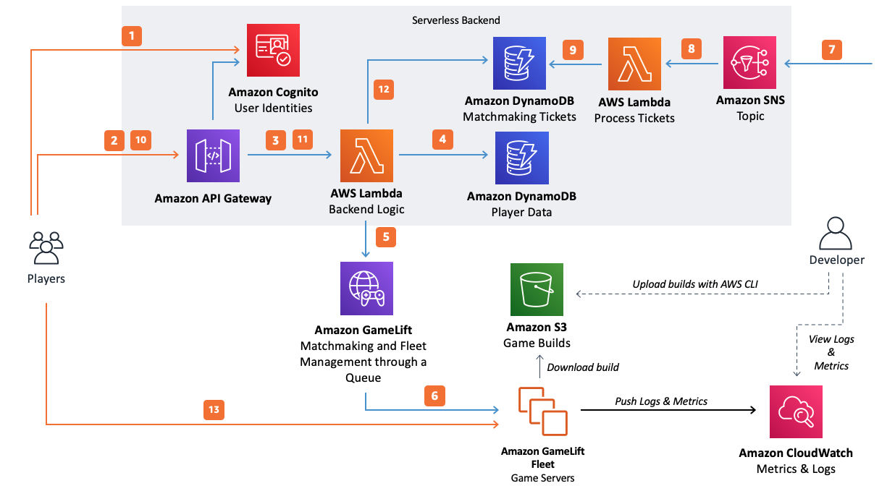

# Session-based game server hosting with

serverless backend

When developing an architecture for your game, you should consider the features and
capabilities you need, and the level of operational management overhead that you are
prepared to own. To provide the best balance between ease of operations and flexibility,
you can build your game using managed services from cloud providers that give you the
control to develop and customize your own custom game features, while also reducing your
burden to deploy and manage infrastructure.

Hosting a session-based multiplayer game requires having server infrastructure to host
the game server processes as well as a scalable backend for matchmaking and session
management. The following reference architecture shows how Amazon GameLift Servers managed hosting and a
serverless backend can be used to manage your session-based games.

_Amazon GameLift Servers managed hosting for session-based games_
The diagram describes the process of getting players into games running on Amazon GameLift Servers managed
game hosting. It includes the following steps:

1. Game client requests an **Amazon Cognito** identity from Amazon Cognito.
   This can optionally be connected to external identity providers.
2. The game client receives temporary access credentials and requests a game session
   through an API hosted with **API Gateway** by using the
   credentials from Amazon Cognito.
3. API Gateway invokes an **AWS Lambda** function.
4. The Lambda function requests player data from a **DynamoDB** table. The Amazon Cognito identity is used to securely request the
   correct player data because the authenticated identity is provided in the
   request.
5. Using the correct player data for any additional information (like player skill
   level), the Lambda function requests a match through **Amazon GameLift Servers
   FlexMatch** matchmaking. You can define a FlexMatch matchmaking
   configuration with JSON-based configuration documents. The game client can generate
   latency metrics by pinging server endpoints in various Regions, and the latency data
   can be used to support latency-based matchmaking.
6. After FlexMatch matches a group of players with suitable latency to a Region, it
   requests a game session placement through a Amazon GameLift Servers queue. The queue contains fleets
   with one or more registered Region locations.
7. When the session is placed on one of the fleet's locations, an event notification is
   sent to an **Amazon SNS** topic.
8. A Lambda function will receive the Amazon SNS event and process it.
9. If the Amazon SNS message is a `MatchmakingSucceeded` event, the Lambda
   function writes the result to DynamoDB with the server port and IP address. A
   time-to-live (TTL) value is used to make sure that matchmaking tickets are deleted
   from DynamoDB when they no longer needed.
10. The game client makes a signed request to API Gateway to check the status of the matchmaking ticket on a specific interval.
11. API Gateway invokes a Lambda function that checks the matchmaking ticket status.
12. The Lambda function checks DynamoDB to determine whether the ticket has succeeded. If
    it has succeeded, the Lambda function sends the IP address, port, and the player
    session ID back to the client. If the ticket hasn't succeeded yet, the Lambda function
    sends a response declaring that the match is not ready.
13. The game client connects to the game server using the port and IP address provided by
    the backend. It sends the player session ID to the game server and the game server
    validates it using the Amazon GameLift Servers Server SDK.
    Alternatively, you can modify the preceding architecture to use API Gateway WebSockets
    with Amazon GameLift Servers. In this approach, communication between the game client and your game backend
    service occur using a [websockets-based implementation](../../../gamelift/latest/developerguide/gamelift_quickstart_customservers_designbackend_arch_websockets.md "../../../gamelift/latest/developerguide/gamelift_quickstart_customservers_designbackend_arch_websockets.md"). This implementation can be used so that the
    game backend Lambda function initiates a server-side message to the game client over a
    WebSocket rather than implementing a polling model.
