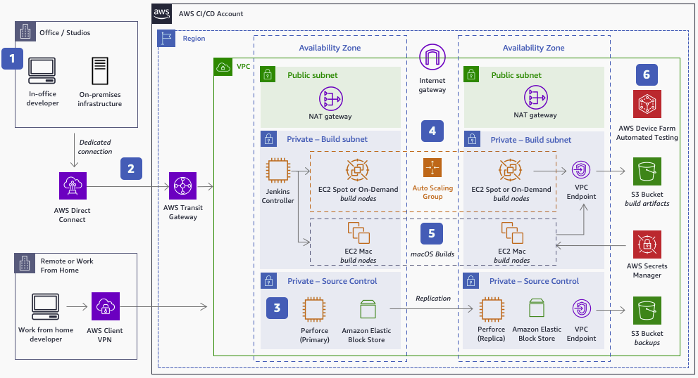

# Game production in the cloud – CI/CD

You must have CI/CD infrastructure when developing games. A game development CI/CD
pipeline is typically comprised of highly available source control servers and storage,
compute resources to run your builds, and software to perform automated testing, along
with the proper network connectivity from your development machines. The following
reference architecture demonstrates how to offload game builds from remote or on-premises
game development environments to the AWS Cloud to aid developers in migrating or
building new build farms.

_Offload game builds to the cloud_

1. **AWS Direct Connect** provides a low latency,
   private dedicated connected to AWS for in-office developers. Remote developers use
   **AWS Client VPN**.
2. **AWS Transit Gateway** simplifies network management for
   connectivity between VPCs and from on-premises networks.
3. Perforce manages source and version control (CI) backed by **Amazon EBS** storage for quickly accessed, persistent data. Perforce Helix
   Core (P4D) is available in the **AWS
   Marketplace**.
4. Commits start a build (CD) in Jenkins when developers push changes to Perforce
   tied to a branch. Perforce triggers POST a JSON payload to Jenkins. The Jenkins
   controller calls engine “headless” CLI commands to run and parallelize the build
   process across ephemeral, Docker nodes (such as **Amazon EC2 Spot
   Instances**), or **Amazon EC2 On-Demand
   Instances**. Developers can increase availability by using two Jenkins
   controllers, one in each Availability Zone, behind a load balancer. For some engines,
   developers might need additional licensing infrastructure configured in additional
   subnets to vend licenses for the build context each time a concurrent build is
   run.
5. The Xcode portion of iOS builds is offloaded to **Amazon EC2
   Mac instances** to sign, build, and export the `.IPA` file,
   splitting the process and reducing build times. **AWS Secrets
   Manager** holds provisioning profiles, private keys, and
   certificates.
6. Build artifacts are delivered to **Amazon S3**, which
   sends notifications of success or failure. **AWS Device
   Farm** enables automated testing.
