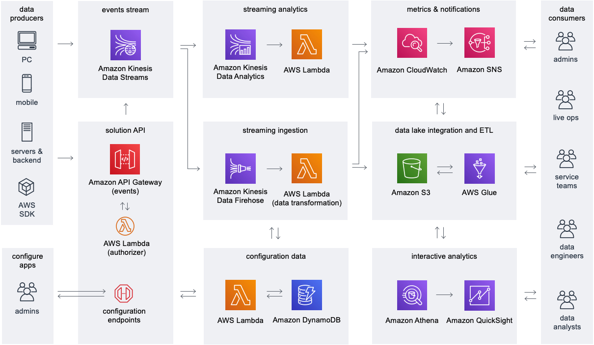

# Game analytics pipeline

Game developers are increasingly looking for ways to better understand player behavior
so that they can improve the gameplay experience to retain and grow their player base. Game
analytics represents the technical infrastructure and processes that is required to
understand and analyze all of the data that is generated from the game and related services.
This typically requires the use of an analytics pipeline architecture that can support this
end-to-end process, such as the [Game Analytics Pipeline](https://aws.amazon.com/solutions/implementations/game-analytics-pipeline/ "https://aws.amazon.com/solutions/implementations/game-analytics-pipeline/")
solution implementation.

Game Analytics architectures have the following characteristics:

- Data sources send data in a common format such as JSON and typically include game servers and game backend services, as well as game clients including PC, mobile devices, and game consoles.
- A game analytics pipeline automates the entire workflow of ingesting and storing the raw data, and processing it into usable output formats so that it can be analyzed efficiently and cost effectively by data consumers, such as end users and analytics applications.
- Game analytics pipelines provide support for ingesting and processing high volumes of real-time data in order to scale as a game grows.
- Provide support for both real-time and batch reporting use cases. For example, real-time dashboards and alerts are typically used by Live Ops teams to monitor game infrastructure and player behavior to detect issues. Data analyst teams typically rely on ad-hoc and batch reporting to understand trends over time.

_Serverless game analytics pipeline for gameplay
telemetry_
Game data is ingested from game clients, game servers, and other applications. The streaming data is ingested into Amazon S3 for data lake integration and interactive analytics. Streaming analytics processes real-time events and generates metrics. Data consumers analyze metrics data in Amazon CloudWatch and raw events in Amazon S3.

1. **Solution API and configuration data:** Use Amazon API
   Gateway to provide a REST API for administering your game analytics pipeline and storing
   configuration data in Amazon DynamoDB using Lambda functions. You can build an internal
   portal on top of this API or a custom command line interface for administration. REST
   API also provides server-authentication for ingesting gameplay data from data sources
   and forwarding the telemetry data to Amazon Kinesis Data Streams for real-time
   processing and ingestion into storage.
2. **Events stream:** Kinesis Data Streams captures streaming data from your
   game for data processing and storage.
3. **Streaming analytics:** Managed Service for Apache Flink analyzes
   streaming event data from the Kinesis Data Streams and can generate custom metrics and alerts that are
   published to CloudWatch using Lambda functions.
4. **Metrics and notifications:** Use Amazon CloudWatch to
   monitor your solution's metrics, logs, and alarms. Use Amazon SNS for sending
   notifications to on-call engineers and other data consumers.
5. **Streaming ingestion:** Use Kinesis Data Firehose to
   easily consume your streaming data from Kinesis Data Streams and deliver it to your data lake in Amazon
   S3 for long-term storage, transformation, and integration with other data.
6. **Data lake integration and ETL:** Use Glue for ETL
   processing workflows and to organize your metadata in the Glue Data Catalog, which
   provides the basis for a data lake for integration with flexible analytics tools.
7. **Interactive analytics:** End users can use Amazon Athena
   to perform ad-hoc interactive queries on the datasets stored in Amazon S3, and QuickSight can
   be used to build dashboards.
   Refer to the [Game Analytics Pipeline](https://aws.amazon.com/solutions/implementations/game-analytics-pipeline/ "https://aws.amazon.com/solutions/implementations/game-analytics-pipeline/") for an automated reference implementation of an
   analytics pipeline that can be deployed into your account using
   CloudFormation.
