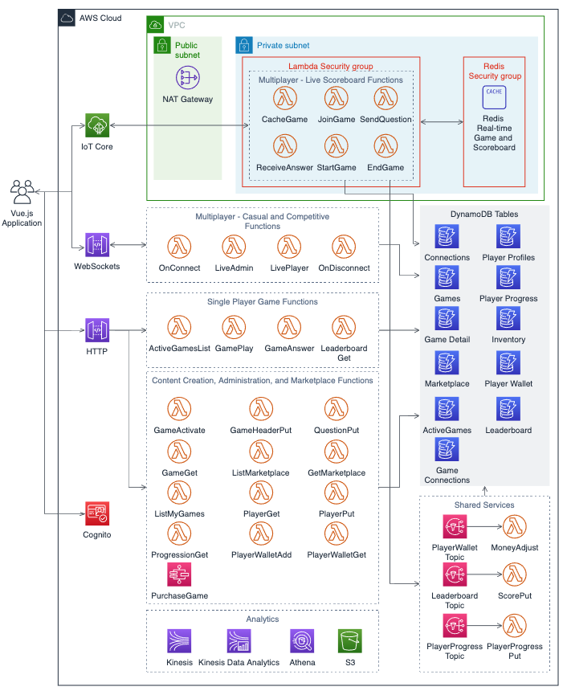

# Serverless-based game backend architecture

Many game developers do not want to manage infrastructure, and
instead prefer to build their games using technologies that allow
them to focus on software. A serverless architecture is
recommended in this scenario because it allows you to build and
release features more quickly, and with less operational overhead.
Serverless architectures are designed using cloud services that
can scale dynamically based on demand without needing to set up,
manage, and scale servers. The following reference architecture
illustrates how to build a game using a serverless architecture.

_Serverless-based game backend reference architecture_

This reference architecture illustrates a web-based trivia game that provides single player and multiplayer features.

- **Player authentication**:
  Players authenticate using Amazon Cognito, which provides
  secure authentication with a user directory for player
  identity management.
- **Game logic as serverless
  functions**: Game features and backend business logic
  run as AWS Lambda functions that are initiated in response to
  events, which keeps costs down because you only pay when the
  function runs. Lambda gives you the flexibility to write each
  game feature as a separate microservice using a programming
  language of your choice. For example, you might choose to
  develop .NET Lambda functions if you have experience using C#
  to build Unity games, or you might choose to develop Node.js
  Lambda functions if you desire to program a frontend and
  backend for a web-based game both in JavaScript.
- **NoSQL Data Store for game and player
  data:** Use DynamoDB to store your player and game
  data, as it is purpose-built for storing large amounts of data
  from microservices. As illustrated in this architecture, it is
  a best practice to use separate data stores for each game
  feature's data storage needs, which makes it straightforward
  for you to monitor and manage the features independently. This
  also creates boundaries of separation if feature or service
  ownership changes within your team. In this reference
  architecture, DynamoDB tables are used to store data such as
  connection state, game details, player progress, and
  leaderboard information.
- **Single player gameplay:**
  Single player features allow players to perform actions like
  selecting and playing a game and viewing the leaderboard.
  These features are implemented as RESTful backend services
  hosted with an Amazon API Gateway HTTP API that invokes the
  appropriate Lambda function to get and set data in DynamoDB
  tables. When gameplay completes, the backend also sends
  notifications to Amazon SNS topics that initiate Lambda
  functions asynchronously to store the player's progress and
  stats.
- **Multiplayer gameplay:**
  Multiplayer game features require the players to be able to
  interact with the game for point-to-point communication, as
  well as broadcast and receive updates from other connected
  players. A WebSockets implementation is suitable for
  point-to-point communication in a lightweight game, such as
  trivia. Players can establish a WebSockets connection to
  Amazon API Gateway WebSockets, which manages the connection
  and only invokes the Lambda functions when there are messages
  to send or receive for a player. For use cases where
  one-to-many communication is required between players, AWS IoT Core provides support for messaging using WebSockets over
  MQTT, which allows clients to subscribe to topics and act on
  the messages it receives. In this architecture, WebSockets
  over MQTT are used to support use cases such as broadcasting
  live in-game updates and asking questions to connected
  players. As an alternative to AWS IoT, you might choose Redis
  Pub/Sub for message delivery or Redis Streams if you need
  message retention.
- **Use VPC-enabled Lambda functions to
  access resources in your private subnets:** Configure
  VPC-enabled Lambda functions to access resources in your VPC's
  private subnets, such as Amazon ElastiCache, which is used to
  reduce query times for low-latency datasets like live
  leaderboards.

For more information, see
[Guidance
for Custom Game Backend Hosting on AWS](https://aws.amazon.com/solutions/guidance/custom-game-backend-hosting-on-aws/ "https://aws.amazon.com/solutions/guidance/custom-game-backend-hosting-on-aws/").
