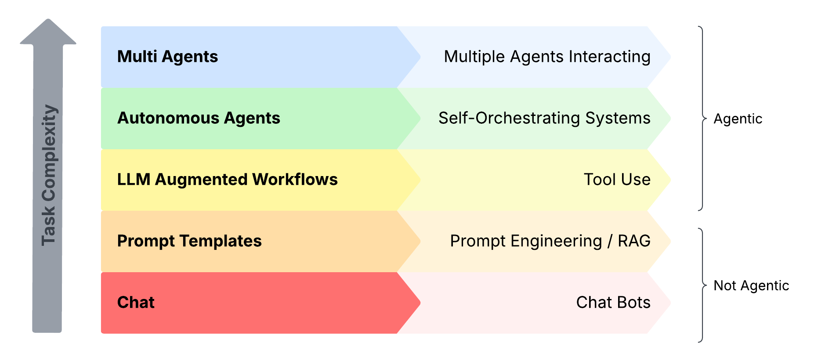
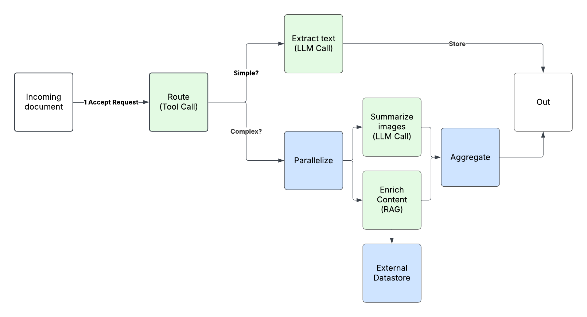
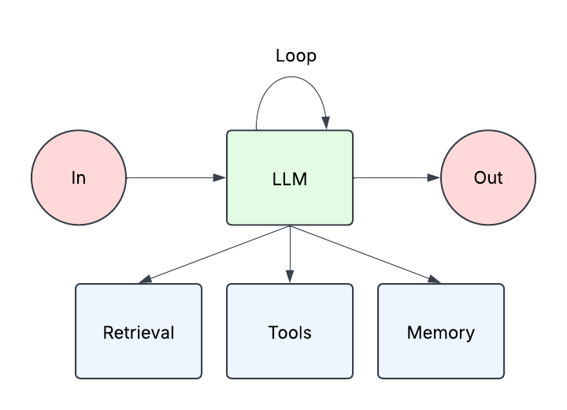
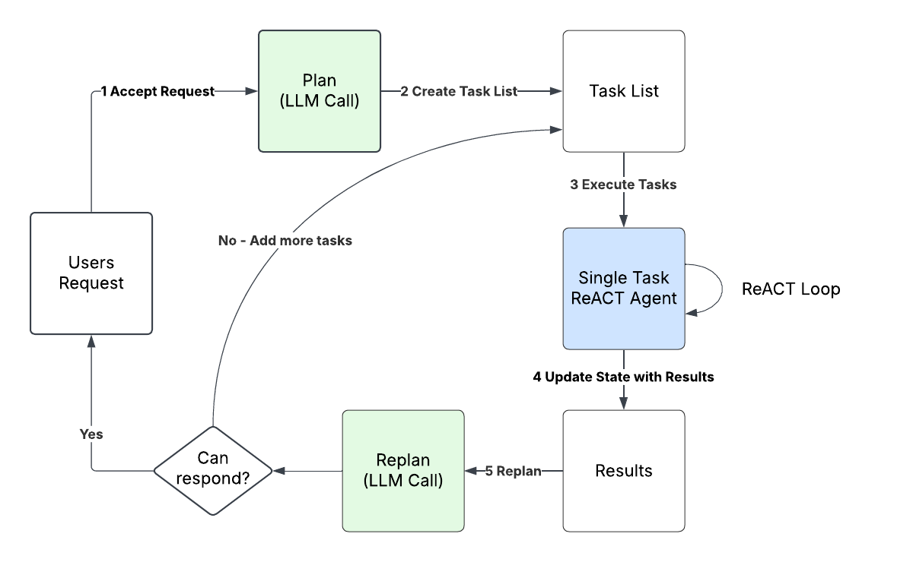

# Agentic AI

AI agents are autonomous entities that are capable of perceiving
their environment, reasoning, and taking actions to achieve defined
goals. Agents can interact with users, services, and other agents in
complex, real-time environments. In generative AI, the core of an
agentic system is usually a large language model (LLM), augmented
with capabilities like retrieval (access to information), tools
(interacting with its environment), and memory. The term agentic
derives from agency (the ability to act independently, make
decisions, and take actions within its environment). Agentic systems
can have varying degrees of agency, ranging from making narrowly
scoped actions to autonomously orchestrating themselves. When
designing an agentic system, it's important to only increase the
agency of the system when the task complexity requires it.

In this section of the Generative AI Lens, we'll discuss a few of
the common agentic patterns we see in practice.

## LLM-augmented workflows

LLM-augmented workflows are systems where code paths are largely
deterministic, with certain steps augmented with LLMs to make
decisions. An example is simplistic document processing system. It
might classify an incoming document as simple or complex and use
tool calls to route the document to the correct path. It has a low
degree of agency, but is still an agentic system as a whole
because it's making decisions through tool invocations.

## Autonomous agents

The architecture of an autonomous agent is simple. These systems
are typically built around an LLM that has been augmented with
retrieval, tools, and memory orchestrated in a loop. This is
commonly referred to as a ReACT (reason and act) loop. An agent is
given a list of tools with instructions on how to use them and is
orchestrated in a loop until the LLM is given a stop reason. These
tools can be internal APIs, connections to data sources, or simple
functions. Tools are often connected to the agent using the MCP
protocol, and the LLM provides the agent with the reasoning
capabilities needed to select the appropriate tool. The guidelines
informing this reasoning capability are traditionally described in
the system prompt, which should outline the goal, role, and other
details the LLM needs to properly reason.

## Hybrids

In practice, many agentic systems use both workflows and
autonomous agents with varied levels of agency. An example is the
plan and solve loop which has a high degree of agency.

First, we use an LLM to create a plan and a task breakdown. The
plan and task list are informed by the agent's system prompt,
which broadly describes how the LLM should reason on the agent's
behalf.

That task list gets fed into a queue and we use a series of ReACT
agents to resolve those tasks.

When the task list is complete, we use another call to an LLM to
decide if we have enough to return to the user or need to add more
tasks to complete the users request.

This pattern could be scaled out using queues, auto-scaling, and
asynchronous executions.

## Conclusion

As we navigate the evolving landscape of generative AI, the
agentic paradigm represents a fundamental shift in how we
architect intelligent systems. From simple LLM-augmented workflows
to fully autonomous agents, these patterns enable us to build
solutions that can perceive, reason, and act within their
environments with varying degrees of agency. The key insight for
practitioners is that agency exists on a spectrum. Our
architectural choices should align the level of autonomy with the
complexity of the problem at hand.

As agentic AI continues to mature, we anticipate these patterns
will evolve and new architectures will emerge. The principles of
well-architected design (reliability, security, performance
efficiency, cost optimization, sustainability, and operational
excellence) remain paramount as we build systems that act on our
behalf. The future of generative AI is increasingly agentic, and
mastering these architectural patterns today prepares us for the
autonomous systems of tomorrow.
