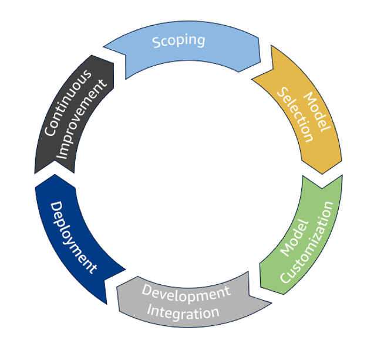

# Generative AI lifecycle

The generative AI lifecycle consists of seven key phases: scoping,
model selection, model customization, development and integration,
deployment, and continuous improvement. Each phase of the generative
AI lifecycle is evaluated against the six pillars of the
Well-Architected Framework. This process helps verify that workloads
are built and maintained according to best practices across critical
aspects of system design and operation.

_Generative AI lifecycle_

## Scoping

The _scoping_ phase prioritizes understanding
the business problem. The initial scoping phase refers to the
stage where the project's goals, requirements, and potential use
cases are clearly defined. This sets the foundation for the
development process by identifying a high-impact, feasible
application, aligning stakeholders to the project's goals, and
determining how success is measured. A robust scoping phase can
significantly improve the chances of the project delivering
valuable outcomes, which streamlines development by focusing
efforts on the most critical aspects of the project.

The primary focus of the scoping phase should be to determine the
relevance of generative AI in solving the problem. Consider the
risks and costs of investment for generative AI to solving that
problem. Self-assess with questions like:

- What kinds of models
  do we need to consider?
- Will an off-the-shelf model satisfy the
  requirements of this business problem or will there be a need to
  customize the model?
- Does one single model address the problem,
  or will there be a need for several models in an orchestrated
  workflow?

Cost considerations for a sustainable solution are critical to
consider at this stage as well. Many components can introduce
additional costs to a generative AI workload, like prompt lengths,
data architecture and access patterns, model selection, and agent
orchestration.

Establish the success metrics for how to measure and evaluate the
model's performance. Determine the technical and organizational
feasibility of the proposed project. Develop a comprehensive risk
profile for the proposed generative AI solution. Discuss
technology risks as well as business risks. If applicable, assess
the availability and quality of data needed to customize the
model. Create security scoping matrices for different use cases.
By clearly outlining project goals early on, you can avoid
misunderstandings and verify that everyone is working towards the
same objectives.

## Model selection

The _model selection_ phase prioritizes the
selection and adoption of a generative AI model. This phase
involves evaluating different models based on your specific
requirements and use cases. During the selection process, consider
various tools and components, including choosing between different
model hosting options. Different workloads may benefit most from
batch inference, real-time inference, or a combination of
inference profiles. To accommodate model selection, make several
options available in the form of a model routing solution, use a
model catalog to quickly onboard new models, and architect model
availability solutions.

Determine which model best aligns with your desired
functionalities and performance metrics. During selection,
consider factors like modality, size, accuracy, training data,
pricing, context window, inference latency, and compatibility
within your existing infrastructure. Understand data usage
policies by model hosting providers. If you are using SageMaker AI
for training or hosting, you should evaluate instance types for
model deployment. If RAG will be used, consider the selection and
availability requirements for vector databases. In some cases, you
may need to train your own model from scratch based on your unique
requirements. Pre-training foundations models from scratch are out
of scope for this document.

## Model customization

The _model customization_ phase aligns the
model with the application's goals. Model customization is a
process of taking a pre-trained model and customizing it to fit
the particular use case by using techniques like prompt
engineering, RAG, agents, fine-tuning, continuous pre-training,
model distillation, and human feedback alignment. These are some
popular model customization techniques, and you can use some or
all of these techniques in the process of developing a generative
AI workload. These techniques transform a generic model into a
solution tailored to the specific data, context, and user
expectations of the application. This process is iterative and
involves continuous refinement and evaluation to verify that the
model performs accurately and ethically within the defined
context.

Craft prompts to guide the model towards generating the desired
outputs. Implement template management for prompts. If needed,
train the model on additional data relevant to the specific
application to improve its performance on that domain. Incorporate
human feedback to refine the model's behavior and align it with
desired ethical and quality standards. This improves the quality
of outputs and helps you tailor the model to the specific needs of
the user and application, which enhances the model's ability to
produce accurate and relevant results within the specified
context. Allow for proactive mitigation of potential biases or
undesired outputs by aligning the model with the desired ethical
guidelines.

## Development and integration

The _development and integration_ phase
integrates the developed model into an existing application or
system, which makes it fully functional and ready for production
use. This process includes optimizing the model for inference,
orchestrating agent workflows, fueling RAG workflows, and building
user interfaces. At this stage, you will bridge the gap between a
trained model and its practical application and make the model
ready to be used effectively in a real-world scenario.

Implement the selected model into your workflow by incorporating
components like conversational interfaces, prompt catalogs,
agents, and knowledge bases. To integrate with existing systems or
applications, connect the model to relevant databases, data
pipelines, and other applications within the organization.
Implement security measures and responsible AI practices, such as
guardrails, to reduce risks common to generative AI, such as
hallucination.

Optimize the model to perform efficiently in real-time inference
within the target application hardware. This may include further
fine-tuning models, implementing model distillation techniques,
and making ongoing adjustments based on performance metrics.
Verify the model can handle increasing workload demands and
maintain consistent performance under production conditions.
Validate that complimentary application components feature
scalable and reliable performance as well.

Allow other applications to interact with the model by creating
application programming interfaces (APIs). Build or use an
existing user-friendly interface for interacting with the model,
including input prompts and output display mechanisms. A
well-designed user interface and seamless integration can
significantly improve user adoption. Validate how well the
integrated components work together with automated testing, and
make necessary adjustments to improve overall system performance.
As you prepare the production environment, establish monitoring
systems to track performance and identify potential issues.

## Deployment

The _deployment_ phase rolls out the generative
AI solution in a controlled manner and scales it to handle
real-world data and usage patterns. At this stage, the model is
moved from a development environment to production, making it
accessible to users by integrating it into an application or
system. This involves setting up the necessary infrastructure to
serve predictions and monitor its performance in real-world
scenarios.

Deployment includes implementing CI/CD pipelines where applicable,
helping maintain system uptime and resiliency, and managing the
day-to-day running of the system. Infrastructure as code (IaC)
principles are often employed using tools like AWS CDK, AWS CloudFormation, or Terraform to manage resources. Version control
systems and automated pipelines are crucial for maintaining and
updating the system. Documentation and versioning of
infrastructure components help maintain system stability and
enable quick rollbacks if needed. Validate your compliance with
security and privacy requirements.

## Continuous improvement

The final phase involves _continuous
improvement_ of the system. This refers to the ongoing
process of monitoring a deployed model's performance, collecting
user feedback, and making iterative adjustments to the model to
enhance its accuracy, quality, and relevance over time. Continuous
improvement aims to constantly refine the system based on
real-world usage and new data. Invest in ongoing education and
training for teams. Stay updated on advancements in generative AI,
and regularly reassess and update your AI strategy.

To review performance monitoring, track key metrics like accuracy,
toxicity, and coherence of the generated outputs to identify areas
for improvement. To identify biases or areas where the model needs
adjustments, gather feedback from users regarding the quality and
usefulness of the generated outputs. Update the training data set
with new examples or refined data based on user feedback to
improve model performance. As user needs and the data landscape
evolve, continuously improve the model to stay relevant and
effective. Enhance quality with regular refinement to mitigate
biases and improve the generated outputs. Experiment with new
techniques by exploring new algorithms, architectures, or training
methods to potentially further enhance the overall solution.
