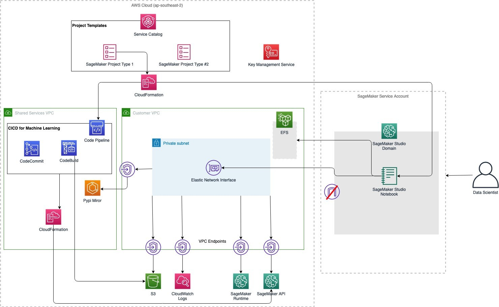

# Artificial intelligence in the public sector

Artificial intelligence (AI) provides significant opportunities for better public policy
and services that deliver more equitable and scalable support for the community. But poorly
designed AI systems can similarly create difficulty at a scale not possible in other sectors
due to the special context of government. For this reason, careful design and governance of AI
in government, including in the context of usage patterns and public impact, is critical for
maintaining responsible and trustworthy AI systems in government.

Understanding the broad categories of how, and in which context you can use AI helps to
establish the right controls and approaches to appropriately govern, design, manage, and
mitigate risks with your AI systems. In this scenario, we explore common patterns for how AI
is broadly used with pragmatic guidance and recommendations to maintain responsible, ethical,
and high integrity outcomes from AI in the special context of government.

Characteristics of a good AI architecture in government include:

- Clear delineation between systems that require explainability
  (such as deciding eligibility to social services) and systems
  that don’t (such as general research or patterns analysis).
  Explainability is the ability to describe why a machine
  learning (ML) model makes a specific prediction.
- Good practice approaches to identifying, addressing, and
  ongoing monitoring for bias in data for training AI models and
  the AI models themselves.
- Monitoring for the measurable intended and unintended impact
  on people, communities and the environment.
- Support for ongoing end user and staff feedback to inform
  continuous improvement and quantitative impact analysis.
- Demonstrable lawfulness of the outcome (particularly in the
  case of decision making systems).
- Transparency for when and how AI is used.
- Augmentation that improves policy and community outcomes,
  rather than just efficiency through automation.
- The system is perceived as lawful, fair, and trustworthy by
  the public.
  The following patterns of AI usage can stand alone or be combined with others. This makes
  it simpler to verify that standalone use cases are not over governed, but also that
  combinations of usage patterns into a solution can address the relevant aspects of good
  governance. Each usage category includes analysis on the suitability of the two mainstream
  types of AI, rules based (RB), and machine learning (ML), and some ideas on risk profile and
  remediations. 

| Usage patterns                      | Description                                                                                                                                                                                                                                                                                            | Suitability of AI types                                                                                                                                                                                                                              | Risk profile                                                                                                                                                                                                                                                                                                                                 | Risk management tools                                                                                                                                                                                                                                                                                                                                                                                                                                                                                                                                         |
| ----------------------------------- | ------------------------------------------------------------------------------------------------------------------------------------------------------------------------------------------------------------------------------------------------------------------------------------------------------ | ---------------------------------------------------------------------------------------------------------------------------------------------------------------------------------------------------------------------------------------------------- | -------------------------------------------------------------------------------------------------------------------------------------------------------------------------------------------------------------------------------------------------------------------------------------------------------------------------------------------- | ------------------------------------------------------------------------------------------------------------------------------------------------------------------------------------------------------------------------------------------------------------------------------------------------------------------------------------------------------------------------------------------------------------------------------------------------------------------------------------------------------------------------------------------------------------- | -------------------------------------------------------------------------------------------------------------------------------------------------------------------------------------------------------------------------------------------------------------------------------------------------------------------------------------------------------------------------------------------------------------------------------------------------------------------------------------------------------------------------------------------------------------------------------------------------------------------------------------------------------------------------------------------------------------------------------------------------------------------------------------------------------------------------------------------------------------------------------------------------------------------------------------------------------------------------------------------------------------------------------------------------------------------------------------------------------------------------------------------------------------------------------------------------------------------------------------------------------------------------------------------------------------------------------------------------------------------------------------------------------------------------------------------------------------------------------------------------------------------------------------------------------------------------------------------------------------------------------------------------------------------------------------------------------------------------------------------------------------------------------------------------------------------------------------------------------------------------------------------------------------------------------------------------------------------------------------------------------------------------------------------------------------------------------------------------------------------------------------------------------------------------------------------------------------------------------------------------------------------------------------------------------------------------------------------------------------------------------------------------------------------------------------------------------------------------------------------------------------------------------------------------------------------------------------------------------------------------------------------------------------------------------------------------------------------------------------------------------------------------------------------------------------------------------------------------------------------------------------------------------------------------------------------------------------------------------------------------------------------------------------------------------------------------------------------------------------------------------------------------------------------------------------------------------------------------------------------------------------------------------------------------------------------------------------------------------------------------------------------------------------------------------------------------------------------------------------------------------------------------------------------------------------------------------------------------------------------------------------------------------------------------------------------------------------------------------------------------------------------------------------------------------------------------------------------------------------------------------------------------------------------------------------------------------------------------------------------------------------------------------------------------------------------------------------------------------------------------------------------------------------------------------------------------------------------------------------------------------------------------------------------------------------------------------------------------------------------------------------------------------------------------------------------------------------------------------------------------------------------------------------------------------------------------------------------------------------------------------------------------------------------------------------------------------------------------------------------------------------------------------------------------------------------------------------------------------------------------------------------------------------------------------------------------------------------------------------------------------------------------------------------------------------------------------------------------------------------------------------------------------------------------------------------------------------------------------------------------------------------------------------------------------------------------------------------------------------------------------------------------------------------------------------------------------------------------------------------------------------------------------------------------------------------------------------------------------------------------------------------------------------------------------------------------------------------------------------------------------------------------------------------------------------------------------------------------------------------------------------------------------------------------------------------------------------------------------------------------------------------------------------------------------------------------------------------------------------------------------------------------------------------------------------------------------------------------------------------------------------------------------------------------------------------------------------------------------------------------------------------------------------------------------------------------------------------------- |
| **Analytical**                      | AI systems that perform  analysis,  identify patterns, produce trends and insights. Examples include risk  assessment  systems, patterns analysis  in helpdesk data to identify bias, and trends   projection.                                                                                         | RB: Low, as it doesn’t  scale and only  useful for pre-determined inquiry. ML: High, both for  scalability and to  explore unknown unknowns in data.                                                                                                 | Both RB and ML based systems run the risk of perpetuating bias and  inaccuracies from past systems.  However,  if the outputs from such systems are treated as indicators, and  supplemented by robust information, they  can be extremely useful.                                                                                           |  • The assessed level of impact should inform governance.  • Either use AI to find and mitigate bias, or make sure that data bias is addressed.  • Verify that analysis outcomes are supplemented with other inputs.  • Transparency on use of AI for all use cases.  • Provenance of sources will help make sure that outputs are not manipulated.                                                                                                                                                                                            |
| **Process Automation**              | AI systems that automate a process, whether it be an existing,  pre-defined, or an inferred process created  from data or model training. Examples include automatic triaging of calls or email  based on rules or data, application sorting, and digitizing PDF files.                                | RB: Medium, provides consistency of processes automated, but doesn’t scale or learn.   ML: High, scales and can improve processes over time.                                                                                                         | Depends on the process, who is impacted by the process, and the worst  possible likely impact. If the impact is considered low and the output is not   something that needs to be appealable, then risk is likely low. If explanation  is needed or if the worst likely impact is high, then risk is high.                                   |  • The assessed level of impact should inform governance.  • Make sure that data bias is addressed.  • If process automation informs a decision or action, include risk mitigations for that category.  • Transparency on use of AI for all use cases.  • Make sure that unintended impacts are monitored for and addressed.                                                                                                                                                                                                                   |
| **Automated Decision Making** (ADM) | AI systems that generate a specific decision or action, either from rules or data. Examples include social service eligibility decision systems,  autonomous cars, and chess and game playing engines.                                                                                                 | RB: Medium to High, rules-based ADM systems provide consistent and traceable outputs. ML: Low to medium, ML ADM systems are currently not traceable to legal authority, nor do they provide consistent outputs over time.                            | Risk is based on the worst likely impact on the end-user, citizen, or company. If the decision or action being automated is subject to administrative law, then the risk of  ML based systems is much higher to mitigate.                                                                                                                    |  • The assessed level of impact should inform governance.  • Make sure that data bias is addressed up front and monitored over time.  • Make sure that ADM outputs are explainable or at least testable against their  legal authorities to help verify legislative compliance.  • Transparency on use of AI to end users.  • Ease of appeal available to end users.  • Continuous service design, monitoring, and improvements based on public feedback.  • Provenance of sources will help make sure that outputs are not manipulated. |
| **Generative**                      | AI systems that produce some form of consumable content, such as video, text, audio, images, code, or recommendations.                                                                                                                                                                                 | RB: Low. RB systems don’t tend to deliver quality new artefacts. ML: High. ML-based systems can use enormous quantities of inputs and  dramatically improve generated outputs over time.                                                             | If the artefact being generated is considered representing government, the  risk could be high due to reputational risk, misdirected efforts in an  emergency, or electoral or policy distrust. Public trust and confidence can  be undermined if they can’t validate authenticity.                                                          |  • The assessed level of impact should inform governance.  • Transparency on use of AI for all use cases.  • Human review is critical for all decision making and public facing usage.  • Provenance of sources will help make sure that outputs are not manipulated.                                                                                                                                                                                                                                                                             |
| **Virtual assistance**              | AI systems that provide assistance or augment the experience of a person in  the moment. Examples include chatbots (either rules- or data-based), augmented  and mixed reality (for example, applications for emergency response support),  or personal assistant technologies (such as Amazon Alexa.) | RB: Low. RB assistants and chatbots work for very limited use cases, but are at least consistent. ML: High. ML will drive improvement in service and functionality of virtual assistants over time, responding to changing use cases and user needs. | High: Government use of this category can be high risk, because the information or service an individual or business receives from this application is likely subject to the same requirements as ADM (namely, explainable traceability, appealability) and directly influences the public perception of public institutions and government. |  • The assessed level of impact should inform governance.  • Make sure that ADM risk mitigations are implemented if solution makes decisions or provides advice.  • Continuous service design, monitoring, and improvements based on public feedback.  • Provenance of sources will help make sure that outputs are not manipulated.                                                                                                                                                                                                              | This reference architecture illustrates a secure, self-service, data science environment using Amazon SageMaker AI Studio. It provides data scientists with access to a secure and persistent experimentation environment as well as continuous integration and continuous deployment (CI/CD) pipelines to perform data science and machine learning at scale.  _Figure 1: A sample reference architecture to enable public sector customers with AI_ This architecture demonstrates a self-service model for enabling multiple project teams to create environments and details the design choices and security controls that your organization can rely on in these environments. Organizations should modify these controls to verify that they meet their specific requirements. This architecture is capable of supporting some of the hardest challenges for the public sector when implementing ML programs such as:  • **Management and governance:** Public sector organizations need to provide increased visibility into monitoring and auditing ML workloads. Changes need to be tracked in several places, including data sources, data models, data transfer, transformation mechanisms, deployments, and inference endpoints.  • **Bias and explainability:** Given the impact of public sector organizations on citizens, the ability to understand why a ML model makes a specific prediction becomes paramount—this is also known as ML explainability. Organizations are under pressure from policymakers and regulators to verify that ML- and data-driven systems do not violate ethics and policies, and do not result in potentially discriminatory behavior.  • **ML Operations (MLOps):** Integrating ML into business operations, referred to as MLOps, requires significant planning and preparation. One of the major hurdles facing government organizations is the need to create a repeatable process for deployment that is consistent with their organizational best practices. Mechanisms must be put in place to maintain scalability and availability, as well as ensuring recovery of the models in case of disasters. Another challenge is to effectively monitor the model in production to verify that ML models do not lose their effectiveness due to the introduction of new variables, changes in source data, or issues with source data. The following list provides some examples of public sector use cases for AI and ML in AWS. For a more comprehensive list, refer to the [AWS Blog](https://aws.amazon.com/blogs/publicsector/tag/machine-learning/ "https://aws.amazon.com/blogs/publicsector/tag/machine-learning/").  • [The AWS toolkit for responsible use of artificial intelligence and machine learning](https://aws.amazon.com/machine-learning/responsible-machine-learning/ "https://aws.amazon.com/machine-learning/responsible-machine-learning/")  • [Improve governance of your machine learning models with Amazon SageMaker AI](https://aws.amazon.com/blogs/machine-learning/improve-governance-of-your-machine-learning-models-with-amazon-sagemaker/ "https://aws.amazon.com/blogs/machine-learning/improve-governance-of-your-machine-learning-models-with-amazon-sagemaker/")  • [Protecting Consumers and Promoting Innovation – AI Regulation and Building Trust in Responsible AI](https://aws.amazon.com/blogs/machine-learning/protecting-consumers-and-promoting-innovation-ai-regulation-and-building-trust-in-responsible-ai/ "https://aws.amazon.com/blogs/machine-learning/protecting-consumers-and-promoting-innovation-ai-regulation-and-building-trust-in-responsible-ai/")  • [How NASA uses AWS to Protect Life and Infrastructure](https://www.amazon.science/how-nasa-uses-aws-to-protect-life-and-infrastructure-on-earth "https://www.amazon.science/how-nasa-uses-aws-to-protect-life-and-infrastructure-on-earth")  • [Paper on Forecasting Spread of COVID-19 Wins Best Paper Award](https://www.amazon.science/blog/paper-on-forecasting-spread-of-covid-19-wins-best-paper-award "https://www.amazon.science/blog/paper-on-forecasting-spread-of-covid-19-wins-best-paper-award")  • [Amazon Supports NSF Research in Human/AI Interaction Collaboration](https://www.amazon.science/blog/amazon-supports-nsf-research-in-human-ai-interaction-collaboration "https://www.amazon.science/blog/amazon-supports-nsf-research-in-human-ai-interaction-collaboration")  • [Using AI to rethink document automation and extract insights](https://aws.amazon.com/blogs/publicsector/using-ai-rethink-document-automation-extract-insights/ "https://aws.amazon.com/blogs/publicsector/using-ai-rethink-document-automation-extract-insights/")  • [Chesterfield County Public Schools uses machine learning to predict county’s chronic absenteeism](https://aws.amazon.com/blogs/publicsector/chesterfield-county-public-schools-uses-machine-learning-predict-countys-chronic-absenteeism/ "https://aws.amazon.com/blogs/publicsector/chesterfield-county-public-schools-uses-machine-learning-predict-countys-chronic-absenteeism/")  • [Using advanced analytics to accelerate problem solving in the public sector](https://aws.amazon.com/blogs/publicsector/using-advanced-analytics-accelerate-problem-resolution-public-sector/ "https://aws.amazon.com/blogs/publicsector/using-advanced-analytics-accelerate-problem-resolution-public-sector/")  • [How AI and ML are helping tackle the global teacher shortage](https://aws.amazon.com/blogs/publicsector/how-ai-and-ml-are-helping-tackle-the-global-teacher-shortage/ "https://aws.amazon.com/blogs/publicsector/how-ai-and-ml-are-helping-tackle-the-global-teacher-shortage/")  • [Improving school safety: How the cloud is helping K12 students in the wake of violent incidents in schools](https://aws.amazon.com/blogs/publicsector/improving-school-safety-how-cloud-helping-k12-students-wake-violence/ "https://aws.amazon.com/blogs/publicsector/improving-school-safety-how-cloud-helping-k12-students-wake-violence/")  • [Heading into Hurricane Season](https://aws.amazon.com/blogs/publicsector/heading-into-hurricane-season/ "https://aws.amazon.com/blogs/publicsector/heading-into-hurricane-season/") |
