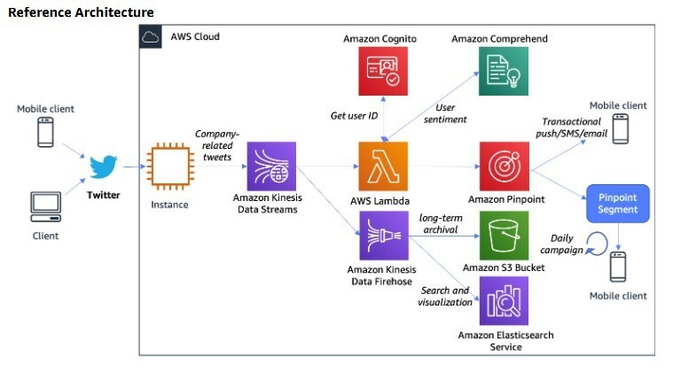

# Citizen engagement reference architecture

Governments are increasingly investing in citizen facing
channels: mobile applications, web portals, call center agents,
and chatbots to enhance the overall citizen experience. In a
regulated industry space, user engagement architectures
challenge the segregation often recommended for classified
workloads and in some cases with citizen engagement it’s based
on verifiable identity along with:

- High volumes of real-time ingestion from public and private
  sources.
- The requirement for different data protection based on data
  classification.
- Use of event-driven architectures to leverage on-demand scalability and pay-per-use
  model.
- Inclusion of real-time and archival flows.

_Figure 2: Reference architecture for a citizen engagement
solution_
