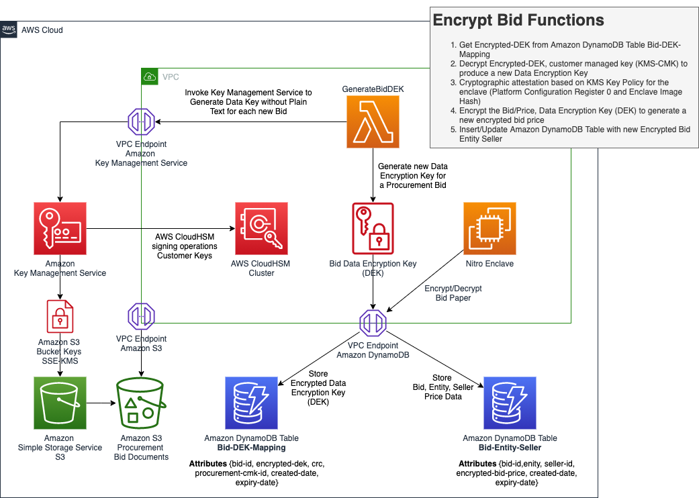

# Distributed processing of sensitive documents reference architecture

Governments often need to separate their processing in segmented
ways to heighten the level of security. This often occurs when
the information is classified as confidential. However, there is
still a need to effectively process the data in segregated
environments. In this scenario, the processing of sensitive
documents might involve distributed and separated systems.

_Figure 4: Reference architecture for the distributed processing of
sensitive data_
