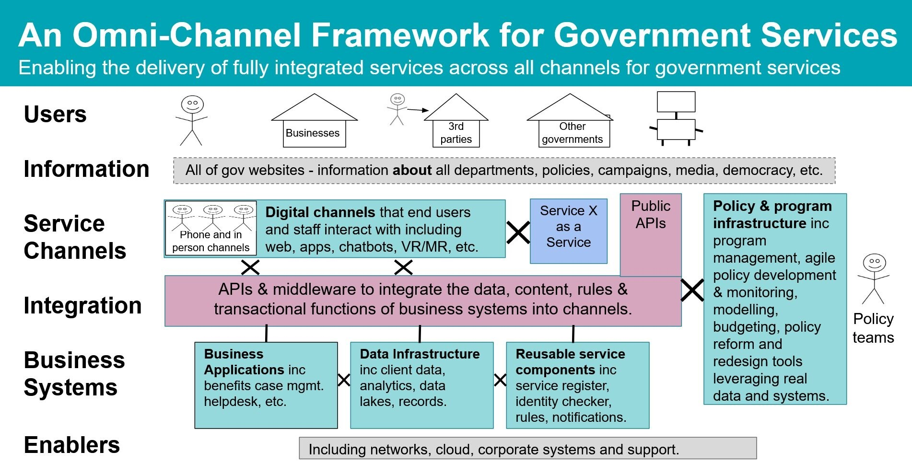

# Omni-channel public services

Public-facing government services should have online and offline options to verify that
they are inclusive and accessible by all. In many cases, this requirement will be
legislated. If a digital service is built in isolation to a phone or in-person channel, then
you might have a duplication of functions and increased management costs, as well as potential
inconsistency across channels. Inconsistency can lead to inequities, especially given the
reality of many government services being either mandatory (such as submitting a tax return)
or a last resort for people at their most vulnerable (such as emergency payments or social
services). 

Omni-channel public services help provide a consistent experience for users, including
staff, by providing a virtualized presentation layer. This approach makes reusable service
components and capabilities available to channels through an integration layer. This means
that the backend and business systems can be consumed across all channels in a consistent way,
while still providing flexibility to the public-facing services to optimize interactions for
different channels.

Through this integration layer, governments should also consider providing a set of
highly reusable modular components for the most commonly needed functions within digital
services, such as taking payments, sending notifications, verifying identity, and collecting
form data. This approach is often referred to as Government as a Platform (GaaP), where
collectively these modular commodity service components provide a platform for services to be
built upon. GaaP allows service teams to consume existing commodities so that they can spend
more time on what is unique to their service and users.

**Characteristics of a good omni-channel architecture:**

- Consistency of functionality and features across channels.
- A virtualized presentation layer, where all channels draw on
  common business functions through a common integration layer.
- An integration layer that provides secure, consistent, and
  common management of data, content, rules, and transactional
  functions across all channels.
- Channel agility, where channels can rapidly evolve and change
  according to new technologies, devices, and user needs as they
  emerge, decoupled from the management of business systems.
- Policy and program teams can use the same infrastructure to
  measure, monitor, and model the intended and unintended
  impacts of government services.

## Conceptual architecture for omni-channel

public services

_Figure 5: The omni-channel architectural framework for government
services_
