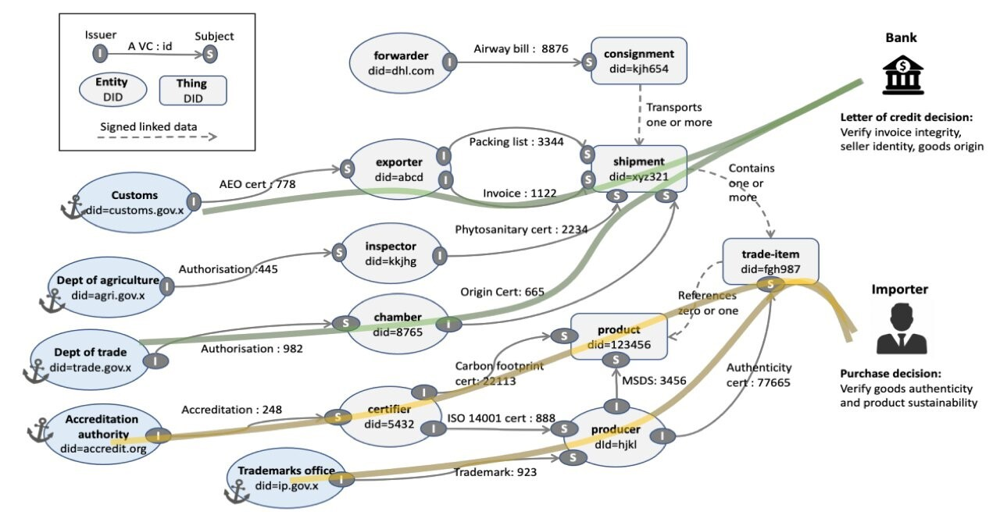

# Verifiable credentials (claims)

for government

There are several scenarios where verifiable credentials (VCs) make sense in a government
context.  Verifiable credentials provide a repeatable pattern in scenarios where assertions
about the state of something is useful and those assertions are valuable outside the four
walls of government or a specific department.  Examples include trade, identity, technology
bill of materials, inspections, and certifications.  The key concept for government is that
they are in a unique position in society to be a _trust anchor_ for
specific types of claims that become a tether for _chains of claims_. 

In most economies, the trust anchors are government agencies and accreditation
authorities. The role of trust anchors is to issue digital credentials to their community
members, which the members can use to make their own credentials more trustworthy. For
example, a national company’s register that traditionally issues company registration
certificates as paper or a PDF file, can now issue them as VCs so that the company can prove
its identity to any verifier. A fundamentally important advantage of the decentralized
architecture of VCs and Digital Identities (DIDs) is that there is no need for a direct
relationship between the issuer (for example, the company’s register) and the verifier who,
for cross border trade scenarios, is most likely in another country.

**Here’s how it works:**

- A member of a regulated community (such as a company
  director) creates a DID and associated public and private
  key pair using the software of their choice.
- The member authenticates to the trust anchor service (such
  as the company’s register) as they would normally do when
  interacting with the regulator or trust anchor.
- The member presents evidence that they are the owner of the
  DID (a digital signature using the DID private key) that the
  trust anchor can verify using the public key.
- The trust anchor issues a VC with the member DID as subject
  that contains relevant claims (for example, that the DID
  subject is indeed an authorized officer of the company).
- The member (that is, the company) can now leverage this
  regulator-attested digital identity as part of its normal
  business. For example, the company issues a commercial
  invoice with their DID as the issuer. The invoice VC
  includes a link to the company registration VC.
- The invoice recipient can now verify that the invoice VC was
  issued by the company DID and hasn’t been tampered with, and
  that the registration VC was issued by the authorized
  government regulator and confirms that the same DID is for
  the same company.
- If the company is de-registered, the regulator can revoke
  the registration VC. Immediately after revocation, any
  verification of the original VC will result in failure.
  It’s important to re-emphasize that the trust anchor is still doing their normal business
  of issuing certificates, permits, registrations, and licenses to their members—they are just
  doing it digitally. There is no relationship between the trust anchor and verifiers. The
  digital credentials are also paper-compatible, for example, they can be made available as a QR
  link on a paper or PDF certificate. Whether the member makes use of the digital credential for
  downstream proofs is up to the member.

When well-implemented, a VC architecture has the following
characteristics:

- Claims and credentials are able to be quickly and programmatically verified in real
  time by relevant authorities.
- The claims and credentials are considered trustworthy for
  major stakeholders.
- An end user gets a more personalized service without having
  to over share personal information.
- VC is made available as a utility to serve multiple use
  cases.
- VCs are signed from a central, reliable, and trustable source – that is, at the
  organizations domain (that is, from `did=trade.govx`) so that people, systems,
  and organizations can rely on the claim issued by the trust anchor.
- VCs issued from the organization are within the legislative
  or administrative scope of the department.
- VCs issued have a human understandable description that maps
  back to the organization’s scope or legislation.
- VC domains map to legislative, international agreements, or
  both so that claims are understandable beyond just the scope
  of the department.
- VC domains are validated against the organizations
  legislative or administrative scope.
- Test architectures, methodologies, and infrastructure are in
  place to verify that only quality claims are issued.

## Conceptual architecture

The following diagram represents a _trust
graph_ combining several claims from various
departments for the benefit of the community. 

_Figure 6: Illustration of the range of government digital identity
proofs_

Figure 6 shows a range of government digital identity proofs examples (Customs,
Department of Agriculture, Department of Trade, Accreditation Authority, and Trademarks
office), each of which can issue a verifiable identity of an entity (exporter, inspector,
chamber, certifier and producer, respectively) or a verifiable piece of information that
relates to a consignment, shipment, product, or producer (such as source, supply chain, or
ingredients). This leads to a bank being able to issue a Letter of Credit decision which can
automatically verify the invoice integrity, seller integrity, and goods origin from each of
the relevant authorities through the verifiable credentials system. It also enables an
importer to make a purchase decision by being able to automatically verify the goods
authenticity and product sustainability through relevant verifiable credentials.

A single verifiable credential allows an issuer to make one or more verifiable claims
about a subject.  For example, an exporter might issue a commercial invoice for a given
shipment of goods as a VC. A verifier can be confident that the invoice was issued by the
identified exporter and hasn’t been tampered with. Similarly, a certifier can issue an
ISO-14000 environment certificate to an identified producer that can be presented to a party
for digital verification of ISO certification. 

These uses are valuable in themselves, but credentials can be chained together to
create _trust graphs_ that release much greater value. The connections
that make up the graph can be explicit (for example, a credential includes a link to another
credential) or implicit (for example, the same DID appears in two separate credentials).
Consider the previous example, in which nodes represent DIDs and links are VCs.

**References**

- Section 3.4 of [UN/CEFAFT White Paper on eDATA Verifiable Credentials for Cross Border Trade](https://unece.org/sites/default/files/2023-08/WhitePaper_VerifiableCredentials-CrossBorderTrade_September2022.pdf "https://unece.org/sites/default/files/2023-08/WhitePaper_VerifiableCredentials-CrossBorderTrade_September2022.pdf")
