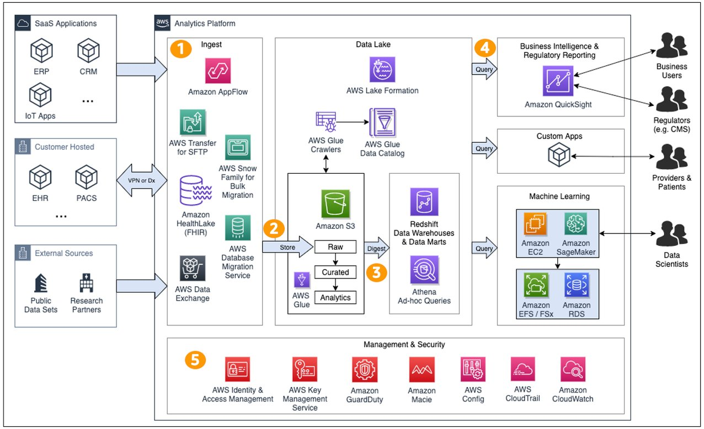

# Healthcare analytics reference architecture

This section covers a reference implementation of a healthcare
analytics platform using native AWS services. Refer to
the [Architecture
Best Practices for Analytics and Big Data](https://aws.amazon.com/architecture/analytics-big-data "https://aws.amazon.com/architecture/analytics-big-data") to browse best
practices for data management and analytics. The components in
this architecture are building blocks that can be used as-is or
substituted with third party components to meet business
requirements.

_A representative healthcare analytics
environment._

- The analytics platform must support the wide variety of
  communication protocols used by healthcare systems including
  bulk data feeds and real-time data streams. Examples include
  bulk data transfers using secure FTP, HL7v2 over MLLP and
  standard FHIR web services. Legacy protocols that don’t
  support encryption must run over an encrypted channel such
  as a Site-to-Site VPN.
- Store raw data in a durable, highly available, and secure
  object store such as Amazon S3. Enable default encryption to
  verify that all objects are encrypted at rest. Lifecycle
  policies can be set up to reduce costs based on your access
  requirements. Many AWS and third party services provide
  direct integrations with Amazon S3 for data integration and
  backup. AWS Lake Formation provides a framework to organize
  and secure the data within the Amazon S3 data lake.
- For high volume message ingestion, batch messages through
  services such as Amazon Kinesis to reduce the number of
  actions taken to store the data. This can reduce the overall
  cost of data ingestion. Prevent data integrity issues by
  ensuring the batching process aligns with the requirements
  of the data pipeline.
- Use AWS Glue Crawlers to automatically discover and catalog
  schemas for the raw datasets. AWS Glue ETL processing
  workflows transform and normalize the data through
  serverless and horizontally scalable jobs. Track data
  lineage to establish traceability and reproducibility for
  compliance. Use Amazon Redshift for data warehousing and
  Amazon Athena for SQL queries against cataloged
  datasets.
- End users interact with the data and insights across all the
  normalized healthcare data through a number of ways. For
  example:
  - Business users and regulators perform analysis, view
    dashboards, and receive reports using business
    intelligence tools like Quick Suite.
  - Custom application integrations use the data to surface
    insights to end users, including to the point of care.
    Data can be accessed using a variety of AWS services
    such as Lambda functions, containers running in Amazon ECS, Amazon EKS, or AWS AppSync. Verify that the AWS
    services being used are eligible for the healthcare
    compliance framework applicable to your workload (such as
    the [HIPAA
    Eligible AWS Services](https://aws.amazon.com/compliance/hipaa-eligible-services-reference/ "https://aws.amazon.com/compliance/hipaa-eligible-services-reference/")).
  - Machine learning (ML) experts can pull standardized
    datasets and combine them with datasets using custom
    data preparation processes.

- Use IAM and Lake Formation to narrowly scope permissions.
  Access controls should be enforced across all AWS
  environments. Use Amazon CloudWatch to monitor your
  solution's metrics, logs, and alarms. Use AWS CloudTrail to
  monitor access to AWS APIs along with GuardDuty to alert on
  unusual activity. Use Amazon Simple Notification Service
  (SNS) for sending notifications to on-call engineers and
  other data consumers. Amazon Macie can automatically
  discover and categorize sensitive data such as personally
  identifiable information (PII) and protected health
  information (PHI). An audit log must be used to capture all
  sensitive data access (create, read, update, and delete) for
  regulatory compliance purposes.
