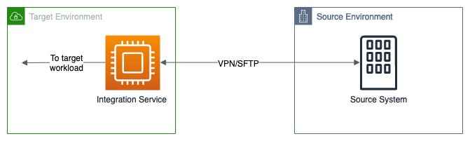
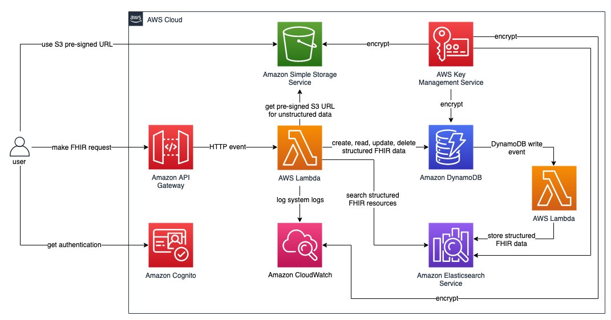

# Interoperability reference architecture

HL7 v2, HL7 v3, and HL7 FHIR are three of the most common healthcare
messaging standards used today. This section highlights
architectures for each.

## HL7 v2

In practice, HL7 v2 tends to have reasonable structural
standardization, but weak semantic interoperability.
Structurally, HL7 v2 messages consist of one or more
_segments_ delineated as separate lines.
Within each segment, _fields_ are
pipe-delimited. Semantically, the contents of HL7 v2 messages
may use any number of standard vocabularies or lack externally
linkable terms or codes entirely. If using HL7 v2, consider
automated ways to map to standard ontologies, such as using
NLP algorithms trained on medical text.

The Minimum Lower Layer Protocol (MLLP) is a common transport
standard used for HL7 v2 interoperability. MLLP streams bytes
using TCP/IP and uses special header and trailer (such as a footer)
wrappers to signify the beginnings and ends of messages.
Notably, the MLLP does not natively provide encryption.
However, in recent years, many interfaces have started
supporting MLLP over TLS for added security. For interfaces
that do not support TLS, additional measures must be taken to
verify encryption of data in transit.

An HL7 v2 interoperability architecture may leverage the HL7
v2 APIs of a source system, like an EHR. To provide end-to-end
encryption between the source system and target system, it’s a
best practice to use a VPN tunnel or secure protocols like SSH
File Transfer Protocol (SFTP), as MLLP may not provide TLS.
The source system may asynchronously send batches of messages
to an encrypted Amazon S3 bucket, or may synchronously exchange
messages with a target integration service, as shown in the following figure.

_A common HL7v2 interoperability
architecture where the integration may exchange HL7 v2
messages through a VPN tunnel or SFTP. MLLP over TLS can
help keep messages encrypted in transit._

## HL7 v3

The HL7 v3 standard is commonly used for exchanging Continuity
of Care Document (CCD) and Consolidated Clinical Document
Architecture (C-CDA) messages. These messages are often
exchanged using Cross-Enterprise Document Sharing (XDS)
transactions, which are based on web services. Amazon API Gateway can be used to create a web service to support these
XDS transactions such as ITI-41. TLS with
[certificated-based
authentication](https://aws.amazon.com/blogs/compute/introducing-mutual-tls-authentication-for-amazon-api-gateway/ "https://aws.amazon.com/blogs/compute/introducing-mutual-tls-authentication-for-amazon-api-gateway/") can be implemented at API Gateway for
data security.
[Resource
policy](../../../apigateway/latest/developerguide/apigateway-resource-policies-examples.md "../../../apigateway/latest/developerguide/apigateway-resource-policies-examples.md") can be used to restrict access to the API Gateway by certain source IP addresses.

## FHIR

The following diagram illustrates a representative FHIR
interoperability architecture, which presents an integration
point in front of one or more systems of record, typically
within a provider or payer organization.

_Example FHIR enabled interoperability
architecture._

- An API or server endpoint is made available for
  integration with other systems or users. A managed API
  service, like Amazon API Gateway, ensures scalability and
  high availability. Restrict network access to the API if
  possible and use a web application firewall to filter
  malicious requests.
- Inbound requests are authenticated with
  [OAuth](https://build.fhir.org/security.html "https://build.fhir.org/security.html")
  or a service like Amazon Cognito to verify that sensitive
  health data is only exchanged with appropriate parties.
- Inbound payloads are checked for conformance to relevant
  structural interoperability standards, ensuring the safety
  and integrity of data exchange.
- Data may be written to or pulled from systems of record
  within the organization hosting the interoperability
  architecture.
- Many systems of record host health data in proprietary
  formats and schemas. Therefore, interoperability
  architectures perform some transformations to map data
  elements to and from the interoperability standard.
- The architecture may store the exchanged health data using
  a database service like DynamoDB, or it may exchange data
  without persisting it.
- [AWS HealthLake](https://aws.amazon.com/healthlake/ "https://aws.amazon.com/healthlake/") enables use cases that require
  enrichment of health data in FHIR format or downstream
  analytics and machine learning. AWS HealthLake can
  improve semantic interoperability by applying natural
  language processing (NLP) to link concepts in unstructured
  data to terms in standard health ontologies, like
  ICD-10-CM, SNOMED CT, and RxNorm.
