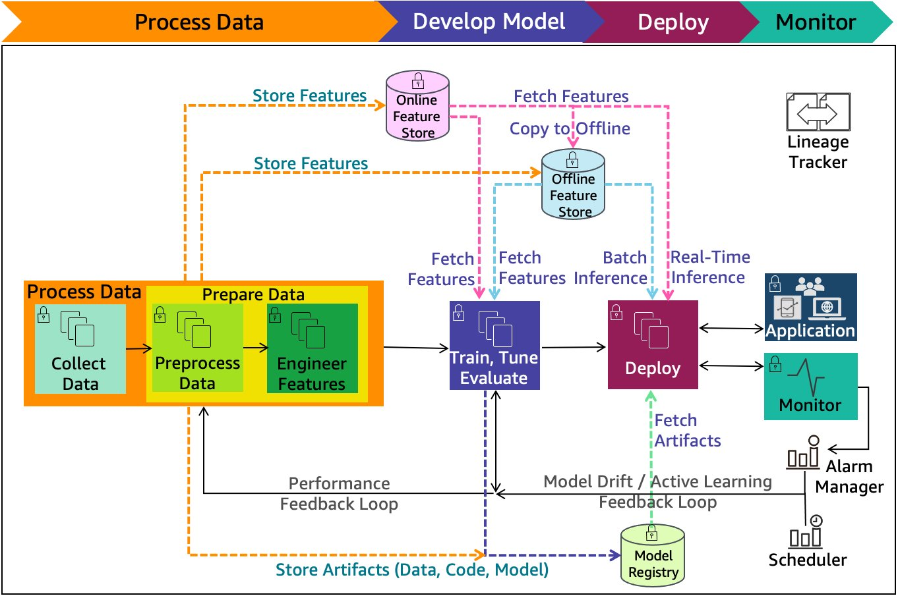

# Machine learning reference architecture

This section depicts a typical machine learning lifecycle and data flow.

_[ML
lifecycle](../machine-learning-lens/ml-lifecycle-phase-model-development.md "../machine-learning-lens/ml-lifecycle-phase-model-development.md") with detailed phases and expanded
components_

The following steps detail the end-to-end data flow for machine learning:

1. Data is collected and pre-processed using a data lake, as
   described in the preceding _healthcare
   analytics_ scenario.
2. Features representing clinically valid events, concepts, and
   processes of care are extracted from raw data and stored in
   feature stores for model training.
3. The ground truth of data labels is populated and reviewed by
   humans, which can be used to build supervised classification
   or regression models.
4. Standard ML training, tuning, and evaluation workflows are
   used to develop models.
5. Models are reviewed by cross-functional stakeholders, such as
   clinical leaders and regulatory reviewers. Models are
   evaluated based on performance and explainability requirements
6. Accepted models may be integrated with IT systems used for
   care delivery, such as EHRs and medical devices.
7. Model inferences are incorporated in clinical workflows.
   Providers may be trained on how to use the models as they
   deliver care.
8. Model inferencing pipelines are monitored, and the performance
   of deployed models is periodically checked.
