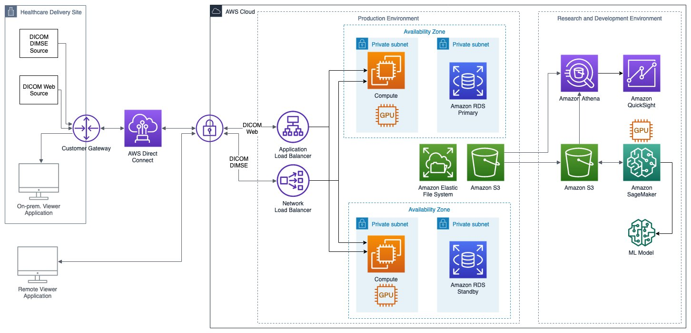

# Medical imaging system reference architecture

This section describes key aspects of medical imaging systems,
such as PACS and VNA solutions.

_A cloud-based medical imaging system, such
as a PACS or VNA, on AWS. High availability and low-latency study retrieval for
medical imaging solutions._

- The solution should be highly available and deployed across
  multiple AWS Availability Zones.
- Medical imaging systems often consist of front-end viewers,
  application servers, databases, and storage for the imaging
  data. Where possible, each tier of the solution should be
  able to auto scale independently. Containerization or
  serverless can simplify operations. Auto Scaling based on
  load provides performance during peak demand and minimize
  costs during periods of low demand.
- Images may be programmatically retrieved using the DICOM
  Message Service Element (DIMSE) or DICOMweb protocol. A
  Network Load Balancer may be used to route traffic on ports
  used by DIMSE.
- End users likely demand low latency for retrieving and
  displaying medical images. Consequently, the data must be
  durably stored and highly available for immediate retrieval.
  Users may expect immediate retrieval of medical images that
  are several years old.
- Recently ingested studies may be cached on
  SAN
  storage, EBS volumes, or high-performance file
  systems like Amazon FSx. Cost optimized solutions provision
  the minimum volume sizes needed to meet performance
  requirements, and maximize the use of cost-effective object
  storage like Amazon S3.
- Medical image data tends to be accessed less frequently as
  it ages, so newly ingested data should land on Amazon S3 Standard,
  and then move to lower-cost
  [tiers](https://aws.amazon.com/s3/storage-classes/ "https://aws.amazon.com/s3/storage-classes/"),
  such as Amazon Glacier Instant Retrieval, as access
  frequency declines over time. Amazon S3 Intelligent-Tiering can
  automatically move data to the most cost-effective access
  tier based on access frequency.
- Metadata for medical image objects and associated clinical
  data is commonly stored in a database. These databases may
  require high-performance storage for the requisite latency
  and IOPS. In-memory caches, like ElastiCache, may also be
  used to improve performance. Leverage fully managed database
  services to attain high availability with minimal
  operational complexity.
- The data acquired by some medical imaging scanners — like
  MRI, CT, C-Arm — must be processed in
  _image_
  _reconstruction_ to yield readable
  images. Image reconstruction can be thought of as a
  [high
  performance computing (HPC) workload](../high-performance-computing-lens/welcome.md "../high-performance-computing-lens/welcome.md"). Cloud based
  compute provides elasticity, reducing the time required to
  perform image reconstruction for emergency procedures.
- Front-end viewers can leverage protocols like
  [HTTP/2](https://developers.google.com/web/fundamentals/performance/http2 "https://developers.google.com/web/fundamentals/performance/http2")
  to minimize image download times. Applications may also
  pre-fetch, cache, or prioritize transmitting the images that
  are likely to be opened by the end user.
- On-premises caches can provide low-latency hot storage.
  [AWS Local Zones](https://aws.amazon.com/about-aws/global-infrastructure/localzones/ "https://aws.amazon.com/about-aws/global-infrastructure/localzones/") and
  [AWS Outposts](https://aws.amazon.com/outposts/ "https://aws.amazon.com/outposts/") may help meet hybrid architecture, latency,
  and data sovereignty concerns.
- Redundant network connections between care settings and
  cloud services are recommended when a loss of connectivity
  can impact patient health.
  [AWS Direct Connect](https://aws.amazon.com/directconnect/ "https://aws.amazon.com/directconnect/") should be used by customer sites with
  high study volume. Hybrid architectures may help meet
  stringent latency and business continuity requirements.
- [Data
  lakes](https://aws.amazon.com/solutions/implementations/data-lake-solution/ "https://aws.amazon.com/solutions/implementations/data-lake-solution/") can enable both operations and research and
  development. Datasets for the development of machine
  learning algorithms and AI features can be stored in data
  lakes.
  [AWS AI services](https://aws.amazon.com/machine-learning/ai-services/ "https://aws.amazon.com/machine-learning/ai-services/") and
  [Amazon SageMaker AI](https://aws.amazon.com/sagemaker/ "https://aws.amazon.com/sagemaker/") can help ISVs rapidly develop AI-based
  features drawing from a data lake. SageMaker AI Ground Truth
  can streamline the process of labeling data for model
  training.
