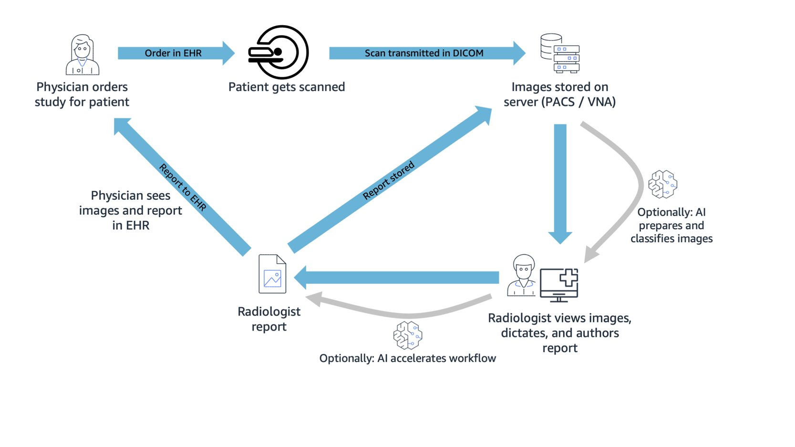

# Medical imaging

Medical imaging in healthcare spans diagnostic medical imaging,
digital pathology, dental imaging, and related applications.
Medical imaging systems enable workflows anchored in the
generation, storage, and analysis of medical imaging study data.
The data is commonly generated by medical imaging hardware, like
[CT
scanner](https://www.fda.gov/radiation-emitting-products/medical-x-ray-imaging/computed-tomography-ct "https://www.fda.gov/radiation-emitting-products/medical-x-ray-imaging/computed-tomography-ct")s, magnetic resonance imaging
([MRI](https://www.fda.gov/radiation-emitting-products/medical-imaging/mri-magnetic-resonance-imaging "https://www.fda.gov/radiation-emitting-products/medical-imaging/mri-magnetic-resonance-imaging"))
machines, and
[ultrasound](https://www.fda.gov/radiation-emitting-products/medical-imaging/ultrasound-imaging "https://www.fda.gov/radiation-emitting-products/medical-imaging/ultrasound-imaging")
devices, and may be stored in picture archiving and communication
systems (PACS) or vendor neutral archives (VNA). There is also
secondary use of medical imaging data for non-clinical workloads,
such as medical research or development of new medical devices.

Characteristics of medical imaging architectures include:

- Imaging study data is generated by on-premises modalities,
  durably stored by PACS and VNA solutions, and maintained
  highly available for immediate retrieval by radiologists and
  other end users. Solution end users, like radiologists, likely
  expect low latency retrievals of new and old imaging studies.
- An imaging study will likely be accessed several times shortly
  after ingestion, and tends to be accessed less frequently with
  age. Regulatory requirements may dictate that studies be
  retained for several years, and operators may decide to keep
  studies in perpetuity.
- The imaging scanners, physicians, technicians, and
  radiologists may be located at the same physical site. Or,
  cross-site collaboration and outsourced radiology services may
  extend workflows across multiple care settings.
- Medical imaging systems commonly interoperate with other
  provider systems, like EHRs, though data integrations.
- Medical imaging study data is often stored and transmitted
  using the
  [DICOM
  standard](https://www.dicomstandard.org/ "https://www.dicomstandard.org/"). This standard covers both a network protocol
  and file format definitions.
- Some medical imaging solutions, such PACS, may fall under
  regulatory control, such as
  [GxP
  regulation](https://aws.amazon.com/compliance/gxp-part-11-annex-11/ "https://aws.amazon.com/compliance/gxp-part-11-annex-11/") in the US. Machine learning algorithms that
  aid in diagnoses may also fall under regulatory control.
  Determine which, if any, regulatory controls are applicable to
  your solutions.
- Data processing, provider workflows, and end user interfaces
  may leverage AI to improve care quality and boost
  productivity. Example applications include computer vision
  applied to detect disease in medical images, and NLP applied
  to support report authoring.
- A high-level overview of the medical imaging workflow is shown
  in figure 3.

_A representative medical imaging
workflow._
