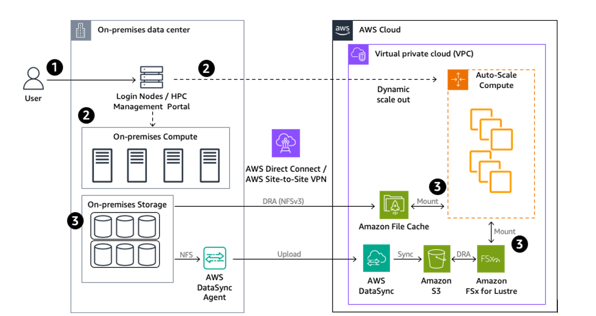

# Hybrid scenarios

Hybrid deployments are primarily considered by organizations that
are invested in their on-premises infrastructure and also want to
use AWS. This approach allows organizations to augment on-premises
resources and creates an alternative path to AWS rather than an
immediate full migration. Hybrid-deployment architectures can be
used for loosely and tightly coupled workloads.

Hybrid scenarios vary from minimal coordination, like workload
separation, to tightly integrated approaches, like
scheduler-driven job placement. Motivations to drive the hybrid
approach could be one of the following:

- **To meet specific workload
  requirements:** An organization may separate their
  workloads and run all workloads of a certain type on AWS
  infrastructure. For example, an organization may choose to run
  research and development workloads in their on-premises
  environment, but may choose to run their production workloads
  on AWS for higher resiliency and elasticity.
- **To extend HPC resources:**
  Organizations with a large investment in their on-premises
  infrastructure typically have a large number of users that
  compete for resources during peak hours. During these times,
  they require more resources to run their workloads.
- **To extend technical
  functionality:** In many cases, on-premises HPC
  infrastructure runs on a unified CPU architecture. Some may
  have accelerators such as GPUs for specialized use cases.
  Customers may avoid lengthy hardware procurement processes and
  run some workloads on AWS to experiment with hardware that is
  not already available in their on-premises environment. AWS
  provides a variety of choices in architecture on Amazon EC2 in
  CPU and accelerators. There are also other services such as
  [Amazon
  Braket](https://aws.amazon.com/braket/ "https://aws.amazon.com/braket/") (a fully managed service for quantum computing),
  [Machine
  Learning Service - Amazon SageMaker AI AI](https://aws.amazon.com/pm/sagemaker/ "https://aws.amazon.com/pm/sagemaker/") (a fully-managed
  service to build, train, and deploy machine learning models),
  and many more that can be used in conjunction with on-premises
  resources.
- **To enhance commercial
  capability:** Some organizations have policy
  restrictions that dictate that their users cannot publish or
  commercialize their in-house developed HPC solutions to the
  general public in their on-premises environment, and may
  choose to do so on AWS. For example, users of a
  government-owned HPC facility may develop applications and
  solutions through their scientific research. To share their
  work within the larger community, they can host their solution
  on AWS and provide it as a solution on AWS Marketplace.

Data locality and data movement are critical factors in
successfully operating a hybrid scenario. A suitable architecture
for a hybrid workload has the following considerations:

- **Network:** In a hybrid
  scenario, the network architecture in between the on-premises
  environment and AWS should be considered carefully. To
  establish a secure connection, an organization may use AWS Site-to-Site VPN to move their data light workloads between
  their own data center and AWS. For data intensive workloads, a
  dedicated network connection in between an on-premises
  environment and AWS with AWS Direct Connect may be a better
  choice for sustainable network performance. For further low
  latency requirements or to meet stringent data residency
  requirements,
  [AWS Local Zones](https://aws.amazon.com/about-aws/global-infrastructure/localzones/ "https://aws.amazon.com/about-aws/global-infrastructure/localzones/") or
  [AWS Dedicated Local Zones](https://aws.amazon.com/dedicatedlocalzones/ "https://aws.amazon.com/dedicatedlocalzones/") may be an option.
- **Storage:** Techniques to address data management vary
  depending on organization. For example, one organization may have their users manage the
  data transfer in their job submission scripts, while others might only run certain jobs in
  the location where a dataset resides, and another organization might choose to use a
  combination of several options. Depending on the data management approach, AWS provides
  several services to aid in a hybrid deployment.

For example, Amazon File Cache can link an on-premises file system to a cache on
AWS, AWS Storage Gateway File Gateway can expose an Amazon S3 bucket to on-premises resources over
NFS or SMB, and AWS DataSync automatically moves data from on-premises storage to Amazon S3
or Amazon Elastic File System. Additional software options are available from third-party companies in the
AWS Marketplace and the AWS Partner Network (APN).

- **Compute:** A single loosely
  coupled workload may span across an on-premises and AWS
  environment without sacrificing performance, depending on the
  data locality and amount of data being processed. Tightly
  coupled workloads are sensitive to network latency, so a
  single tightly coupled workload should reside either on
  premises or in AWS for best performance.
- **Deployment:** Many job
  schedulers support bursting capabilities onto AWS, so an
  organization may choose to use their existing on-premises job
  scheduler to handle deployment of compute resources onto the
  cloud. There are also third-party HPC portals or meta
  schedulers that can be integrated with clusters either on
  premises or in the cloud. Depending on its hybrid strategy, an
  organization may choose to separate their workloads by
  different teams, in which case they may consider using AWS
  tools and services such as AWS ParallelCluster and AWS Batch
  with file sharing capabilities through hybrid storage
  offerings such as Amazon File Cache, AWS DataSync or AWS Storage Gateway.

## Reference architecture: Hybrid deployment

Data-light workloads in a hybrid HPC architecture are typically
workloads with a small dataset that does not require many I/O
operations during runtime. For data-light workloads where data
movement between on-premises infrastructure and the AWS Cloud is
not a significant factor, consider setting up a cache
functionality on AWS. Amazon File Cache can be used to create a
cache for workloads on AWS and can be mounted directly on Amazon EC2 instances. Amazon File Cache is an AWS service that can be
associated with Amazon S3 or NFS as a data repository.

Many HPC facilities have a parallel file system in their
on-premises infrastructure, which can be exported over NFS
protocol. When data is accessed on a linked NFS data repository
using the cache, Amazon File Cache automatically loads the
metadata (the name, ownership, timestamps, and permissions) and
file contents if they are not already present in the cache. The
data in the data repositories appears as files and directories
in the cache. If data is not in the cache on first read, Amazon
File Cache initiates lazy load to make it available on the
cache.

Data-intensive workloads generate a large amount of I/O to files
while the workload is running. When processing data intensive
workloads with HPC infrastructure, it is important that the data
is placed as close to the compute resources as possible for
lower latency. Due to latency issues, it is not realistic to
move large data sets whenever necessary or access files multiple
times that are located at a distant place. Therefore, for
data-intensive workloads, it is critical to place data in the
location where the workload will run. If the primary storage is
in the on-premises data center, there should be a copy of the
data on AWS before a workload is run.

AWS DataSync is a service that allows movement of data in and
out of AWS for timely in-cloud processing, which can be used for
this type of scenario. Depending on the usage pattern or
operational policy, you can choose to sync your entire storage
data (or a subset of the data) to optimize cost. When a secure
network connection such as AWS Direct Connect or AWS
Site-to-site VPN is already configured, data can be synced
securely in between the on-premises storage system and AWS.

In general, Amazon S3 is a good choice as a target storage
system for data transfers due to its durability, low cost, and
capability to integrate with other AWS services. Associating an
Amazon FSx for Lustre file system with an S3 bucket makes it
possible to seamlessly access the objects stored in your S3
bucket from Amazon EC2 instances that mount the Amazon FSx for Lustre file system. Once the job is complete, results can be
exported back onto the data repository.

_Reference architecture: Hybrid deployment_

**Workflow steps**

1. User logs on to the Login Node or HPC Management Portal and
   submits a job through the mechanism available (for example,
   scheduler, meta-scheduler, or commercial job submission
   portals).
2. The job is run on either on-premises compute or AWS
   infrastructure based on configuration.
3. The job access shared storage based on their run location.
   Depending on whether the workload is data light or data
   heavy, files should be placed in a strategically chosen
   place. For data-light workloads, if user wants to run on AWS
   and data is not available on the cache, Amazon File Cache
   initiates lazy load before data is processed by the compute
   fleet. For data-intensive workloads, files should have
   already copied over to Amazon S3 using AWS DataSync before
   the job is run on AWS. Once the job starts running, Amazon FSx for Lustre initiates lazy load from Amazon S3 to Lustre.
