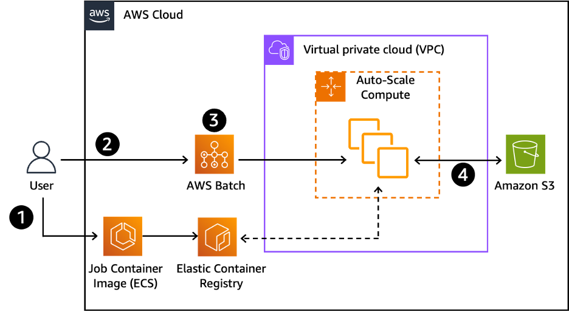

# Loosely coupled scenarios

A loosely coupled workload entails the processing of a large number of smaller tasks.
Generally, the smaller task runs on one node, either consuming one process or multiple
processes with shared memory parallelization (SMP) for parallelization within that node. The
parallel processes, or the iterations in the simulation, are post-processed to create one
solution or discovery from the simulation. The loss of one node or job in a loosely coupled
workload usually doesn't delay the entire calculation. The lost work can be picked up later or
omitted altogether. The nodes involved in the calculation can vary in specification and power.
Loosely coupled applications are found in many disciplines and range from data-light
workloads, such as Monte Carlo simulations, to data-intensive workloads, such as image
processing and genomics analysis. Data-light workloads are generally more flexible in
architectures, while data-intensive workloads are generally more impacted by storage
performance, data locality with compute resources, and data transfer costs. A suitable
architecture for a loosely coupled workload has the following considerations:

- **Network:** Because parallel
  processes do not typically interact with each other, the
  feasibility or performance of the workloads is typically not
  sensitive to the bandwidth and latency capabilities of the
  network between instances. Therefore, cluster placement groups
  are not necessary for this scenario because they weaken
  resiliency without providing a performance gain. However,
  data-intensive workloads are potentially more sensitive to
  network bandwidth to your storage solution when compared to
  data-light workloads.
- **Storage:** Loosely coupled
  workloads vary in storage requirements and are driven by the
  dataset size and desired performance for transferring,
  reading, and writing the data. Some workloads may require a
  local disk for low latency access to data, in which case
  customers may choose an EC2 instance with instance storage.
  Some workloads may require a shared file system that can be
  mounted on different EC2 instances, which would be a better
  fit with an NFS file share, such as
  [Amazon Elastic File System (EFS)](https://aws.amazon.com/efs/ "https://aws.amazon.com/efs/"), or a parallel file system, such as
  [Amazon FSx for Lustre](https://aws.amazon.com/fsx/lustre/ "https://aws.amazon.com/fsx/lustre/").
- **Compute:** Each application
  is different, but in general, the application's
  memory-to-compute ratio drives the underlying EC2 instance
  type. Some applications are optimized to take advantage of AI
  accelerators such as
  [AWS Trainium](https://aws.amazon.com/machine-learning/trainium/ "https://aws.amazon.com/machine-learning/trainium/") and
  [AWS Inferentia](https://aws.amazon.com/machine-learning/inferentia/ "https://aws.amazon.com/machine-learning/inferentia/"), graphics processing units (GPUs), or
  field-programmable gate array (FPGA) on EC2 instances.
- **Deployment:** Loosely coupled
  simulations can be run across many (sometimes millions) of
  compute cores that can be spread across Availability Zones
  without sacrificing performance. They consist of many
  individual tasks, so workflow management is key. Deployment
  can be performed through end-to-end services and solutions
  such as AWS Batch and AWS ParallelCluster, or through a
  combination of AWS services, such as
  [Amazon Simple Queue Service (Amazon SQS)](https://aws.amazon.com/sqs/ "https://aws.amazon.com/sqs/"),
  [AWS Auto Scaling](https://aws.amazon.com/autoscaling/ "https://aws.amazon.com/autoscaling/"),
  [Serverless
  Computing - AWS Lambda](https://aws.amazon.com/pm/lambda/ "https://aws.amazon.com/pm/lambda/"), and
  [AWS Step Functions](https://aws.amazon.com/step-functions/ "https://aws.amazon.com/step-functions/"). Loosely coupled jobs can also be
  orchestrated by commercial and open-source workflow engines.

## Reference architecture: AWS Batch

AWS Batch is a fully managed service that helps you run large-scale compute workloads in
the cloud without provisioning resources or managing schedulers. AWS Batch enables developers,
scientists, and engineers to easily and efficiently run hundreds of thousands of batch
computing jobs on AWS. AWS Batch dynamically provisions the optimal quantity and type of
compute resources (for example, CPU or memory-optimized instances) based on the volume and
specified resource requirements of the batch jobs submitted. It plans, schedules, and runs
containerized batch computing workloads across the full range of AWS compute services and
features, such as Amazon EC2 and AWS Fargate. Without the need to install and manage the batch
computing software or server clusters necessary for running your jobs, you can focus on
analyzing results and gaining new insights. With AWS Batch, you package your application in a
container, specify your job's dependencies, and submit your batch jobs using the AWS Management Console,
the CLI, or an SDK. You can specify runtime parameters and job dependencies and integrate
with a broad range of popular batch computing workflow engines and languages (for example,
Pegasus WMS, Luigi, and AWS Step Functions). AWS Batch provides default job queues and compute
environment definitions that enable you to get started quickly.

_AWS Batch reference architecture_

**Workflow steps**

1. User creates a container containing applications and their
   dependencies, uploads the container to the Amazon Elastic Container Registry or another container registry (for
   example, DockerHub), and creates a job definition to AWS Batch.
2. User submits jobs to a job queue in AWS Batch.
3. AWS Batch pulls the image from the container registry and
   processes the jobs in the queue
4. Input and output data from each job is stored in an S3
   bucket.

AWS Batch can be used for data-light and data-intensive
workloads. It also can be deployed in a single Availability Zone
or across multiple Availability Zones for additional compute
capacity or architecture resiliency. When using any multi-AZ
architecture, consider the service and location for data storage
to manage performance and data-transfer costs, especially for
data-intensive workloads.
