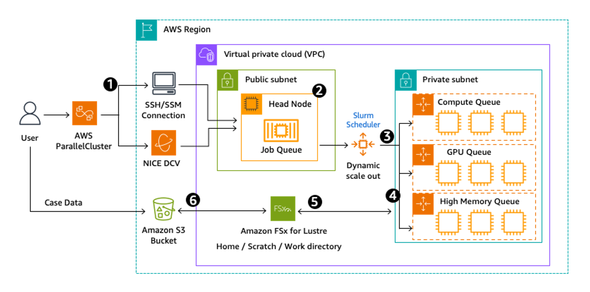

# Tightly coupled scenarios

Tightly coupled applications consist of parallel processes that
are dependent on each other to carry out the calculation. These
applications can vary in size and total run time, but the main
common theme is the requirement for all processes to complete
their tasks. Unlike a loosely coupled computation, all processes
of a tightly coupled simulation iterate together and require
communication with one another.

An _iteration_ is defined as one step of the
overall simulation. Tightly coupled calculations rely on tens to
thousands of processes or cores over one to many iterations. The
failure of one node usually leads to the failure of the entire
calculation. To mitigate the risk of complete failure,
application-level checkpointing can be used. This is a feature of
some software that allows checkpointing (saving) regularly during
computation to allow for the restarting of a simulation from a
known state.

Tightly coupled simulations typically rely on a Message Passing Interface (MPI) for
inter-process communication. Multi-threading and shared memory parallelism through OpenMP can
be used with MPI. Examples of tightly coupled HPC workloads include computational fluid
dynamics (CFD), finite element analysis (FEA), weather prediction, and reservoir simulation.

_An example of a tightly coupled workload; a high cell count
Computational Fluid Dynamics simulation_

A suitable architecture attempts to minimize simulation runtimes.
A tightly coupled HPC workload has the following key
considerations:

- **Network**: The network
  requirements for tightly coupled calculations are demanding.
  Slow communication between nodes results in the slowdown of
  the entire calculation. Cluster placement groups and
  high-speed networking cards, such as the Elastic Fabric
  Adapter (EFA), help to achieve this in the cloud. Larger
  workloads run on HPC systems are more reliant on core or
  memory speed and can scale well across multiple instances.
  Smaller workloads with a lower total computational requirement
  find networking can be the bottleneck (due to the amount of
  communication between instances required) and can have the
  greatest demand on the network infrastructure. EFA enables
  running applications that require high levels of internode
  communications at scale on AWS.
- **Storage**: Tightly coupled
  workloads vary in storage requirements and are driven by the
  dataset size and desired performance for transferring,
  reading, and writing the data. Some applications make use of
  frequent I/O calls to disk, while others only read and write
  on initial load and final save of files. Particular instances
  on Amazon EC2 have local storage (often NVMe) which suit being
  used as fast scratch storage well. In other cases, a shared
  file system, such as Amazon FSx for Lustre, would provide the
  throughput required for HPC applications.
- **Compute**: EC2 instances are
  offered in a variety of configurations with varying core to
  memory ratios. For parallel applications, it is helpful to
  spread memory-intensive parallel simulations across more
  compute nodes to lessen the memory-per-core requirements and
  to target the best performing instance type. Tightly coupled
  applications require queues with homogenous compute nodes,
  though it is possible to assign different instance types to
  different queues. Targeting the largest instance size
  minimizes internode network latency while providing the
  maximum network performance when communicating between nodes.
  Some software benefits from particular compute features and
  defining a queue with instances that benefit one code over
  another can provide more flexibility and optimization for the
  user.
- **Deployment**: A variety of
  deployment options are available. End-to-end automation is
  achievable, as is launching simulations in a traditional
  cluster environment. Cloud scalability means that you can
  launch hundreds of large multi-process cases at once, so there
  is no need to wait in a queue. Tightly coupled simulations can
  be deployed with end-to-end solutions such as AWS ParallelCluster and AWS Batch, or through solutions based on
  AWS services such as AWS CloudFormation or EC2 Fleet.

## Reference architecture: AWS ParallelCluster

A data light workload for tightly coupled compute scenarios may
be one where a lot of the file-based input and output happens at
the start and end of a compute job, with relatively small data
sets used. An example workload of this is computational fluid
dynamics, where a simulation could be created from a
light-weight geometry model. Computational fluid dynamics
involves the computation of numerical methods to solve problems
such as aerodynamics. One method of solving these problems
requires the computational domain to be broken into small cells
with equations, then solved iteratively for each cell. Even the
simplest geometric model can require millions of mathematical
equations to be solved. Due to the splitting of the domain into
smaller cells (which in turn can be grouped across different
processors), these simulations can scale well across many
compute cores.

Data intensive workloads for tightly coupled workloads have
large data sets in frequent I/O operations. Two example data
intensive workloads in a tightly coupled scenario are finite
element analysis (FEA) and computational fluid dynamics (CFD).
Both workload types require an initial read and final write of
data which can be large in size. However, FEA also requires
constant I/O during compute time. For these data intensive
workloads, it is important the path between the data and the
processor is as fast as possible while also acquiring the best
throughput possible from the storage device. Generally, if the
computational code supports parallel input and output, the HPC
cluster benefits from a very high throughput shared file system,
such as one based on Amazon FSx for Lustre.

For workloads that require many read and write operations during
solve time, such as FEA, a common approach is to allow the user
to specify a scratch drive to use for data transfer during the
simulation run time. Instance store volumes based on NVMe help
here because temporary read and write operations can be kept
local to the compute processors reducing any network or file
system bottlenecks during simulation solve time and removing the
I/O bottleneck. In this case, running these solvers on an AWS
Instance with Instance Store Volumes, such as hpc6id.32xlarge,
provides the best possible throughput for in-job I/O required.

A reference architecture suitable for this workload is shown in
the following AWS ParallelCluster Architecture diagram. This
diagram shows Amazon FSx for Lustre in use for the shared file
storage system. In many cases, Amazon EFS would be suitable for
a data light workload, though when running a large number of
simultaneous jobs Amazon FSx for Lustre may be more suited to
avoid potential race conditions occurring during software load.

AWS ParallelCluster is an AWS supported open-source cluster
management tool that makes it easy to deploy and manage an HPC
cluster with a scheduler such as Slurm. It deploys cluster
through configuration files so uses infrastructure as code (IaC)
to automate and version cluster provisioning. There are multiple
ways ParallelCluster can be used to create a cluster, like
through an API, the CLI, a GUI, or an AWS CloudFormation
template.

AWS ParallelCluster can be deployed with a shared file system
(for example,
[Amazon Elastic File System](https://aws.amazon.com/efs/ "https://aws.amazon.com/efs/") or
[Amazon FSx for Lustre](https://aws.amazon.com/fsx/lustre/ "https://aws.amazon.com/fsx/lustre/")) that a head node, as well as any compute
nodes, all have access to. With no running jobs on the cluster,
Amazon EC2 compute instances remain in terminated state, and
users are not billed for compute instance resource consumption.
When a job is submitted to the cluster, EC2 instances are
started using a specified Amazon Machine Image (AMI), and once
provisioned and fully running, become available for the compute
queue the job was submitted to. These machines remain available
and used by the scheduler until they are idle for a cooldown
period of time (10 minutes by default), at which point the EC2
instances will then be shut down and released back to AWS.

_Reference architecture: AWS ParallelCluster_

**Workflow steps**

1. User connects to cluster through a terminal session using
   either SSH connections or SSM through the AWS console.
   Alternatively, an Amazon DCV server may be running on an
   instance that allows connection to the head node through a
   graphical user interface.
2. User prepares jobs using the head node and submits jobs to a
   job queue using the scheduler, such as Slurm.
3. AWS ParallelCluster starts compute instances based on the
   requested resources. These instances are started and
   assigned to the AWS account before being available within
   the cluster's compute queue.
4. Jobs are processed through the scheduler queue with compute
   instance types and number determined by the user.
5. Input and output data from each job is stored on a shared
   storage device, such as FSx for Lustre.
6. Data can be exported to Amazon S3 (and archived in Amazon Glacier), with S3 also being used as a means of loading data
   onto the cluster from on-premises machines.

AWS ParallelCluster can be used for data-light and
data-intensive workloads. It also can be deployed in a single
Availability Zone or across multiple Availability Zones within
an AWS Region for scalability with additional compute capacity.
When using any multi-AZ architecture, consider the service and
location of the storage for lower latency and data-transfer
costs, especially for data-intensive workloads.
