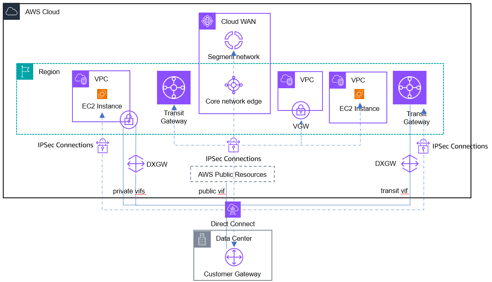

# AWS Direct Connect and IPSec VPN

Direct Connect supports MACsec encryption for dedicated 10Gbps, 100Gbps, 400Gbps, and
partner interconnects to provide point-to-point security on Ethernet links. IPSec VPNs can be
used for 1Gbps and sub-1Gbps Direct Connect connections or dedicated high bandwidth Direct
Connect connections that requires end-to-end encryption across multiple network segments. This
method achieves traffic encryption by combining the benefits of the end-to-end secure IPSec
connection, with low latency and consistent network experience of AWS Direct Connect when reaching
resources in your VPC. IPSec VPN connections can be established over Direct Connect public,
transit, or private VIF.

Direct Connect public VIF establishes a dedicated network connection between on-premises
location with AWS public resources such as AWS Site-to-Site VPN endpoints and self-managed VPN services
on EC2. Once the public VIF BGP connection is established between AWS and on-premises
location, IPSec connections can be created to self-managed VPN services on EC2, virtual
private gateway, transit gateway, or Cloud WAN core network edge to reach VPCs. This option is
recommended if you can use public IP address for VPN connections.

AWS Site-to-Site VPN Private IP VPN connection is deployed on top of Direct Connect transit VIF
connecting to Transit Gateway using private IP addresses. Customers can encrypt traffic
between their on-premises networks and AWS via Direct Connect connections without the need
for public IP addresses. Private IP VPN allows you to use Transit Gateway for access to
multiple VPCs from on-premises networks in a secure, private and scalable manner. This option
is recommended for access to multiple VPCs over a single VPN connection using private IP
address.

Software VPN appliances running on self-managed EC2 instances offers the flexibility to
fully manage both sides of your IPSec connectivity. IPSec VPN connections between your remote
network and EC2 instances can be established on top of Direct Connect private VIF using
private IP address of the VPC. This option is recommended if you must manage both ends of the
VPN connection, either for compliance purposes or for leveraging gateway devices that are not
currently supported by Amazon VPC's VPN solution.
