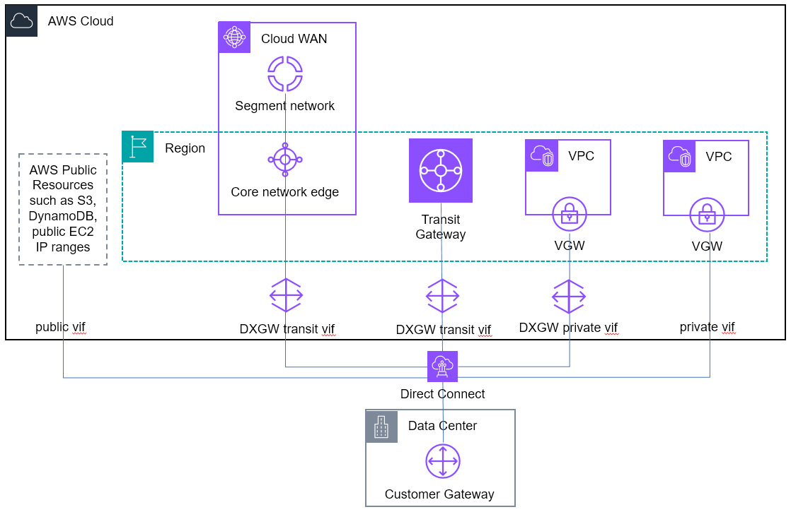

# AWS Direct Connect

Network latency over the internet can vary due to changing routes on how data gets from
point A to point B. AWS Direct Connect can enable consistent, low latency, high bandwidth dedicated
connectivity between your data centers or branch locations and AWS.

There are two types of AWS Direct Connect connections, dedicated and hosted. A dedicated
connection is a direct link between an AWS device and your on-premises device, with
bandwidths of 1 Gbps, 10 Gbps, 100 Gbps, or 400 Gbps. Hosted connections are provided by
AWS Direct Connect Partners using pre-established network links between themselves and AWS with
available bandwidths from 50 Mbps up to 25 Gbps.

If you need more bandwidth, with dedicated connections, you can provision a LAG bundle
with AWS Direct Connect. You can have a maximum of two 100 Gbps or 400 Gbps connections, or four
connections with a port speed less than 100 Gbps in a LAG. You can [Create a LAG at an Direct Connect
endpoint](../../../directconnect/latest/UserGuide/create-lag.md "../../../directconnect/latest/UserGuide/create-lag.md") from existing connections, or you can provision new connections. However, a
LAG only includes ports on the same AWS device. AWS does not support multi-chassis LAG,
this means all of your Direct Connect connections terminate on the same hardware on the AWS
side. A LAG is not recommended for a high-availability strategy.

MACsec over Direct Connect provides layer 2 encryption for point-to-point traffic between
the Direct Connect edge device and the customer's edge device. MACsec is available at selected
locations on dedicated 10 Gbps, 100 Gbps, and 400 Gbps Direct Connect connections and link
aggregation group. This encryption occurs after security keys are exchanged and verified
between the interfaces at both ends of the cross-connect.

Once the physical connectivity is established at the Direct Connect location, you can
create virtual interfaces (VIF) which are logical connections on top of physical Direct
Connect connections that enable access to AWS resources. For more information see, [Direct Connect virtual interfaces and hosted virtual interfaces](../../../directconnect/latest/UserGuide/WorkingWithVirtualInterfaces.md "../../../directconnect/latest/UserGuide/WorkingWithVirtualInterfaces.md").

These virtual interfaces use industry standard 802.1Q VLANs and require the use of BGP. A
hosted connection can only have one virtual interface, while dedicated connection can have
multiple virtual interfaces to isolate different traffic flows.

AWS Direct Connect provides the following virtual interfaces:

Public virtual interfaces: these provide connectivity to public AWS resources, such as
S3, DynamoDB, and public EC2 IP ranges. While a public VIF does not have direct access to the
internet, any Amazon public resource can reach it (including other customers' public EC2
instances), which customers should consider during security planning.

Private virtual interfaces: these provide connectivity to the private IP range of your
VPCs. When you use private virtual interfaces, your VPC becomes a logical layer-3 extension of
your network.

Transit virtual interfaces: these provide connectivity to Transit Gateway or Cloud WAN
core network edge. While this virtual interface enables connectivity to multiple VPCs, there
is cost associated with AWS Direct Connect attachment to Transit Gateway or Cloud WAN core network
edge. For more information about pricing, refer to the [AWS Transit Gateway pricing](https://aws.amazon.com/transit-gateway/pricing/ "https://aws.amazon.com/transit-gateway/pricing/") or [AWS Cloud WAN pricing](https://aws.amazon.com/cloud-wan/pricing/ "https://aws.amazon.com/cloud-wan/pricing/").

AWS Direct Connect gateway is a global resource that allows you to use your Direct Connect
connections to connect to resources in the same or different AWS Regions. You can create and
associate a Direct Connect gateway with virtual private gateways of the VPC you want
connectivity into, then create a private virtual interface to the Direct Connect gateway.

You can associate up to 20 virtual private gateways across different AWS Regions
directly to a Direct Connect gateway. You can create a transit virtual interface to attach a
total of 6 transit gateways across different AWS Regions to a Direct Connect gateway or
attach 1 Cloud WAN core network across to all or selective core network edges within the core
network to a Direct Connect gateway.

For standard use cases, we recommend starting with a transit virtual interface to enable
connectivity to multiple VPCs through transit gateway or Cloud WAN. However, if your data
transfer volume is high or requires low latency, for example on-premises data backup to a VPC,
or if you have 100 Gbps connections and want full 100 Gps bandwidth to a VPC, we recommend
using a private virtual interface to connect to VPC.
