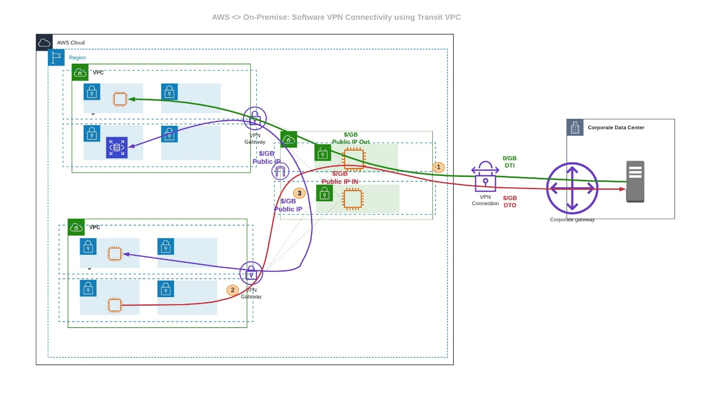
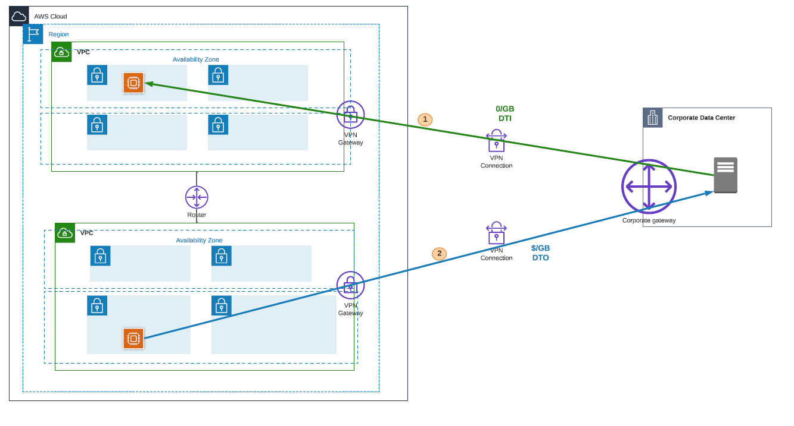
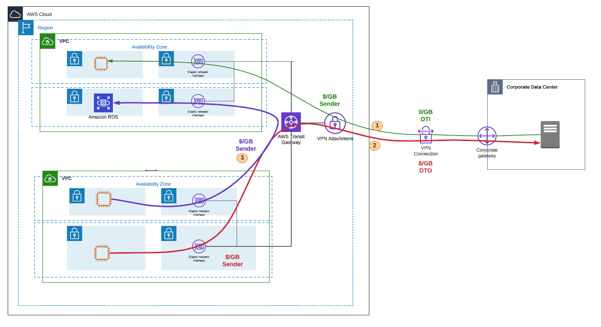
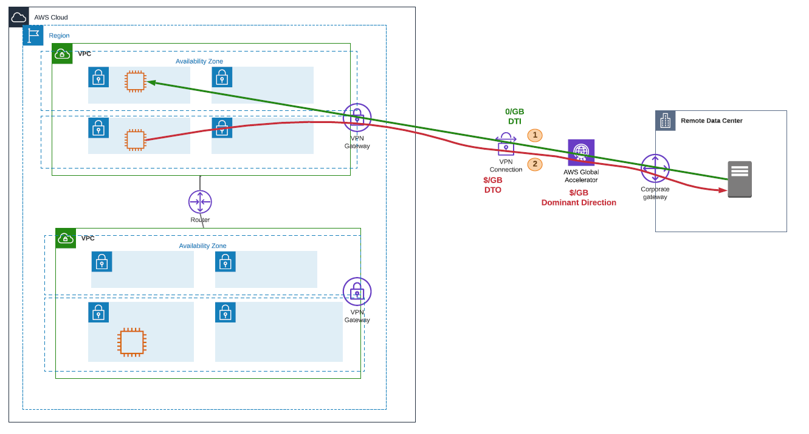
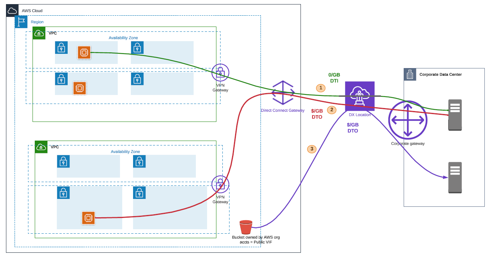
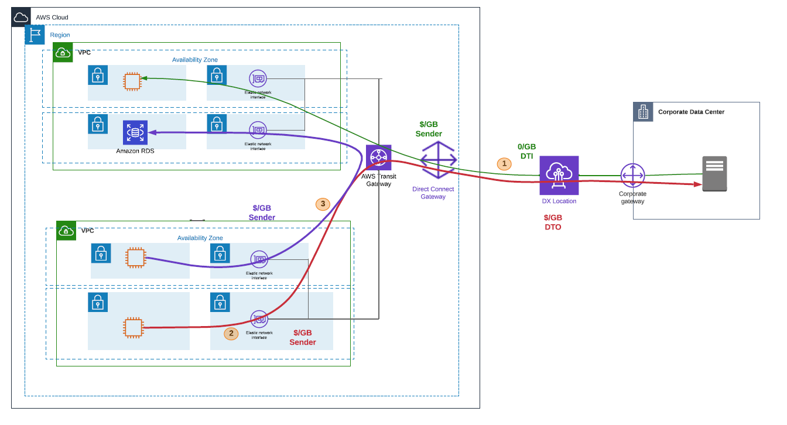
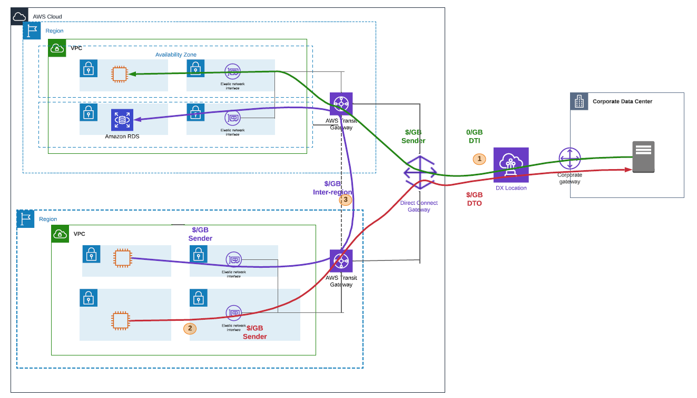

# Cost optimization pillar

The cost optimization pillar includes the continual process of refinement and improvement
of a system over its entire lifecycle. From the initial design of your first proof of concept to
the ongoing operation of production workloads, adopting the practices in this whitepaper will
enable you to build and operate cost-aware systems that achieve business outcomes and minimize
costs, thus allowing your business to maximize its return on investment.

## Best practices

There are four best practice areas for cost optimization in the cloud:

- Practice Cloud Financial Management
- Expenditure and usage awareness
- Cost-effective resources
- Manage demand and supply resources
- Optimize over time

As with the other pillars, there are trade-offs to consider. For example, do you want to
optimize for speed to market or for cost? In some cases, it’s best to optimize for speed—going
to market quickly, shipping new features, or simply meeting a deadline—rather than investing
in upfront cost optimization. Design decisions are sometimes guided by haste as opposed to
empirical data, as the temptation always exists to overcompensate _just in
case_ rather than spend time benchmarking for the most cost-optimal deployment.
This often leads to drastically over-provisioned and under-optimized deployments.

The following sections provide techniques and strategic guidance for the initial and
ongoing cost optimization of your deployment.

## Practice Cloud Financial

Management

For best practices in the Practice Cloud Financial Management area for cost optimization
in hybrid networking, refer to the AWS Well-Architected Framework .

## Expenditure and usage awareness

| **HN_COST1: How are you monitoring usage of your hybrid networking solution?**                                               |
| ---------------------------------------------------------------------------------------------------------------------------- | ------------------------------------------------------------------------------------------------------------------------------------------------------------------------------------------------------------------------------------------------------------------------------------------------------------------------------------------------------------------------------------------------------------------------------------------------------------------------------------------------------------------------------------------------------------------------------------------------------------------------------------------------------------------------------------------------------------------------------------------------------------------------------------------------------------------------------------------------------------------------------------------------------------------------------------------------------------------------------------------------------------------------------------------------------------------------------------------------------------------------------------------------------------------------------------------------------------------------------------------------------------------------------------------------------------------------------------------------------------------------------------------------------------------------------------------------------------------------------------------------------------------------------------------------------------------------------------------------------------------------------------------------------------------------------------------------------------------------------------------------------------------------------------------------------------------------------------------------------------------------------------------------------------------------------------------------------------------------------------------------------------------------------------------------------------------------------------------------------------------------------------------------------------------------------------------------------------------------------------------------------------------------------------------------------------------------------------------------------------------------------------------------------------------------------------------------------------------------------------------------------------------------------------------------------------------------------------------------- | ------------------------------------------------------------------------------------------- | ---------------------------------------------------------------------------------------------------------------------------------------------------------------------------------------------------------------------------------------------------------------------------------------------------------------------------------------------------------------------------------------------------------------------------------------------------------------------------------------------------------------------------------------------------------------------------------------------------------------------------------------------------------------------------------------------------------------------------------------------------------------------------------------------------------------------------------------------------------------------------------------------------------------------------------------------------------------------------------------------------------------------------------------------------------------------------------------------------------------------------------------------------------------------------------------------------------------------------------------------------------------------------------------------------------------------------------------------------------------------------------------------------------------------------------------------------------------------------------------------------------------------------------------------------------------------------------------------------------------------------------------------------------------------------------------------------------------------------------------------------------------------------------------------------------------------------------------------------------------------------------------------------------------------------------------------------------------------------------------------------------------------------------------------------------------------------------------------------------------------------------------------------------------------------------------------------------------------------------------------------------------------------------------------------------------------------------------- | ---------------------------------------------------------------------------------------------------------------------------- | --------------------------------------------------------------------------------------------------------------------------------------------------------------------------------------------------------------------- | -------------------------------------------------------------------------------------- | ----------------------------------------------------------------------------------------------------------------------------------------------------------------------------------------------------------------------------------------------------------------------------------------------------------------------------------------------------------------------------------------------------------------------------------------------------------------------------------------------------------------------------------------------------------------------------------------------------------------------------------------------------------------------------------------------------------------------------------------------------------------------------------------------------------------------------------------------------------------------------------------------------------------------------------------------------------------------------------------------------------------------------------------------------------------------------------------------------------------------------------------------------------------------------------------------------------------------------------------------------------------------------------------------------------------------------------------------------------------------------------------------------------------------------------------------------------------------------------------------------------------------------------------------------------------------------------------------------------------------------------------------------------------------------------------------------------------------------------------------------------------------------------------------------------------------------------------------------------------------------------------------------------------------------------------------------------------------------------------------------------------------------------------------------------------------------------------------------------------------------------------------------------------------------------------------------------------------------------------------------------------------------------------------------------------------------------------------------------------------------------------------------------------------------------------------------------------------------------------------------------------------------------------------------------------------------------------------------------------------------------------------------------------------------------------------------------------------------------------------------------------------------------------------------------------------------------------------------------------------------------------------------------------------------------------------------------------------------------------------------------------------------------------------------------------------------------------------------------------------------------------------------------------------------------------------------------------------------------------------------------------------------------------------------------------------------------------------------------------------------------------------------------------------------------------------------------------------------------------------------------------------------------------------------------------------------------------------------------------------------------------------------------------------------------------------------------------------------------------------------------------------------------------------------------------------------------------------------------------------------------------------------------------------------------------------------------------------------------------------------------------------------------------------------------------------------------------------------------------------------------------------------------------------------------------------------------------------------------------------------------------------------------------------------------------------------------------------------------------------------------------------------------------------------------------------------------------------------------------------------------------------------------------------------------------------------------------------------------------------------------------------------------------------------------------------------------------------------------------------------------------------------------------------------------------------------------------------------------------------------------------------------------------------------------------------------------------------------------------------------------------------------------------------------------------------------------------------------------------------------------------------------------------------------------------------------------------------------------------------------------------------------------------------------------------------------------------------------------------------------------------------------------------------------------------------------------------------------------------------------------------------------------------------------------------------------------------------------------------------------------------------------------------------------------------------------------------------------------------------------------------------------------------------------------------------------------------------------------------------------------------------------------------------------------------------------------------------------------------------------------------------------------------------------------------------------------------------------------------------------------------------------------------------------------------------------------------------------------------------------------------------------------------------------------------------------------------------------------------------------------------------------------------------------------------------------------------------------------------------------------------------------------------------------------------------------------------------------------------------------------------------------------------------------------------------------------------------------------------------------------------------------------------------------------------------------------------------------------------------------------------------------------------------------------------------------------------------------------------------------------------------------------------------------------------------------------------------------------------------------------------------------------------------------------------------------------------------------------------------------------------------------------------------------------------------------------------------------------------------------------------------------------------------------------------------------------------------------------------------------------------------------------------------------------------------------------------------------------------------------------------------------------------------------------------------------------------------------------------------------------------------------------------------------------------------------------------------------------------------------------------------------------------------------------------------------------------------------------------------------------------------------------------------------------------------------------------------------------------------------------------------------------------------------------------------------------------------------------------------------------------------------------------------------------------------------------------------------------------------------------------------------------------------------------------------------------------------------------------------------------------------------------------------------------------------------------------------------------------------------------------------------------------------------------------------------------------------------------------------------------------------------------------------------------------------------------------------------------------------------------------------------------------------------------------------------------------------------------------------------------------------------------------------------------------------------------------------------------------------------------------------------------------------------------------------------------------------------------------------------------------------------------------------------------------------------------------------------------------------------------------------------------------------------------------------------------------------------------------------------------------------------------------------------------------------------------------------------------------------------------------------------------------------------------------------------------------------------------------------------------------------------------------------------------------------------------------------------------------------------------------------------------------------------------------------------------------------------------------------------------------------------------------------------------------------------------------------------------------------------------------------------------------------------------------------------------------------------------------------------------------------------------------------------------------------------------------------------------------------------------------------------------------------------------------------------------------------------------------------------------------------------------------------------------------------------------------------------------------------------------------------------------------------------------------------------------------------------------------------------------------------------------------------------------------------------------------------------------------------------------------------------------------------------------------------------------------------------------------------------------------------------------------------------------------------------------------------------------------------------------------------------------------------------------------------------------------------------------------------------------------------------------------------------------------------------------------------------------------------------------------------------------------------------------------------------------------------------------------------------------------------------------------------------------------------------------------------------------------------------------------------------------------------------------------------------------------------------------------------------------------------------------------------------------------------------------------------------------------------------------------------------------------------------------------------------------------------------------------------------------------------------------------------------------------------------------------------------------------------------------------------------------------------------------------------------------------------------------------------------------------------------------------------------------------------------------------------------------------------------------------------------------------------------------------------------------------------------------------------------------------------------------------------------------------------------------------------------------------------------------------------------------------------------------------------------------------------------------------------------------------------------------------------------------------------------------------------------------------------------------------------------------------------------------------------------------------------------------------------------------------------------------------------------------------------------------------------------------------------------------------------------------------------------------------------------------------------------------------------------------------------------------------------------------------------------------------------------------------------------------------------------------------------------------------------------------------------------------------------------------------------------------------------------------------------------------------------------------------------------------------------------------------------------------------------------------------------------------------------------------------------------------------------------------------------------------------------------------------------------------------------------------------------------------------------------------------------------------------------------------------------------------------------------------------------------------------------------------------------------------------------------------------------------------------------------------------------------------------------------------------------------------------------------------------------------------------------------------------------------------------------------------------------------------------------------------------------------------------------------------------------------------------------------------------------------------------------------------------------------------------------------------------------------------------------------------------------------------------------------------------------------------------------------------------------------------------------------------------------------------------------------------------------------------------------------------------------------------------------------------------------------------------------------------------------------------------------------------------------------------------------------------------------------------------------------------------------------------------------------------------------------------------------------------------------------------------------------------------------------------------------------------------------------------------------------------------------------------------------------------------------------------------------------------------------------------------------------------------------------------------------------------------------------------------------------------------------------------------------------------------------------------------------------------------------------------------------------------------------------------------------------------------------------------------------------------------------------------------------------------------------------------------------------------------------------------------------------------------------------------------------------------------------------------------------------------------------------------------------------------------------------------------------------------------------------------------------------------------------------------------------------------------------------------------------------------------------------------------------------------------------------------------------------------------------------------------------------------------------------------------------------------------------------------------------------------------------------------------------------------------------------------------------------------------------------------------------------------------------------------------------------------------------------------------------------------------------------------------------------------------------------------------------------------------------------------------------------------------------------------------------------------------------------------------------------------------------------------------------------------------------------------------------------------------------------------------------------------------------------------------------------------------------------------------------------------------------------------------------------------------------------------------------------------------------------------------------------------------------------------------------------------------------------------------------------------------------------------------------------------------------------------------------------------------------------------------------------------------------------------------------------------------------------------------------------------------------------------------------------------------------------------------- |
|                                                                                                                              |
|                                                                                                                              |
| **HN_COST2: How are you identifying data transfer costs for shared resources?**                                              |
| ---                                                                                                                          |
|                                                                                                                              |
|                                                                                                                              | Integrate existing hybrid network monitoring solutions with Cloud Monitoring solutions to enable complete end to end visibility. Data transfer costs are included as part of your AWS bill but it can be a challenge to understand exactly what type of data transfer charges are represented. AWS provides tools such as the [AWS Cost & Usage Report](https://aws.amazon.com/aws-cost-management/aws-cost-and-usage-reporting/ "https://aws.amazon.com/aws-cost-management/aws-cost-and-usage-reporting/") and AWS VPC Flow Logs that can be used to track the costs associated with hybrid networking components as well as [Amazon Athena](https://aws.amazon.com/athena/ "https://aws.amazon.com/athena/") and [Quick Suite](https://aws.amazon.com/quicksight/ "https://aws.amazon.com/quicksight/") for cost analysis and visualization. Implementing solutions, or leveraging services that enable the identification of data transfer costs in particular, complements the use of cost-effective resources and optimal architectures. For example, customers can use Amazon Athena queries to analyze usage information in Amazon S3 and Quick Suite to visualize the Amazon Athena analysis of the AWS Cost and Usage reports to identify data transfer costs. To setup Quick Suite and Athena for analysis of the AWS Data Transfer cost details in the AWS CUR, refer to [AWS Well-Architected Lab on Data Transfer Cost Analysis](https://wellarchitectedlabs.com/cost/200_labs/200_enterprise_dashboards/3_create_data_transfer_cost_analysis/ "https://wellarchitectedlabs.com/cost/200_labs/200_enterprise_dashboards/3_create_data_transfer_cost_analysis/"). The Cost optimization pillar of the [Well Architected Framework](../framework.md "../framework.md") provides additional best practices for Expenditure and usage awareness. ## Cost-effective resources                                                                                                                                                                                                                                                                                                                                                                                                                                                                                                                                                                                                                                                                                                            |
| **HN_COST3: How do you determine your data connectivity requirements for the most cost effective hybrid networking option?** |
| ---                                                                                                                          |
|                                                                                                                              | Choose hybrid networking connectivity for workloads with varying requirements for throughput and consistency as indicated in the reliability pillar. You may decide it would be more cost effective to use an Internet-based VPN connection for non-mission critical workloads that have no strict resiliency or latency requirements. You may also decide to use a private dedicated connectivity for your production traffic to achieve a more consistent and higher bandwidth connectivity between your Data Center and AWS. Start off with Internet-based hybrid networking connections while in the testing phase of any workload migration or deployment and then migrate to more permanent connections only after baseline bandwidth requirements have been identified. For example, leveraging an internet based solution like AWS Site-to-Site VPN and then migrating to a dedicated connection like AWS Direct Connect. This enables you to start-off with a cost effective solution that can also be easily decommissioned prior to deploying a more permanent hybrid networking connection. If you have a small hybrid network setup with a few VPCs and cost-saving intent and want to quickly establish on-premises network integration with your emerging AWS environment, you can use AWS Virtual Private Gateway to terminate your internet based AWS Site-to-Site VPN or private AWS Direct Connect connections. If you have multiple VPCs and there’s a need to enable your development, test, production, and other VPCs to have network connectivity to your on-premises environment, use an AWS Transit Gateway in addition to AWS Site-to-Site VPN or AWS Direct Connect. While AWS Transit Gateway scales your VPN and Direct Connect connections and simplifies management, you are charged for the number of connections that you make to the AWS Transit Gateway per hour and the amount of traffic that is processed by the AWS Transit Gateway. The lower operational overhead cost savings benefits that Transit Gateway provides can outweigh the additional cost of AWS Transit Gateway data processing charges. For use cases where you require a transfer of very large amounts of data into AWS, consider a design approach where AWS Transit Gateway is in the traffic path to most VPCs but not all. This approach avoids the AWS Transit Gateway data processing fees. A cost-effective comparison for different hybrid networking scenarios is shown in the following table. _Table 5 - Cost-Effectiveness comparison for AWS Hybrid Networking scenarios_ |
| **Category**                                                                                                                 | **Customer- managed VPN or SD-WAN**                                                                                                                                                                                                                                                                                                                                                                                                                                                                                                                                                                                                                                                                                                                                                                                                                                                                                                                                                                                                                                                                                                                                                                                                                                                                                                                                                                                                                                                                                                                                                                                                                                                                                                                                                                                                                                                                                                                                                                                                                                                                                                                                                                                                                                                                                                                                                                                                                                                                                                                                                               | **AWS S2S VPN**                                                                             | **AWS** **Accelerated S2S VPN**                                                                                                                                                                                                                                                                                                                                                                                                                                                                                                                                                                                                                                                                                                                                                                                                                                                                                                                                                                                                                                                                                                                                                                                                                                                                                                                                                                                                                                                                                                                                                                                                                                                                                                                                                                                                                                                                                                                                                                                                                                                                                                                                                                                                                                                                                                          | **AWS Direct Connect Hosted Connection**                                                                                     | **AWS Direct Connect Dedicated Connection**                                                                                                                                                                           |
| ---                                                                                                                          | ---                                                                                                                                                                                                                                                                                                                                                                                                                                                                                                                                                                                                                                                                                                                                                                                                                                                                                                                                                                                                                                                                                                                                                                                                                                                                                                                                                                                                                                                                                                                                                                                                                                                                                                                                                                                                                                                                                                                                                                                                                                                                                                                                                                                                                                                                                                                                                                                                                                                                                                                                                                                               | ---                                                                                         | ---                                                                                                                                                                                                                                                                                                                                                                                                                                                                                                                                                                                                                                                                                                                                                                                                                                                                                                                                                                                                                                                                                                                                                                                                                                                                                                                                                                                                                                                                                                                                                                                                                                                                                                                                                                                                                                                                                                                                                                                                                                                                                                                                                                                                                                                                                                                                      | ---                                                                                                                          | ---                                                                                                                                                                                                                   |
| Requires customer internet connection                                                                                        | Yes                                                                                                                                                                                                                                                                                                                                                                                                                                                                                                                                                                                                                                                                                                                                                                                                                                                                                                                                                                                                                                                                                                                                                                                                                                                                                                                                                                                                                                                                                                                                                                                                                                                                                                                                                                                                                                                                                                                                                                                                                                                                                                                                                                                                                                                                                                                                                                                                                                                                                                                                                                                               | Yes                                                                                         | Yes                                                                                                                                                                                                                                                                                                                                                                                                                                                                                                                                                                                                                                                                                                                                                                                                                                                                                                                                                                                                                                                                                                                                                                                                                                                                                                                                                                                                                                                                                                                                                                                                                                                                                                                                                                                                                                                                                                                                                                                                                                                                                                                                                                                                                                                                                                                                      | No                                                                                                                           | No                                                                                                                                                                                                                    |
| Provisioned resources cost                                                                                                   | EC2 instance and software licensing                                                                                                                                                                                                                                                                                                                                                                                                                                                                                                                                                                                                                                                                                                                                                                                                                                                                                                                                                                                                                                                                                                                                                                                                                                                                                                                                                                                                                                                                                                                                                                                                                                                                                                                                                                                                                                                                                                                                                                                                                                                                                                                                                                                                                                                                                                                                                                                                                                                                                                                                                               | [AWS S2S VPN](https://aws.amazon.com/vpn/pricing/ "https://aws.amazon.com/vpn/pricing/")    | [AWS S2S](https://aws.amazon.com/vpn/pricing/ "https://aws.amazon.com/vpn/pricing/") [VPN](https://aws.amazon.com/vpn/pricing/ "https://aws.amazon.com/vpn/pricing/") and [AWS Global](https://aws.amazon.com/global-accelerator/pricing/ "https://aws.amazon.com/global-accelerator/pricing/") [Accelerator](https://aws.amazon.com/global-accelerator/pricing/ "https://aws.amazon.com/global-accelerator/pricing/")                                                                                                                                                                                                                                                                                                                                                                                                                                                                                                                                                                                                                                                                                                                                                                                                                                                                                                                                                                                                                                                                                                                                                                                                                                                                                                                                                                                                                                                                                                                                                                                                                                                                                                                                                                                                                                                                                                                   | [Hosted Connection port cost](https://aws.amazon.com/directconnect/pricing/ "https://aws.amazon.com/directconnect/pricing/") | [Dedicated port](https://aws.amazon.com/directconnect/pricing/ "https://aws.amazon.com/directconnect/pricing/") [cost](https://aws.amazon.com/directconnect/pricing/ "https://aws.amazon.com/directconnect/pricing/") |
| Data transfer cost                                                                                                           | Internet rate                                                                                                                                                                                                                                                                                                                                                                                                                                                                                                                                                                                                                                                                                                                                                                                                                                                                                                                                                                                                                                                                                                                                                                                                                                                                                                                                                                                                                                                                                                                                                                                                                                                                                                                                                                                                                                                                                                                                                                                                                                                                                                                                                                                                                                                                                                                                                                                                                                                                                                                                                                                     | Internet rate or DIRECT CONNECT rate                                                        | Internet with data transfer premium                                                                                                                                                                                                                                                                                                                                                                                                                                                                                                                                                                                                                                                                                                                                                                                                                                                                                                                                                                                                                                                                                                                                                                                                                                                                                                                                                                                                                                                                                                                                                                                                                                                                                                                                                                                                                                                                                                                                                                                                                                                                                                                                                                                                                                                                                                      | DX rate                                                                                                                      | DX rate                                                                                                                                                                                                               |
| Transit Gateway                                                                                                              | Optional                                                                                                                                                                                                                                                                                                                                                                                                                                                                                                                                                                                                                                                                                                                                                                                                                                                                                                                                                                                                                                                                                                                                                                                                                                                                                                                                                                                                                                                                                                                                                                                                                                                                                                                                                                                                                                                                                                                                                                                                                                                                                                                                                                                                                                                                                                                                                                                                                                                                                                                                                                                          | Optional                                                                                    | Required                                                                                                                                                                                                                                                                                                                                                                                                                                                                                                                                                                                                                                                                                                                                                                                                                                                                                                                                                                                                                                                                                                                                                                                                                                                                                                                                                                                                                                                                                                                                                                                                                                                                                                                                                                                                                                                                                                                                                                                                                                                                                                                                                                                                                                                                                                                                 | Optional                                                                                                                     | Optional                                                                                                                                                                                                              |
| Data processing cost                                                                                                         | N/A                                                                                                                                                                                                                                                                                                                                                                                                                                                                                                                                                                                                                                                                                                                                                                                                                                                                                                                                                                                                                                                                                                                                                                                                                                                                                                                                                                                                                                                                                                                                                                                                                                                                                                                                                                                                                                                                                                                                                                                                                                                                                                                                                                                                                                                                                                                                                                                                                                                                                                                                                                                               | Only with AWS Transit Gateway                                                               | Yes                                                                                                                                                                                                                                                                                                                                                                                                                                                                                                                                                                                                                                                                                                                                                                                                                                                                                                                                                                                                                                                                                                                                                                                                                                                                                                                                                                                                                                                                                                                                                                                                                                                                                                                                                                                                                                                                                                                                                                                                                                                                                                                                                                                                                                                                                                                                      | Only with AWS Transit Gateway                                                                                                | Only with AWS Transit Gateway                                                                                                                                                                                         |
| Can be used over AWS Direct Connect?                                                                                         | Yes                                                                                                                                                                                                                                                                                                                                                                                                                                                                                                                                                                                                                                                                                                                                                                                                                                                                                                                                                                                                                                                                                                                                                                                                                                                                                                                                                                                                                                                                                                                                                                                                                                                                                                                                                                                                                                                                                                                                                                                                                                                                                                                                                                                                                                                                                                                                                                                                                                                                                                                                                                                               | Yes                                                                                         | No                                                                                                                                                                                                                                                                                                                                                                                                                                                                                                                                                                                                                                                                                                                                                                                                                                                                                                                                                                                                                                                                                                                                                                                                                                                                                                                                                                                                                                                                                                                                                                                                                                                                                                                                                                                                                                                                                                                                                                                                                                                                                                                                                                                                                                                                                                                                       | N/A                                                                                                                          | N/A                                                                                                                                                                                                                   | ## Manage demand and supply resources                                                  |
| HN_COST4: How do you match the supply of resources for your hybrid networking with demand?                                   |                                                                                                                                                                                                                                                                                                                                                                                                                                                                                                                                                                                                                                                                                                                                                                                                                                                                                                                                                                                                                                                                                                                                                                                                                                                                                                                                                                                                                                                                                                                                                                                                                                                                                                                                                                                                                                                                                                                                                                                                                                                                                                                                                                                                                                                                                                                                                                                                                                                                                                                                                                                                   | ---                                                                                         |                                                                                                                                                                                                                                                                                                                                                                                                                                                                                                                                                                                                                                                                                                                                                                                                                                                                                                                                                                                                                                                                                                                                                                                                                                                                                                                                                                                                                                                                                                                                                                                                                                                                                                                                                                                                                                                                                                                                                                                                                                                                                                                                                                                                                                                                                                                                          |                                                                                                                              |                                                                                                                                                                                                                       | **HN_COST5. How do you prioritize traffic across your hybrid networking connections?** |
| ---                                                                                                                          |                                                                                                                                                                                                                                                                                                                                                                                                                                                                                                                                                                                                                                                                                                                                                                                                                                                                                                                                                                                                                                                                                                                                                                                                                                                                                                                                                                                                                                                                                                                                                                                                                                                                                                                                                                                                                                                                                                                                                                                                                                                                                                                                                                                                                                                                                                                                                                                                                                                                                                                                                                                                   |                                                                                             | It is important to plan and accurately forecast your hybrid connectivity demands because of the length of time it can take to establish and scale the connectivity if requirements change. For example, you cannot dynamically self-provision to increase the speed from 1 Gbps to 10 Gbps or 100 Gbps for a private dedicated connection like AWS Direct Connect. Since there can be lead times of several weeks or more to create and configure increased speeds for AWS Direct Connect connectivity, we recommend starting the process soon even if you don’t intend to depend on AWS Direct Connect in support of your initial few productions workload on AWS. Obtain a comprehensive profile of the application demand to be placed on the network to prevent under-provisioning or over-provisioning hybrid network connectivity resources available or supplied. As previously mentioned, you should start with a hybrid networking connectivity solution that can be easily modified or terminated if the baseline traffic bandwidth requirements are not known at the time. The baseline network demand would also dictate whether an expansive transit multi-site network like MPLS would be required in the customer site depending on the number of locations, which might require consistent access to AWS. Another strategy could be to create a Link Aggregation Groups (LAG) with the minimum initial Direct Connect connection and then add connections as the network demand grows. For AWS Site-to-Site VPN, you can gain more bandwidth by provisioning new VPN tunnels using Equal Cost Multipath (ECMP) with a Transit Gateway deployment. Customers should leverage prioritization and queuing techniques on their on-premises network devices in situations where the traffic entering the hybrid networking connections exceed the available bandwidth. For example, ensuring that traffic that is very susceptible to delay and jitter such as voice is configured to be transmitted ahead of bulky traffic such as replication traffic. You should also have minimum bandwidth guaranteed throughout the portions of the network where this can be configured. If you are going to over subscribe, customers should ensure traffic prioritization can be deployed through the network. ## Optimize over time | **HN_COST6: How are you designing your architecture for data transfer?**                                                     |                                                                                                                                                                                                                       | ---                                                                                    |
|                                                                                                                              |                                                                                                                                                                                                                                                                                                                                                                                                                                                                                                                                                                                                                                                                                                                                                                                                                                                                                                                                                                                                                                                                                                                                                                                                                                                                                                                                                                                                                                                                                                                                                                                                                                                                                                                                                                                                                                                                                                                                                                                                                                                                                                                                                                                                                                                                                                                                                                                                                                                                                                                                                                                                   | **HN_COST7: How are you optimizing your hybrid networking architecture for data transfer?** |                                                                                                                                                                                                                                                                                                                                                                                                                                                                                                                                                                                                                                                                                                                                                                                                                                                                                                                                                                                                                                                                                                                                                                                                                                                                                                                                                                                                                                                                                                                                                                                                                                                                                                                                                                                                                                                                                                                                                                                                                                                                                                                                                                                                                                                                                                                                          | ---                                                                                                                          |                                                                                                                                                                                                                       |                                                                                        | Data transfer fees can be a hidden cost in a hybrid connectivity deployment if not properly tracked. It is important to understand what drives your data transfer costs in order to optimize the cost of running your AWS hybrid networking architecture. Although you may regard data transfer costs as high, data transfer costs are relatively inexpensive compared to typical bandwidth charges from Internet Service Providers (ISPs) and data center operating costs that are common to on-premises workloads. If you have multi-tenant Software-as-a-Service (SaaS) workloads and a hybrid networking environment, it’s also important to understand who pays for hourly and data transfer charges to enhance your pricing model. You have different design choices on AWS when architecting your hybrid networking environment to optimize data transfer costs and it's important to understand the different data transfer pricing considerations. There are 4 main network connectivity options to consider on the AWS end and the data transfer costs will vary based on the option you choose. 1. **Customer managed VPN and Transit VPC**: For this internet-based connectivity model, you deploy commercial router virtual appliances in a transit VPC. This deployment option with Transit VPC was a common pattern used by customers prior to the advent of AWS Transit Gateway. The virtual appliances come with VPN licensing deployed on virtual machines (EC2) acting as an Intrusion Prevention System (IPS)/Intrusion Detection System (IDS), with all traffic flowing through these machines within a VPC. AWS Site-to-site VPN connections are established between the router virtual appliances and a virtual private gateway in each of your VPCs. Some customers terminate their customer managed VPN on an AWS Transit VPC, which is used to connect your VPC(s) and VPN connections via a Virtual Private Gateway (VGW) to your on-premises environment. Data Transfer cost considerations for a Customer Managed VPN and Transit VPC deployment are as follows and shown in the following diagram:  • (1) Data Transfer IN (DTI) from your on-prem environment to the VPN appliance within the Transit VPC is free. Data transferred out from the VPN appliance (EC2 public IP) through the Virtual Private Gateway (VGW) to the non-transit VPC is charged per GB. For example, data transfer from a server in your Data Center to the Transit VPC is free while there’s a data transfer cost for data from the EC2 public IP via VGW to EC2 instances in your non-transit AWS VPC.  • (2) Data transferred from the VGW to the VPN appliance with public IP is charged per GB. Data Transfer OUT (DTO) over the internet to your on-premises environment is also charged per GB.  • (3) For inter-VPC connectivity through the Transit VPC, data transfer is charged per GB for traffic that flows in to and out of the Transit VPC VPN appliance with Public IP.  • This design provides multi-VPC connectivity as well as hybrid network connectivity to your on-premises environment. This option is a lower cost when compared to a virtual private gateway option for an AWS Site-to-Site VPN design mentioned in 2a, where every VPC has a VPN termination and data transfer costs. With this design, you mostly accrue data transfer costs between your Transit VPC and on-prem Data center.  • Customers with a Transit VPC and Software VPN deployment should consider replacing this model with an AWS Transit Gateway and Site-to-Site VPN deployment to reduce complexity and operational costs.  • For pricing information on the charges per GB of traffic sent, refer to the [AWS VPN Pricing page](https://aws.amazon.com/vpn/pricing/ "https://aws.amazon.com/vpn/pricing/") and [EC2 Data Transfer pricing page](https://aws.amazon.com/ec2/pricing/on-demand/ "https://aws.amazon.com/ec2/pricing/on-demand/").  _Data Transfer: AWS to on-Premises: Software VPN Connectivity using Transit VPC_ 2. **AWS Site-to-Site VPN**: You can deploy an internet-based hybrid option with AWS Site-to-Site-VPN using AWS Virtual Private Gateway or AWS Transit Gateway as termination points on AWS. For internet-based solutions like AWS Site-to-Site VPN, data transferred to an AWS VPC is free whereas Data transferred out from an AWS VPC is charged. VPN is charged on an hourly basis whether you use it or not so it’s recommended to terminate inactive VPNs to avoid generating costs while not in use. a. **Terminating via AWS Virtual Gateway** (VGW): When using an AWS virtual gateway, you need to connect your on-premises environment to each VPC due to the intransitive nature of virtual gateways. Data Transfer cost considerations for an AWS Site-to-Site VPN and AWS Virtual Gateway deployment are as follows and shown in the following diagram:  • (1) Data Transfer IN (DTI) from your on-prem environment to AWS VPC is free. For example, a server on-prem transfers data to an EC2 instance in your VPC.  • (2) Data Transfer OUT (DTO) from the AWS VPC to your on-prem environment is charged per GB. For example, an EC2 instance in your VPC putting out data to your on-prem server.  • For pricing information on the charges per GB of traffic sent, refer to the [AWS VPN Pricing page](https://aws.amazon.com/vpn/pricing/ "https://aws.amazon.com/vpn/pricing/")  _Data Transfer: AWS to on-Premises: Site-to-Site VPN Connectivity using AWS Virtual Gateway_ b. **Terminating via AWS Transit Gateway** (TGW): The AWS Transit Gateway option provides a more scalable approach to using the Transit VPC (1) or Site-to-Site VPN using Virtual Gateway (2). While the data transfer costs for running AWS Transit Gateway may seem higher than the AWS Virtual Gateway option, Transit Gateway deployments help simplify VPC to VPC network connectivity, reducing operational overhead and total cost of ownership in the long term for AWS Site-to-Site VPN and AWS Direct Connect. Data Transfer cost considerations for an AWS Site-to-Site VPN and AWS Transit Gateway deployment are as follows and shown in the following diagram :  • (1) Data Transfer IN (DTI) from your on-prem environment to AWS VPC is free and you are charged per GB for AWS Transit Gateway data processing costs.  • (2) Data Processing from the sender, which is the VPC attachment for AWS Transit Gateway data processing costs is charged per GB in addition to Data Transfer OUT (DTO) charge per GB for data going out from your VPC over the internet to your on-prem environment.  • (3) For inter-VPC connectivity, you are charged per GB of traffic for AWS Transit Gateway data processing costs.  • For pricing information on the charges per GB of traffic sent, refer to the [Transit Gateway pricing page](https://aws.amazon.com/transit-gateway/pricing/ "https://aws.amazon.com/transit-gateway/pricing/").  _Data Transfer: AWS to on-Premises: Site-to-Site VPN Connectivity using AWS Transit Gateway_ 3. **Accelerated Site-to-Site VPN:** This option enables acceleration of your AWS Site-to-Site VPN connection using AWS Global Accelerator to avoid network disruptions that may occur as a result of using the public internet. With this option, AWS routes traffic from your on-prem network to an AWS edge location that is closest to your customer gateway device and provides consistency and reduced latency for data transfer. Data Transfer cost considerations for an Accelerated Site-to-Site VPN deployment are as follows and shown in the following diagram:  • (1) Data Transfer IN (DTI) from your remote on-prem environment to AWS VPC is free.  • (2) Data Transfer OUT (DTO) from your AWS VPC to your remote on-prem environment is charged per GB in addition to the Global Accelerator charges, which is dependent on traffic flowing in the dominant direction in or out and the destination edge location. Refer to the [AWS Global Accelerator pricing page](https://aws.amazon.com/global-accelerator/pricing/ "https://aws.amazon.com/global-accelerator/pricing/") for pricing details.  _Data Transfer: AWS to on-Premises: Accelerated Site-to-Site VPN Connectivity_ 4. **AWS Direct Connect**: For situations where an internet-based connection like AWS Site-to-Site VPN is not sufficient, you can use a dedicated connection like AWS Direct Connect. For data transfer cost optimization between your on-premises and AWS environment, it’s recommended to use a dedicated connection like AWS Direct Connect as it’s usually multiple times less expensive than an internet based solution like AWS Site-to-Site VPN. There are two main ways to terminate AWS Direct Connect and for both options, the standard Internet data transfer charges do not apply. Data transferred out of AWS via a dedicated connection such as AWS Direct Connect is charged per GB. There is no data transfer charge for data coming into AWS Direct Connect from your data center or co-location facility. The cost of outbound data varies by region and Direct Connect location. a. **AWS** **Direct Connect Gateway & Virtual Private Gateway (VGW)**: With this deployment model, every VPC will have its own AWS Virtual Private Gateway connected to an AWS Direct Connect Gateway. AWS Direct Connect Gateway is recommended for deployments that require connectivity between multiple VPCs in the same or different AWS Regions (except China) to their Direct Connect connection. AWS Direct Connect Gateway works with virtual private gateways or with Transit Gateway for multiple VPCs in the same region. Data Transfer cost considerations for an AWS Direct Connect Gateway and AWS Virtual Gateway deployment are as follows and shown in the following diagram:  • (1) Data Transfer IN (DTI) from the on-prem environment to AWS VPC is free  • (2) Direct Connect Data Transfer OUT (DTO) from your AWS VPC to on-prem environment is charged per GB according to the Direct Connect pricing per region.  • (3) If you have a resource such as an S3 bucket owned by one of your AWS organization accounts or Direct Connect public VIF (virtual interface), you are charged per GB for Data Transfer (DTO) charges based on Direct Connect data transfer out pricing and region for example if your on-prem server is pulling data out of the S3 bucket.  • (3) If your AWS resource such as a public S3 bucket is not owned by your AWS organization accounts or Direct Connect public VIF, the owner of that resource or S3 bucket is charged per GB for Data Transfer out (DTO) based on the internet data transfer charges.  • For pricing information on data transfer rates, refer to the [Direct Connect pricing page](https://aws.amazon.com/directconnect/pricing/ "https://aws.amazon.com/directconnect/pricing/").  _Data Transfer: AWS to On-Premises: Direct Connect using a Virtual Gateway_ b. **Direct Connect Gateway & Transit Gateway Same-region**: With this scenario, you can replace the Virtual private gateways seen in Option 3(a) with AWS Transit Gateway for a more scalable design. Data Transfer cost considerations for an AWS Direct Connect Gateway and AWS Transit Gateway deployment in the same region are as follows and shown in the following diagram:  • (1) Data Transfer IN (DTI) from your on-prem environment to Direct Connect Location is free while Transit Gateway data processing charges for the Direct Connect Gateway attachment is charged per GB based on who the sender is (in this case Direct Connect Gateway). Note that there’s a Transit Gateway attachment charge associated with using a Transit Gateway compared to the VGW option in 4(a).  • (2) For data sent from the EC2 instance in a VPC attached to the Transit Gateway, data Processing is charged per GB to the VPC owner who sends traffic to Transit Gateway. In addition, there are Direct Connect Data Transfer OUT (DTO) charges per GB from your AWS Region to your Direct Connect location.  • (3) For inter-VPC communication, you are charged per GB of traffic for Transit Gateway data processing costs based on the sender, which is the VPC owner who sends traffic to Transit Gateway. For pricing information on data transfer rates, refer to the [Direct Connect pricing page](https://aws.amazon.com/directconnect/pricing/ "https://aws.amazon.com/directconnect/pricing/")  _Data Transfer: AWS to On-Premises: Direct Connect using Transit Gateway in the same AWS Region_ c. **Direct Connect Gateway & Transit Gateway cross-region:** With this connectivity model, Direct Connect is used to connect multiple regions to your on-prem location(s). Here, everything is connected through a Direct Connect Gateway and between the regions, there is a Transit Gateway. Inter-VPC communication can happen through your AWS Transit Gateway peering connection but if there’s a requirement to have connectivity from your AWS Direct Connect location to various VPCs in different AWS regions, that communication happens via the Direct Connect Gateway and Transit Gateway path. Data Transfer cost considerations for an AWS Direct Connect Gateway and AWS Transit Gateway deployment in different regions are as follows and shown in the following diagram:  • (1) Data Transfer IN (DTI) from your on-prem environment to Direct Connect Location is free Transit Gateway data processing charges for the Direct Connect Gateway attachment is charged per GB based on who the sender is (in this case Direct Connect Gateway). Note that there’s a Transit Gateway charge associated with using a Transit Gateway compared to the VGW option in 4(a).  • (2) For data sent from the EC2 instance in a VPC attached to the Transit Gateway, data Processing is charged per GB to the VPC owner who sends traffic to Transit Gateway. In addition, there are Direct Connect Data Transfer OUT (DTO) charges per GB from your AWS Region to your Direct Connect location.  • (3) For inter-VPC communication across the region, you are charged per GB of traffic for data processing on traffic based on the sender, which is the VPC owner who sends traffic to Transit Gateway. In addition, you are charged for inter-region data transfer costs based on cross-region data transfer pricing.  _Data Transfer: AWS to On-Premises: Direct Connect using AWS Transit Gateway Cross-Region_ ## Resources Refer to the following resources to learn more about AWS best practices for cost optimization. ### Documents  • [10 things you can do today to reduce AWS costs](https://aws.amazon.com/blogs/compute/10-things-you-can-do-today-to-reduce-aws-costs/ "https://aws.amazon.com/blogs/compute/10-things-you-can-do-today-to-reduce-aws-costs/")  • [Data Transfer Pricing](https://aws.amazon.com/ec2/pricing/on-demand/#Data_Transfer "https://aws.amazon.com/ec2/pricing/on-demand/#Data_Transfer")  • [AWS VPN FAQs](https://aws.amazon.com/vpn/faqs/ "https://aws.amazon.com/vpn/faqs/")  • [Cost and Usage Analysis Well-Architected Lab](https://wellarchitectedlabs.com/cost/200_labs/200_4_cost_and_usage_analysis/ "https://wellarchitectedlabs.com/cost/200_labs/200_4_cost_and_usage_analysis/")  • [Data Transfer Cost Analysis Well-Architected Lab](https://wellarchitectedlabs.com/cost/200_labs/200_enterprise_dashboards/3_create_data_transfer_cost_analysis/ "https://wellarchitectedlabs.com/cost/200_labs/200_enterprise_dashboards/3_create_data_transfer_cost_analysis/")  • [Hybrid Connectivity Whitepaper](../../../whitepapers/latest/hybrid-connectivity/hybrid-connectivity.md "../../../whitepapers/latest/hybrid-connectivity/hybrid-connectivity.md") ### Videos  • [NET305 Behind the Scenes: Exploring the AWS Global Network](https://www.youtube.com/watch?v=tPUl96EEFps "https://www.youtube.com/watch?v=tPUl96EEFps")  • [Nine Ways to Reduce Your AWS Bill](https://pages.awscloud.com/Nine-Ways-to-Reduce-Your-AWS-Bill_2020_0008-CMP_OD.html "https://pages.awscloud.com/Nine-Ways-to-Reduce-Your-AWS-Bill_2020_0008-CMP_OD.html")  • [Pricing Model Analysis](https://wellarchitectedlabs.com/Cost/Cost_Effective_Resources/200_Pricing_Model_Analysis/README.html "https://wellarchitectedlabs.com/Cost/Cost_Effective_Resources/200_Pricing_Model_Analysis/README.html") |
