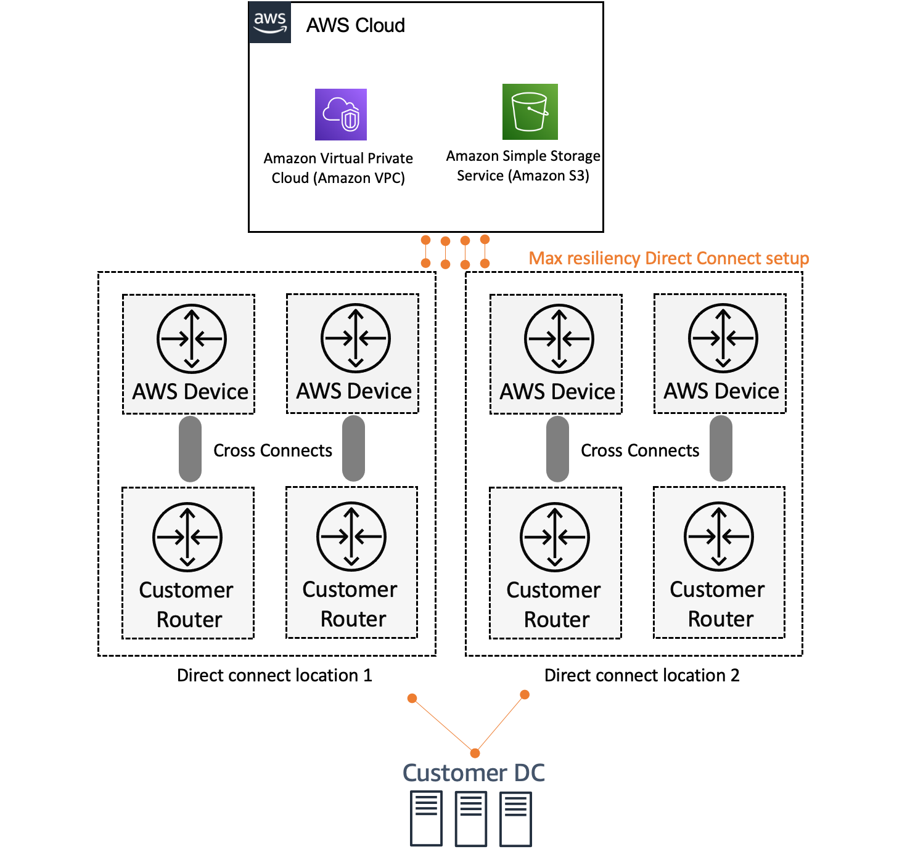
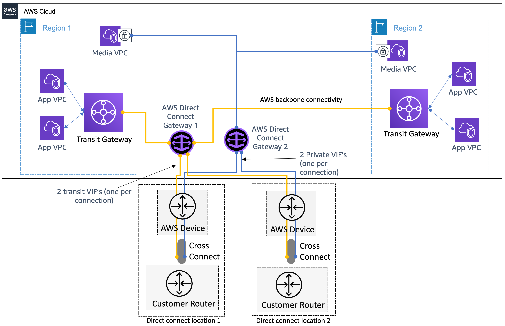

# Designing a reliable, dedicated hybrid networking

setup using fiber connectivity for critical workloads

Network latency over the internet varies because it is constantly changing how data gets
from point A to point B. While accelerated VPN helps with network latency, the last mile from
an AWS edge location to your data center is still over the internet. To achieve consistent
end-to-end network performance, you can leverage AWS Direct Connect to enable consistent, low
latency, high-bandwidth dedicated fiber connectivity between your data centers and AWS.
Direct Connect provides dedicated connections at bandwidths of 1 Gbps, 10 Gbps, and 100 Gbps.
Hosted connections are provided by AWS Direct Connect Partners using pre-established network links
between themselves and AWS and are available from 50 Mbps up to 10 Gbps.

AWS Direct Connect is available at over 100 locations around the world. Building highly
resilient, fault-tolerant connections are key to a well-architected system when connecting to
AWS Direct Connect locations. AWS recommends connecting from multiple data centers for physical
location redundancy as well as establishing multiple connections at a direct connect location
for device redundancy. When designing WAN connections, investigate using redundant hardware
and telecommunications providers with redundant paths. A best practice is to use dynamic
routing with Direct Connect, Active/Active connections for automatic load balancing, and
failover across redundant network connections. Additionally, provision sufficient network
capacity to ensure that the failure of one network connection does not overwhelm and degrade
redundant connections. To achieve the best availability, you can leverage the [resiliency
architecture](https://aws.amazon.com/directconnect/resiliency-recommendation/ "https://aws.amazon.com/directconnect/resiliency-recommendation/") for AWS Direct Connect as shown in the following diagram.

_AWS Direct Connect maximum resiliency architecture_

If you need more than 100 Gbps of bandwidth, you can provision a [link aggregation
group](../../../directconnect/latest/UserGuide/lags.md "../../../directconnect/latest/UserGuide/lags.md") (LAG) bundle with AWS Direct Connect. A LAG is a logical interface that uses the
Link Aggregation Control protocol (LACP) to aggregate multiple connections at a single Direct
Connect location, allowing you to treat them as a single, managed connection. You can have a
maximum of two 100G connections, or four connections with a port speed less than 100G in a
LAG. You can [create a LAG](../../../directconnect/latest/UserGuide/create-lag.md "../../../directconnect/latest/UserGuide/create-lag.md") from existing connections, or you can provision new connections.
However, a LAG only includes ports on the same AWS device. AWS doesn’t support
multi-chassis LAG, this means all of your Direct Connect connections terminate on the same
hardware on the AWS side. A LAG is not recommended for a high-availability strategy.

Once the physical connectivity is established at the Direct Connect location, you can
create [virtual
interfaces](../../../directconnect/latest/UserGuide/WorkingWithVirtualInterfaces.md "../../../directconnect/latest/UserGuide/WorkingWithVirtualInterfaces.md") which are logical connections on top of physical Direct Connect
connections that enable access to AWS resources. These virtual interfaces are tagged with
802.1Q VLANs and require the use of Border Gateway Protocol (BGP).

AWS Direct Connect provides the following virtual interfaces:

**Public virtual interfaces –** Provide global connectivity to
public AWS resources, including AWS

public service endpoints public Amazon EC2 IP addresses, and public Elastic Load Balancing addresses.

**Private virtual interfaces –** Provide connectivity to the
private IP range of your VPC.

When you use private virtual interfaces, your VPC becomes a logical layer-3 extension of
your network. For information about pricing, refer to the [AWS Direct Connect pricing](https://aws.amazon.com/directconnect/pricing/ "https://aws.amazon.com/directconnect/pricing/").

**Transit virtual interfaces –** Enables connectivity to Transit
Gateway(s). While this virtual interface enables scaling you pay for the cost associated with
AWS Direct Connect and Transit Gateway. For more information about pricing, refer to the [AWS Transit Gateway pricing](https://aws.amazon.com/transit-gateway/pricing/ "https://aws.amazon.com/transit-gateway/pricing/").

In the digital world of today, most customers are establishing global presence. There is
a need to deploy resources within a large number of VPCs across multiple AWS Regions and
connect to them from datacenters spread across geographies. By leveraging [AWS Direct Connect gateway](../../../directconnect/latest/UserGuide/direct-connect-gateways-intro.md "../../../directconnect/latest/UserGuide/direct-connect-gateways-intro.md"), a global resource that allows you to use your Direct Connect
connections to connect to resources in VPCs in most AWS Regions, you can more easily connect
to your resources. To enable global connectivity, you can create and associate a Direct
Connect gateway with the virtual private gateway of the VPC you want connectivity into, and
then create a private virtual interface to the Direct Connect gateway. You can associate up to
10 virtual private gateways (each attached to a VPC) in different AWS Regions, directly to a
Direct Connect gateway. Alternatively, you can create a transit virtual interface and attach a
total of three transit gateways (each attached to thousands of VPCs) across different AWS
Regions to a Direct Connect gateway.

For standard use cases, we recommend starting with a transit virtual interface. However,
if your data transfer volume is high, for example on-premises data backup to a VPC, or if you
have 100 Gbps connections and want full 100 Gbps bandwidth to a VPC, we recommend using a
private virtual interface. Additionally, you can use a hybrid approach for multiple use cases,
as showing in the following diagram.

_Global Direct Connect reference architecture – high
resiliency_
