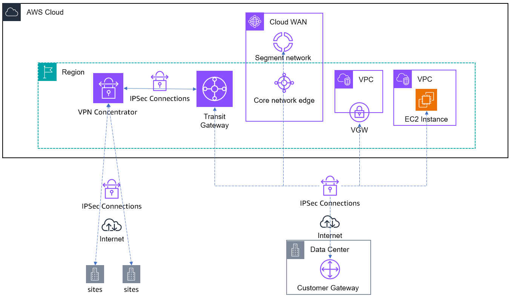

# IPSec VPN

The quickest way to get started with hybrid connectivity is to establish IPSec VPN over
the internet. AWS Site-to-Site VPN connects your data center or branch locations to AWS using IPsec
tunnels. You can configure routing using BGP over the IPsec tunnel or configure static routes.
Traffic in the tunnel is encrypted with AES128 or AES256 and use Diffie-Hellman groups for key
exchange, providing Perfect Forward Secrecy. AWS authenticates with SHA1 or SHA2 hashing
functions. AES256 and SHA2 are recommended for stronger encryption and authentication.

Each AWS Site-to-Site VPN connection consists of two VPN tunnel endpoints. Each tunnel can have a
maximum bandwidth up to 4.9 Gbps. For high availability, configure both tunnels, as each
tunnel endpoint is in a different Availability zone within the AWS region. Each tunnel must
terminate to one on-premises customer gateway.

An AWS Site-to-Site VPN connections can connect to a virtual private gateway for access to a VPC
that the gateway is attached to. For every VPC that you want to connect to, you must create a
separate VPN connection to a separate virtual private gateway attached to the VPC. Only one of
the 2 tunnels within the VPN connection can be active, with the other tunnel in fail over.

An AWS Site-to-Site VPN connection attached to a Transit Gateway to access multiple VPCs in the same
regions, or a Cloud WAN core network edge to access multiple VPCs in the same region or
different regions. Transit Gateway and Cloud WAN support Equal Cost Multi-path (ECMP) routing
for BGP dynamic routing VPN connections, allowing you to load balance traffic and aggregate
bandwidth across multiple VPN tunnels. A VPN connection with 2 VPN tunnels terminating on
transit gateway or Cloud WAN, each with maximum bandwidth up to 4.9 Gbps, can aggregate to
maximum bandwidth up to 9.8 Gbps.

To summarize, terminating VPN at transit gateway or Cloud WAN gives you a lot more
flexibility into the number of VPC's you can connect to over single VPN connection and
provides added functionality like ECMP. For some unique use cases involving large data
transfers, leveraging the virtual private gateway termination to a VPC can be more cost
effective and be a viable alternative.

You can optionally enable acceleration for your Site-to-Site VPN connection. An [accelerated Site-to-Site VPN
connection](../../../vpn/latest/s2svpn/accelerated-vpn.md "../../../vpn/latest/s2svpn/accelerated-vpn.md") uses AWS Global Accelerator to route traffic from your on-premises network to an
AWS edge location that is closest to your customer gateway device. AWS Global Accelerator optimizes the
network path, using the congestion-free AWS global network to route traffic to the endpoint
that provides the best application performance. You can use an accelerated VPN connection to
avoid network disruptions that might occur when traffic is routed over the public internet.

AWS Site-to-Site VPN Concentrator is a fully managed feature that provides you a cost-efficient
solution to connect your remote sites with low bandwidth requirements (50 – 100 Mbps) to
AWS. You can connect multiple remote sites using a singe VPN concentrator to the same
Transit Gateway using a VPN concentrator attachment. VPN Concentrator is suitable for
workloads in AWS that need to connect 25+ remote sites, with each site needing 50 – 100 Mbps
bandwidth.

Amazon VPC offers you the flexibility to fully manage both sides of your IPSec connectivity by
creating a VPN connection between your remote network and a software VPN appliance running on
EC2 instances in your Amazon VPC network. This option is recommended if you must manage both ends
of the VPN connection, either for compliance purposes or for leveraging gateway devices that
are not currently supported by Amazon VPC's VPN solution.

The bandwidth of the VPN appliance is dependent on the EC2 instance type and the
capabilities of the VPN software. The maximum network throughput to the internet from an EC2
instance varies based on EC2 instance type and size. Bandwidth for multi-flow traffic is
limited to 50% of the available bandwidth for traffic that goes through an internet gateway or
a local gateway for instances with 32 or more vCPUs, or 5 Gbps, whichever is larger. For
instances with fewer than 32 vCPUs, bandwidth is limited to 5 Gbps.

You can scale the number of EC2 instances for VPN appliances and create multiple VPN
tunnels to these virtual appliances. Within a VPC route table you can only have single ENI as
next hop for a destination prefix. In order to distribute traffic across EC2 instances you
need to designate different EC2 instances as next hop targets for different prefixes. You are
responsible for the overall management of the EC2 instances and ensuring availability.
