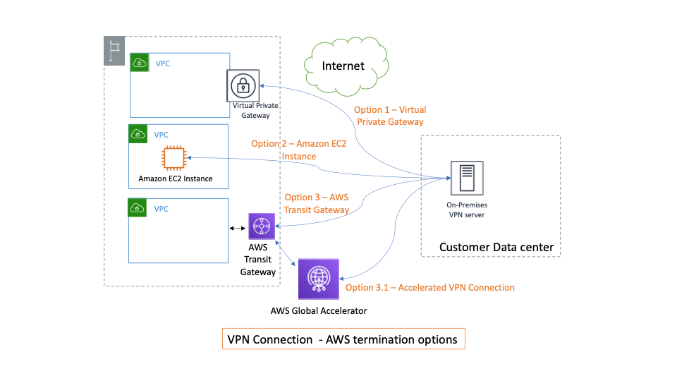
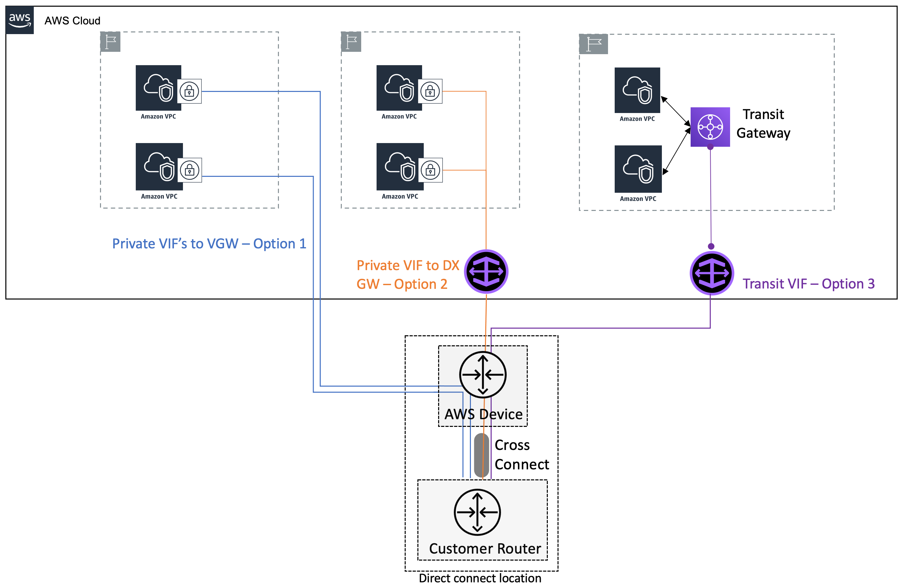
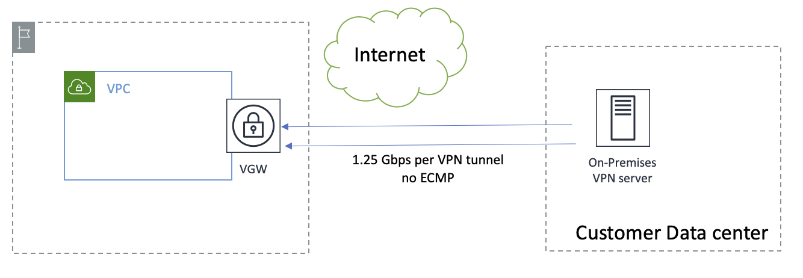
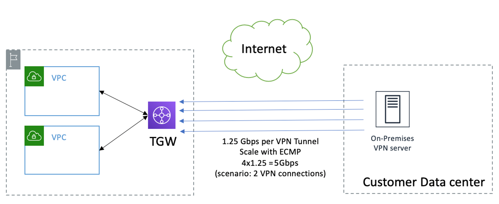
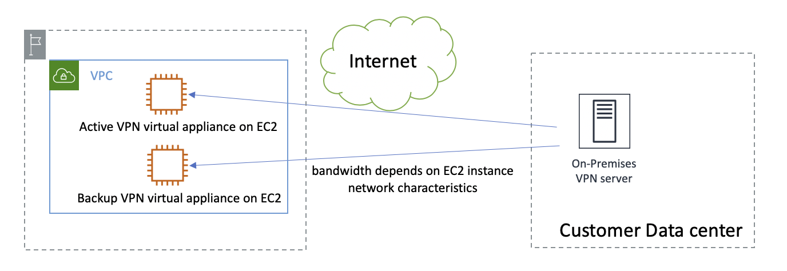
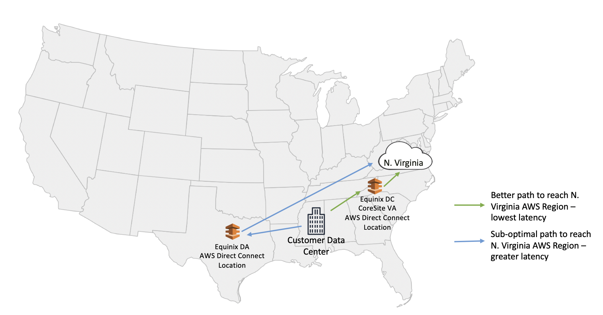

# Performance efficiency pillar

The performance efficiency pillar focuses on the efficient use of computing resources to
meet requirements and maintain efficiency as demand changes and technologies evolve.

## Best Practices

There are four best practice areas for Performance Efficiency in the cloud:

- Selection
- Review
- Monitoring
- Tradeoffs

Use a data-driven approach to select a high-performance architecture. Gather data on all
aspects of the architecture, from the high-level design to the selection and configuration of
resource types. Review your choices on a cyclical basis to ensure that you are taking
advantage of the continually evolving AWS platform. Monitor your workload to ensure that you
are aware of any deviance from expected performance. Understand where you can make
architecture tradeoffs to improve performance, such using VPN over internet vs dedicated
circuits via AWS Direct Connect for your hybrid connectivity or terminating your hybrid
connectivity on Virtual Private gateway instead of Transit Gateway.

### Selection

There are multiple technology and design choices to consider when setting up hybrid
networking connectivity on AWS. Each option has its own performance characteristics and
considerations. Understand your performance requirements to make the right selection.

These are our general recommendations:

1. Choose VPN (encrypted tunnels over the internet), AWS Direct Connect (dedicated fiber
   connectivity), or both.
2. Select the right termination endpoints in AWS.
   - VPN options include AWS Transit Gateway, a customer-managed EC2 instance, and
     a virtual private gateway. You can optionally enable acceleration for your
     Site-to-Site VPN connection to AWS Transit Gateway.

   

   _VPN connectivity options_
   - AWS Direct Connect options include virtual private gateway, Direct Connect gateway
     and virtual private gateway, or Direct Connect gateway and AWS Transit Gateway.
     Select Direct Connect locations where you perform a standard cross-connect between
     customer/service provider router and AWS device. For a list of Direct Connect
     locations, refer to [AWS Direct Connect
     Location](https://aws.amazon.com/directconnect/features/#AWS_Direct_Connect_Locations "https://aws.amazon.com/directconnect/features/#AWS_Direct_Connect_Locations")s.

_Direct Connect connectivity options_

Based on your bandwidth requirements, a single VPN or Direct Connect connection might
not be sufficient and you will have to architect the hybrid networking setup to enable
traffic load balancing across multiple connections.

| **HN_PERF1: How do you decide between AWS Direct Connect and AWS VPN as your connectivity option?** |
| ------------------------------------------------------------------------------------------------------ |
|                                                                                                        |

| **HN_PERF2: Determine and define your performance requirements using bandwidth, latency and jitter values.** |
| --------------------------------------------------------------------------------------------------------------- |
|                                                                                                                 |

Before you design the best performing architecture, define what performance means for
you and the parameters involved. Typically, performance metrics are based around bandwidth
(rate of data transfer), latency (round trip time for a network packet to travel form source
to destination), and jitter (variation in latency). Start by estimating the bandwidth and
latency requirements of your hybrid networking applications. For existing apps that are
moving to AWS, a good way to get these estimates is to rely on data from your internal
monitoring systems. For new apps or existing apps for which you don’t have monitoring data,
talk to the app/product owners to understand what traffic load is expected on the system,
what network dependencies does the application have and what are the acceptable latency
numbers to ensure good customer experience. Match these estimates with the options available
from AWS to determine which technology you should choose, and the appropriate
configuration.

**Deciding between AWS Direct Connect and AWS VPN as your connectivity
option**

Based on your requirements (bandwidth, latency, jitter), you can either choose to
establish VPN connectivity using AWS VPN or AWS Direct Connect (or both). The following information
will help you guide the path to take.

_Table 1 - Guided path for deciding between AWS VPN and
AWS Direct Connect_

| **Characteristic** | **AWS VPN**                                                                                                                                                                                                      | **AWS Direct Connect**                                                                                                                                                                                                                                          |
| ------------------ | ---------------------------------------------------------------------------------------------------------------------------------------------------------------------------------------------------------------- | --------------------------------------------------------------------------------------------------------------------------------------------------------------------------------------------------------------------------------------------------------------- |
| Bandwidth          | Low-Medium: Depends on customer internet connection and VPN device constraints. At the AWS end, you can scale the VPN bandwidth by creating multiple VPN connections                                       | High: Each Direct Connect connection can be up to 100 Gbps with option to scale bandwidth by adding additional connections.                                                                                                                                  |
| Latency            | Medium-high: Traffic traverses the internet and can flow through multiple hops. Note: Leveraging accelerated VPN could result in lower latency.                                                            | Low-Medium: Traffic traverses private circuit between AWS, third-party cloud provider, customer and has the minimal number of hops. In certain circumstances (outside customers control) like when there is a failure, higher latency can be possible. |
| Jitter             | Medium: It’s hard to predict the number of hops the traffic traverses over the internet and the congestion (or lack thereof) at these hops. Note: Leveraging accelerated VPN could result in lower jitter. | Low-medium: Traffic traverses private circuit and does not have the same uncertainties of internet. In certain rare circumstances (outside customers control) like when there is failure, higher jitter can be possible.                                  |

As depicted in the previous table, the best performing and recommended option is
AWS Direct Connect for production workloads. To get started quickly while getting good
performance for your development/sandbox environments, choose AWS VPN. It is very important to
always work backwards for your use case and requirements to make the right technology
choice. You can also choose a hybrid design where they leverage both AWS VPN and
AWS Direct Connect.

| **HN_PERF3: How do you select the best performing hybrid VPN architecture?** |
| ------------------------------------------------------------------------------- |
|                                                                                 |

**Selecting the right VPN termination endpoint at the AWS
end:**

There are four termination options at the AWS end. The VPN performance and
scalability will vary based on which option you choose. For each option it’s important to
understand the bandwidth and scalability characteristics.

1. **Termination at the virtual private gateway**:

_Bandwidth_ - Up to 1.25 Gbps per VPN connection.

_Scalability_ - Load balancing traffic across multiple VPN
connections for a given prefix is not enabled on the virtual private gateway. Since the
gateway can only attach to a single VPC, you can get up to 1.25 Gbps per VPC for a given
on-premises prefix you advertise.

_Termination at virtual gateway_ 2. **Termination on AWS Transit Gateway**:

_Bandwidth_ - Up to 1.25 Gbps per VPN tunnel. Each VPN attachment
allows you to create two VPN tunnels, with BGP ECMP load balancing enabled you can get a
total of 2.5 Gbps per VPN attachment.

_Scalability_ - Create multiple VPN attachments and scale the
aggregate bandwidth by load balancing traffic across these VPN connections. To make sure
that ECMP is active, the BGP path cost of all the links should be the same that is, AS
PATH length should be the same and you should have no or same MED values tagged to a
given prefix across all connections. The bandwidth you get is aggregate for all the VPCs
that AWS Transit Gateway attaches to.

_Termination at Transit Gateway_

Boost performance with accelerated Site-to-Site VPN – Optionally, you can enable
acceleration for your Site-to-Site VPN connection. An accelerated Site-to-Site VPN
connection (accelerated VPN connection) uses [AWS Global Accelerator](https://aws.amazon.com/global-accelerator/ "https://aws.amazon.com/global-accelerator/") to route traffic from your on-premises
network to an AWS edge location that is closest to your customer gateway device. AWS
Global Accelerator optimizes the network path, using the congestion-free AWS global network to
route traffic to the endpoint that provides the best application performance. You can
use an accelerated VPN connection to avoid network disruptions that might occur when
traffic is routed over the public internet. VPN tunnel bandwidth remains same as when
terminating directly on AWS Transit Gateway, but you get better latency, jitter, and
overall performance with an accelerated VPN connection. 3. **Termination on a customer-managed EC2 instance running virtual VPN
appliance**:

_Bandwidth_ - The bandwidth is dependent on the type/size of the EC2
instance and the capabilities of the VPN software running on the EC2 instance. The
maximum network throughput to the internet from an EC2 instance varies based on EC2
instance type and size. Instance flow limits (10 Gbps within a placement group and 5
Gbps otherwise) should be considered as well.

_Scalability_ – You can scale the number of EC2 instances and create
multiple VPN tunnels to these virtual appliances. Within a VPC route table you can only
have single ENI as next hop for a destination prefix, in order to distribute load across
EC2 instances you need to designate different EC2 instances as next hop targets for
different prefixes. You are responsible for the overall management of the EC2 instances
and ensuring availability.

_Termination on an EC2 instance_

| **HN_PERF4: How do you select the best performing hybrid architecture leveraging AWS Direct Connect?** |
| --------------------------------------------------------------------------------------------------------- |
|                                                                                                           |

**Choosing the right AWS Direct Connect location:**

Getting an AWS direct connect connection is to decide on a direct connect location
where you will establish a cross connect with AWS. You can connect to AWS at any of the
[direct connect locations](https://aws.amazon.com/directconnect/locations/ "https://aws.amazon.com/directconnect/locations/")
and get access to all AWS regions globally (except China). A key factor in deciding on
which direct location to choose is latency. The latency you get when choosing Direct Connect
as your hybrid connectivity option is dependent on two factors – the distance between your
data center and the Direct Connect location where you connect into and the distance between
the Direct Connect location and the AWS Region you are connecting into.

When deciding on a Direct Connect location, minimize the combined latency of these two
factors. Latency is directly proportional to geographical distance and hence you should
choose locations that minimize the overall distance. As you choose multiple Direct Connect
locations for High-availability it’s key to choose direct connect locations that are
geographically apart; striking a balance between and latency and high-availability is
important.

_Choosing the correct AWS Direct Connect location_

**Choosing the right termination endpoint on AWS end:**

Once you have established cross connect to an AWS device at an AWS Direct Connect
location, there are two options on how you can access VPC resources within an AWS Region.

1. Private virtual interface to AWS Direct Connect Gateway which is associated to a virtual
   private gateway.
2. Transit virtual interface to AWS Direct Connect Gateway which is associated to a
   transit gateway.

Both options offer high bandwidth, scalability, and low latency. However, when using
transit virtual interface to connect to AWS Transit Gateway, you are limited by the
bandwidth of the AWS Transit Gateway attachment (up to 50 Gbps). Of the two options, we
recommended using transit virtual interface as it enables a hub and spoke topology which
scales better and is easier to manage, unless you have a requirement for bandwidth speeds in
the range of hundreds of Gbps.

**Choosing the right AWS infrastructure location for deploying your
workloads:**

While it has been assumed throughout this document that your infrastructure will be
deployed in an AWS region, for workloads that require very low-latency or local data
processing, you can bring AWS infrastructure closer to you by leveraging AWS Local
Zones.

[AWS Local
Zones](https://aws.amazon.com/about-aws/global-infrastructure/localzones/ "https://aws.amazon.com/about-aws/global-infrastructure/localzones/") are a new type of AWS infrastructure designed to run workloads that
require single-digit millisecond latency, such as video rendering and graphics intensive,
and virtual desktop applications. AWS Local Zones have their own connection to the
internet and support AWS Direct Connect, so resources created in the Local Zone can serve local
end-users with very low-latency communications.

When connecting to a Local Zone via AWS Direct Connect, you can create a private virtual
interface (leveraging Direct Connect gateway) which allows connectivity directly to the VPC
associated with the Local Zone. For more information, refer to the [Amazon VPC User Guide](../../../vpc/latest/userguide/Extend_VPCs.md "../../../vpc/latest/userguide/Extend_VPCs.md").
This creates a direct traffic path between your data centers and the local zone allowing you
to achieve latency as low as 1-2ms.

**Note:** If you are using a transit virtual interface, traffic
is first sent to the transit gateway in the AWS region before being forwarded to the local
zone. For low-latency traffic we recommend creating a private virtual interface when
connecting to a Local Zone.

**Scaling your direct connect connection bandwidth:**

AWS currently offers Direct Connect connections with speeds up to 100 Gbps. You can
aggregate up to two 100 Gbps (or up to four 10Gbps) connections in a LAG, to get up to 200
Gbps of bandwidth. A link aggregation group (LAG) is a logical interface that uses the Link
Aggregation Control Protocol (LACP) to aggregate multiple connections at a single
AWS Direct Connect endpoint, allowing you to treat them as a single, managed connection. All
connections in a LAG operate in Active/Active mode.

Increase bandwidth by load balancing traffic across multiple Direct Connect connections
at a single Direct Connect location using BGP Equal-cost multipath (ECMP). Advertise the
same prefixes with the same BGP attribute values (ex: AS PATH) on virtual interfaces you
create over multiple connections to enable this behavior. When you have Direct Connect
connections across multiple Direct Connect locations, by default, AWS uses the distance
from the local Region to the AWS Direct Connect location to determine the virtual
interface/connection to send the traffic (assuming you are advertising same prefixes) over
the different VIF/connections’ across Direct Connect locations. You can modify this behavior
by tagging the prefixes you advertise over virtual interfaces with [BGP
communities](../../../directconnect/latest/UserGuide/routing-and-bgp.md#private-routing-policies "../../../directconnect/latest/UserGuide/routing-and-bgp.md#private-routing-policies"). To load balance traffic across multiple AWS Direct Connect connections,
apply the same community tag to the prefixes you advertise across the connections.

**Note:** When multiple paths exist for the same advertised
prefix, BGP community preference (high, medium, low) value takes priority over AS PATH
length when making a routing decision. If you tag your prefixes across multiple connections
with the same BGP community, then the AS PATH length is looked at to determine which
connection to send the traffic to. Same AS PATH lengths across multiple connections in this
case will result in ECMP load balancing.

### Review

See the AWS Well-Architected Framework whitepaper for best practices in the review
area for performance efficiency that apply to hybrid networking .

### Monitoring

Monitoring and tracking the performance of your hybrid networking connectivity is
important. Often, you deploy your hybrid networking connectivity for an initial set of
applications but as time progresses more and more apps start using this existing
connectivity. This can lead to a low-performing or over-subscribed link. Rely on Amazon CloudWatch
metrics and your on-premises (and/or service provider) device and router metrics for
tracking the performance of your VPN and Direct Connect connection. If your applications are
experiencing less than ideal performance, you must identify the root cause and fix it. For
AWS service related issues, you can open an AWS Support ticket, while in other cases,
re-architecting for scalability might be needed.

| **HN_PERF5: How do you monitor and scale your hybrid connectivity post launch to ensure they are performing as expected?** |
| -------------------------------------------------------------------------------------------------------------------------------- |
|                                                                                                                                  |

**Tracking and estimating growing usage of VPN or Direct Connect
connectivity:**

Every time you deploy a new hybrid networking application, estimate the bandwidth
requirements ahead of time to ensure that you are not oversubscribing the existing hybrid
network connectivity link. To track the usage of a VPN connection, rely on [Amazon CloudWatch
metrics for VPN](../../../vpn/latest/s2svpn/monitoring-cloudwatch-vpn.md "../../../vpn/latest/s2svpn/monitoring-cloudwatch-vpn.md") (we recommend `TunnelDataIn` and
`TunnelDataOut` metrics), and your on-premises VPN device metrics. For Direct
Connect, rely on [Amazon CloudWatch metrics](../../../directconnect/latest/UserGuide/monitoring-cloudwatch.md "../../../directconnect/latest/UserGuide/monitoring-cloudwatch.md")
(we recommend the `ConnectionBpsIngress` and `ConnectionBpsEgress`
metrics). Additionally, look at customer device metrics and, if applicable, metrics provided
by your network service provider or circuit provider.

**Increasing VPN or Direct Connect bandwidth:**

When using VPN, if excessive latency and jitter are seen due to internet congestion,
the best option might be moving to accelerated VPN or AWS Direct Connect. If VPN bandwidth is the
limiting factor, depending on what limit is, you might want to get a more capable VPN
termination device on premises or move to a different VPN termination endpoint in AWS. If
your VPN is shutting down on a virtual private gateway, you should move the VPN endpoint to
AWS Transit Gateway, which enables you to achieve higher VPN throughput at the AWS end
using BGP ECMP load balancing across different VPN tunnels. You can do this without having
to make any changes on your customer gateway. Using the ModifyVpnConnection API or the
AWS Management Console, you can update the target gateway of a VPN connection. This preserves the
endpoint's IP addresses on AWS, and the tunnel options such as inside-tunnel Classless
Inter-Domain Routing (CIDR) and pre-shared keys. After you have moved to AWS Transit
Gateway, add additional VPN connections and enable ECMP load balancing across all the VPN
tunnels.

When using Direct Connect, you can add more capacity and load balance traffic across
the old and new connections. You can add capacity one of two ways:

- Add more connections in a Link Aggregation Group (LAG) – you can request additional
  Direct Connect connections at the same Direct Connect location and place them in a LAG.
  All connections in the LAG shut down on the same AWS Direct Connect device. You can bundle up
  to four Direct Connect connections in a LAG. Since we implement same-chassis LAG at the
  AWS end, your new connections also land on the same AWS device as your previous
  connections. This might not always be possible, especially if there are no empty ports
  on the existing AWS device.

**Note:** All connections in the LAG must have the same
bandwidth.

- Add more individual Direct Connect connections (no LAG) and load balance traffic
  across all the connections using BGP ECMP. When the added connections are in the same
  Direct Connect location, ensure that the ECMP is active, the BGP path cost of all the
  links should be the same, and the AS PATH length should be the same. When the added
  connections are spread across multiple direct connect locations, tag your prefixes with
  the same [community tag](../../../directconnect/latest/UserGuide/routing-and-bgp.md#private-routing-policies "../../../directconnect/latest/UserGuide/routing-and-bgp.md#private-routing-policies") in addition to ensuring same BGP path cost across the
  connections.

**Estimating how AWS Direct Connect connection failures impact your
application performance:**

Failures often leave your hybrid networking connectivity in a degraded state, which
affects performance. To ensure that failures don’t affect performance, architect and
implement your connectivity in a way that upon failure, your connectivity can still meet the
load of your workloads. You can either set up your Direct Connect connections to be
Active/Active or Active/Passive. If using Active/Passive, your passive connection should
have the same performance metrics as your primary connectivity. Essentially, you are
provisioning twice the capacity of what your requirement is and using half of it at any
given time. This is same for Active/Active, with the only difference being that you are
using both the links at half capacity.

As your connectivity requirements change and you need to scale your primary connection
bandwidth, scale the passive or secondary links as well. It’s also important to frequently
test for failure scenarios to make sure that your application experience is not degraded
when switching to the backup connectivity links.

### Tradeoffs

| **HN_PERF6: How do you use tradeoffs to improve network performance?** |
| ------------------------------------------------------------------------- |
|                                                                           |

When deciding on which technology to choose (VPN vs dedicated circuits) or which
termination endpoint to choose (EC2 instance vs TGW for VPN termination), consider the
tradeoff between performance, cost, and ease/time to setup. Understanding the tradeoffs will
help you choose the right tool for the right job.

**Tradeoffs between AWS VPN and AWS Direct Connect on cost and time to
setup:**

The following tables show different factors to consider when making a choice between
AWS VPN and Direct Connect.

_Table 2 - Tradeoffs between AWS VPN and AWS Direct Connect on cost and
time to setup_

| **Tradeoff**  | **AWS VPN**                                                                                                                                                                                                                                                          | **AWS Direct Connect**                                                                                                                                                                                                                                                                                                                                                          |
| ------------- | -------------------------------------------------------------------------------------------------------------------------------------------------------------------------------------------------------------------------------------------------------------------- | ------------------------------------------------------------------------------------------------------------------------------------------------------------------------------------------------------------------------------------------------------------------------------------------------------------------------------------------------------------------------------- |
| Cost          | Low: If you have an active already paid for internet connection at the customer end, you pay for [AWS VPN costs](https://aws.amazon.com/vpn/pricing/ "https://aws.amazon.com/vpn/pricing/").                                                                   | Low-Medium: Data transfer out cost over Direct Connect is lower than that over VPN. If you don’t have existing circuits to a Direct Connect location, you may have to pay for circuit costs to your service provider in addition to AWS [Direct connect hourly charge](https://aws.amazon.com/directconnect/pricing/ "https://aws.amazon.com/directconnect/pricing/"). |
| Time to Setup | Low: If you have an internet connection at the customer end, VPN can be established in minutes.                                                                                                                                                                   | Low-Medium: If you already have a circuit to a Direct Connect location, AWS Direct connect can be setup in few days. If you don’t have a circuit, circuit setup times can vary in the range of weeks.                                                                                                                                                                     |
| Performance   | Medium: medium bandwidth (based on internet speeds), medium-high latency (unpredictable number of hops), medium-high jitter (unknown hops, internet congestion). Note: Leveraging accelerated VPN could lead to reduced (low-medium) latency and jitter. | High: high bandwidth (upto 100 Gbps), low latency and minimal jitter (private circuit with predictable number of hops).                                                                                                                                                                                                                                                      |

**Example: Where you can tradeoff performance for time to
setup** - If you want to get your developers connectivity to development or
sandbox VPC’s quickly to start experimenting, then VPN is the recommended approach.

**Example: Where you can tradeoff time to setup for
performance** - For production workloads, where performance is critical and you
have a longer time to plan things, AWS Direct Connect is the recommended approach.

_Table 3 - Tradeoffs between AWS VPN and VPN termination on EC2 instances_

| **Tradeoff**                             | **Virtual appliance on EC2 instance**                                                                                                                                                                                                                                                                                                 | **AWS VPN (on AWS Transit Gateway)**                                                                                                            |
| ---------------------------------------- | ------------------------------------------------------------------------------------------------------------------------------------------------------------------------------------------------------------------------------------------------------------------------------------------------------------------------------------- | ----------------------------------------------------------------------------------------------------------------------------------------------- |
| Cost                                     | Medium • High: You pay for [EC2 instance pricing](https://aws.amazon.com/ec2/pricing/ "https://aws.amazon.com/ec2/pricing/") (2 or more instances for HA) in addition to any third-party licensing fees.                                                                                                                     | Low: You pay for [AWS VPN costs](https://aws.amazon.com/vpn/pricing/ "https://aws.amazon.com/vpn/pricing/") (hourly charge + data transfer). |
| Setup complexity and management overhead | High: Management and maintenance of EC2 instances is customer responsibility.                                                                                                                                                                                                                                                         | Low: AWS VPN is a fully managed solution.                                                                                                       |
| Scalability and performance              | Low-medium: You can vertically scale an EC2 instance to get higher bandwidth. Horizontal scalability is limited due to how egress traffic can be load balanced to multiple ENI’s in a VPC route table.                                                                                                                          | High: You can scale VPN bandwidth by provisioning more VPN connections and load balancing traffic using ECMP.                                |
| 3rd party features                       | High: You can choose a third-party vendor software to get additional functionality like DMVPN ([Dynamic Multipoint VPN,](https://www.cisco.com/c/en/us/products/security/dynamic-multipoint-vpn-dmvpn/index.html "https://www.cisco.com/c/en/us/products/security/dynamic-multipoint-vpn-dmvpn/index.html") a Cisco VPN protocol). | Low-medium: AWS VPN doesn’t support third-party proprietary features like DMVPN.                                                                |

**Example: Where you can tradeoff performance for third-party
features** - If you standardize on using DMVP for all your sites and want to
quickly setup connectivity to a dev environment, the recommended approach is to use a
third-party virtual appliance like Cisco CSR to terminate VPN.

**Example: Where you can tradeoff third-party features for
performance** - If you standardize on using DMVP for all your sites and but want
a fully managed, scalable solution for your production workloads, the recommended approach
is to take time to move to IPSEC VPN connectivity leveraging AWS VPN.

## Resources

Refer to the following resources to learn more about our best practices related to
performance efficiency.

### Documents

- [Hybrid Connectivity
  Whitepaper](../../../whitepapers/latest/hybrid-connectivity/introduction.md "../../../whitepapers/latest/hybrid-connectivity/introduction.md")
- [AWS Direct Connect Locations](https://aws.amazon.com/directconnect/features/#AWS_Direct_Connect_Locations "https://aws.amazon.com/directconnect/features/#AWS_Direct_Connect_Locations")
- [AWS Direct Connect
  Link Aggregation Groups](../../../directconnect/latest/UserGuide/lags.md "../../../directconnect/latest/UserGuide/lags.md")
- [Accelerated
  Site-to-site VPN](../../../vpn/latest/s2svpn/accelerated-vpn.md "../../../vpn/latest/s2svpn/accelerated-vpn.md")
- [AWS Global Accelerator](https://aws.amazon.com/global-accelerator/?blogs-global-accelerator.sort-by=item.additionalFields.createdDate&blogs-global-accelerator.sort-order=desc&aws-global-accelerator-wn.sort-by=item.additionalFields.postDateTime&aws-global-accelerator-wn.sort-order=desc "https://aws.amazon.com/global-accelerator/?blogs-global-accelerator.sort-by=item.additionalFields.createdDate&blogs-global-accelerator.sort-order=desc&aws-global-accelerator-wn.sort-by=item.additionalFields.postDateTime&aws-global-accelerator-wn.sort-order=desc")
- [Routing policies and BGP communities](../../../directconnect/latest/UserGuide/routing-and-bgp.md "../../../directconnect/latest/UserGuide/routing-and-bgp.md")

### Videos

- [AWS
  Networking Series | Episode 2 | Connectivity to AWS and Hybrid AWS Network
  Architectures](https://www.twitch.tv/videos/674929188?collection=HBANRY7lIxagXQ "https://www.twitch.tv/videos/674929188?collection=HBANRY7lIxagXQ")
- [AWS re:Invent 2019: The right
  AWS network architecture for the right reason (NET320)](https://www.youtube.com/watch?v=Ot1kcQfUIdg "https://www.youtube.com/watch?v=Ot1kcQfUIdg")
- [AWS re:Invent 2019:
  Connectivity to AWS and hybrid AWS network architectures (NET317)](https://www.youtube.com/watch?v=eqW6CPb58gs "https://www.youtube.com/watch?v=eqW6CPb58gs")
- [AWS re:Invent 2020: Go global
  with AWS multi-Region network services](https://www.youtube.com/watch?v=K70QkVWy4YM "https://www.youtube.com/watch?v=K70QkVWy4YM")
