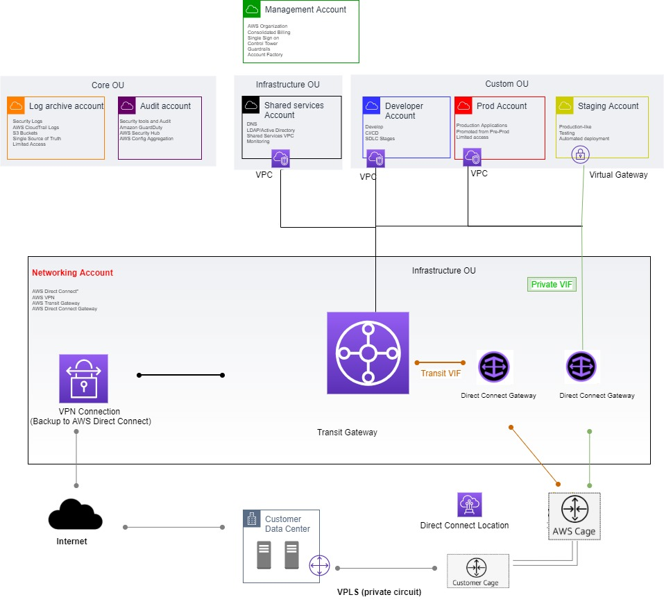
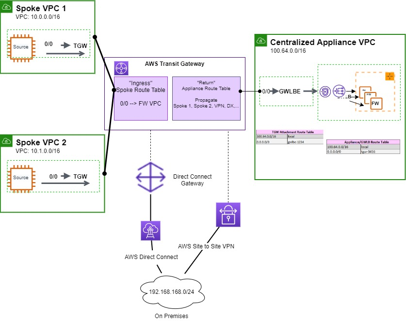
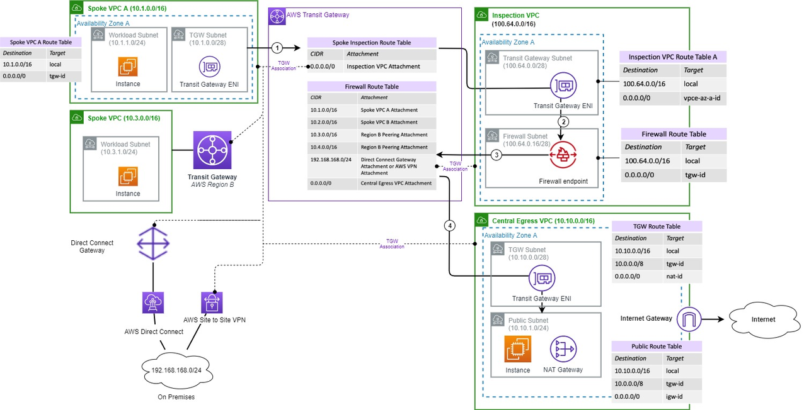

# Security pillar

The security pillar describes how to take advantage of cloud
technologies to protect data, systems, and assets in a way that can
improve your security posture.

## Best practices

There are five best practice areas for security in the cloud:

- Identity and access management
- Detective controls
- Infrastructure protection
- Data protection
- Incident response

Securing your hybrid network includes identifying security
incidents, protecting your systems and services, and maintain the
confidentiality and integrity of data through data protection.
Unauthorized access to systems can cause financial loss and loss
of compliance with regulatory obligations. Before creating a
hybrid network, we recommend having a well-defined and practiced
process for responding to security incidents.

The AWS Shared Responsibility Model enables organizations that
adopt the cloud to achieve their security and compliance goals.
Because AWS physically secures the infrastructure that supports
our cloud services, AWS customers can focus on using services to
accomplish their goals. The AWS also provides greater access
to security data and an automated approach to responding to
security events.

In this section, we provide principles that help you strengthen
your system’s security and hybrid networking workloads, it’s
expected that you will also be following the security best
practices of the AWS Well-Architected Framework whitepaper.

## Identity and access management

Deploying hybrid networking requires the creation of constructs
that must be controlled to prevent unauthorized access to your
VPCs and services. To secure and control access to your hybrid
networking environment, it's important to consider the roles and
responsibilities of your teams managing and operating your
workloads using the principle of least privilege. Additionally,
it’s important to isolate your networking services and implement
separation of duties between the network specialists and
application owners. Regardless of your operating model, this will
allow the different teams to have required access to network
services based on their roles. For example, it's best practice to
create a separate Central Networking cloud account managed by the
networking specialist team to centrally manage network policies,
gateways and internet-based VPN and dedicated Direct Connect
connections. Separation of accounts will prevent your application
teams from negatively impacting your hybrid network.

| HN_SEC1: How do you control access to your resources and workloads across your Hybrid networking environment? |
| ---------------------------------------------------------------------------------------------------------------- |
|                                                                                                                  |

AWS recommends implementing a landing zone, which is a
preconfigured, secure, scalable, and multi-account AWS environment
based on best practice blueprints. AWS Control Tower can automate
the provisioning of your landing zone and accounts and help you
manage the level of separation.
[AWS Control Tower](https://aws.amazon.com/controltower/ "https://aws.amazon.com/controltower/") provides an initial set of guardrails to help
enhance the security of your overall AWS environment.

The following reference architecture diagram shows an example of a
central Networking account which hosts all of the hybrid
networking resources and enables demarcation of network
administrative boundaries. There are additional AWS accounts owned
by the various application teams for example, production account,
staging account, and dev account, some are associated to the
central networking account for hybrid connectivity. Hybrid
networking constructs such as Direct Connect connections, Direct
Connect gateway, Networking services, Shared VPCs, and Transit
Gateway resources should be deployed in the Central Networking
account. In order to share AWS Direct Connect connectivity with
the rest of your Landing Zone, you can share the Transit Gateway
through RAM with VPCs that reside in other accounts.

_Sample architecture for AWS hybrid network connectivity
using Transit Gateway_

In a hybrid networking environment, the networking and security
teams may share some of the responsibilities for securing network
boundaries. To implement the principle of least privilege for
example, the networking and/or security teams should have control
over creating and modifying resources to enable hybrid
connectivity while the developer teams should not have permissions
to create or make changes to any network or security settings
defined by the networking or security teams. The networking team
should own the management of circuits as well as the provisioning
of private dedicated Direct Connect virtual interfaces and/or
internet-based Site-to-Site VPN connections, even though the
development teams have dependencies on the various shared
networking resources.

Sensitive APIs for setting up hybrid connectivity for example, the
creation and deletion of AWS resources such as Direct Connect
virtual interfaces, Transit Gateway, Direct Connect Gateway, and
Direct Connect Gateway associations should be restricted to the
networking account and specialists. If most Hybrid Networking
connections are established with these APIs from specific networks
or geographic areas, you should restrict access to hybrid
networking connections based on location where possible. For
example, AWS Direct Connect APIs which support resource-based
access policies based on the CIDR range or source IP address. This
can isolate network access to a given Direct Connect resource from
only the specific VPC within the central networking account. For
more information, refer to
[AWS Direct Connect resource-based policy examples](../../../directconnect/latest/UserGuide/security_iam_resource-based-policy-examples.md "../../../directconnect/latest/UserGuide/security_iam_resource-based-policy-examples.md").
Additionally, the networking teams should own all of the API calls
for creation and deletion of connections while the application
teams should be allowed to use describe calls for APIs on the
hybrid network resources. Direct Connect supports specific
actions, resources, and condition keys. To learn about all of the
elements that you use in a JSON policy, refer to
[IAM
JSON Policy Elements Reference](../../../IAM/latest/UserGuide/reference_policies_elements.md "../../../IAM/latest/UserGuide/reference_policies_elements.md") in the _IAM User
Guide_.

We also recommend that the networking team tag your AWS hybrid
network resources upon creation, for example, Site-to-Site VPN
connections, virtual private gateways, and customer gateways from
the central networking account. You can enforce the use of tagging
and control which tag keys and values are set on networking
resources. For example, you can tag a Direct Connect connection
based on the different business units or AWS account and limit
control over who can create a private or transit VIF on that
connection. As shown in the previous reference architecture
diagram, if Direct Connect is connected to a Transit Gateway, you
should restrict control to the networking team to allow changes to
the Transit Gateway route table association and propagation,
failing to do so could potentially give other teams access to
hybrid connectivity.

For accounts with multiple VPCs that need to be shared with two or
more accounts, VPC sharing can be used to improve security and
compliance of your different accounts. With VPC sharing, the AWS account that creates and owns a VPC can choose to share particular
subnets with other AWS accounts, and that account can then create,
view, and modify resources it owns within those particular
subnets. For example, using VPC sharing, you won’t have to write
complicated IAM policies to prevent developers from altering the
VPC that connects to your on-premises network or interact with
resources with which they are not associated. For more
information, refer to
[working
with shared VPCs](../../../vpc/latest/userguide/vpc-sharing.md "../../../vpc/latest/userguide/vpc-sharing.md").

| HN_SEC2: How do you segment access between AWS and your on-premises network? |
| ---------------------------------------------------------------------------- |
|                                                                              |

It's also important to segment access between your on-premises network and AWS
networks. Your networking team should verify that your customer gateway router and firewall
configurations are aligned with how you expect to separate traffic between your on-premises
and AWS environments. For example, you might need to constrain your production VPC to
accessing only allowed on-premises production services and data. Additionally, you might need
to configure your on-premises routers to help ensure that only certain on-premises networks or
specific clients can access your networks. For more information, refer to the [Infrastructure Protection](#infrastructure-protection "#infrastructure-protection") section of the Hybrid
Networking Lens Security pillar for ways to constrain access in your hybrid networking
environment.

It is common that your application owners in your development, staging, and production
environments in AWS will need to have connectivity to some of your on-premises resources
such as Active Directory services, DNS, or network security proxying services. It is also
possible that your on-premises users and workloads have dependencies on AWS workloads and
data. For example, there may be existing test and production data services in your on-premises
environment that your workloads in AWS will need to access. It is important that access to
the AWS platform be controlled via role-based access control and permissions assigned to
roles with AWS Identity and Access Management (IAM).

### Detection controls

Detective controls can be used to identify a potential security
threat or incident. You can get detailed insights into your hybrid
network performance and use that information to detect
misconfigurations or potential malicious activity, and further
optimize your deployment.

| **HN_SEC3: How are you capturing and analyzing metrics in your hybrid networking environment?** |
| -------------------------------------------------------------------------------------------------- |
|                                                                                                    |

A recommended best practice is to monitor and implement an immediate response process that detects and reacts to any suspicious or malicious activity. Monitoring workloads is important especially when investigating a security incident. At a minimum, the metadata of logs should be captured for hybrid network connections with private connections like AWS Direct Connect for 1GB and higher. You can leverage [Amazon GuardDuty](https://aws.amazon.com/guardduty/ "https://aws.amazon.com/guardduty/"), a threat detection service with built in VPC flow logs that continuously monitors your workloads for malicious activity.

We also recommended having a central logging and analytics setup for your hybrid environment. With AWS Hybrid Networking, you can implement detective controls using Amazon CloudWatch Logs, Amazon CloudWatch metrics, and Transit Gateway Route Analyzer. For an example, refer to [AWS Central Logging and Analytics architecture example for Hybrid Networking](https://d1.awsstatic.com/architecture-diagrams/ArchitectureDiagrams/central-logging-and-analytics-in-hybrid-environments.pdf "https://d1.awsstatic.com/architecture-diagrams/ArchitectureDiagrams/central-logging-and-analytics-in-hybrid-environments.pdf").

For dedicated Direct Connect deployments with multiple virtual interfaces, you can leverage [CloudWatch metric math](../../../AmazonCloudWatch/latest/monitoring/using-metric-math.md "../../../AmazonCloudWatch/latest/monitoring/using-metric-math.md") to configure specific ingress and egress metrics and send a CloudWatch alarm for all virtual interfaces if the threshold for a metric is breached.

If you deploy AWS Transit Gateway for dedicated Direct Connect or internet based Site-to-Site VPN environments, you can gain focused insights into the amount of data flowing in and out over a transit gateway connection using CloudWatch metrics. Verify routes in your hybrid networking environment for traffic reachability to prevent faulty route configurations that could lead to the exposure of sensitive environments on AWS to untrusted networks on-premises and on AWS. The Transit Gateway Network Manager dashboard can be used to visualize and monitor your AWS resources and on-premises networks, and can help you identify whether issues in your hybrid network are caused by AWS resources, on-premises resources, or the connections between resources such as network topology changes, routing updates, and connection status. Using the Route Analyzer feature of Transit Gateway, you can validate that the AWS Transit Gateway route table configurations work as expected before sending live network traffic over Site-to-Site VPN connections or dedicated AWS Direct Connect.

Hybrid network connectivity leverages IP prefixes which network administrators should monitor to ensure that the number of prefixes injected from customer gateways such as routers or firewalls stay within the allowed limits. Staying within the allowed limits ensures that you avoid resource starvation of your AWS hybrid networking services and also protects them from abuse.

For best practices in detection controls for hybrid networking, refer to the [AWS Well-Architected Security pillar whitepaper.](../security-pillar.md "../security-pillar.md")

### Infrastructure protection

Infrastructure protection for hybrid networking involves securing
all networking resources from your on-premises deployment to the
cloud. Enforcing boundary protection, monitoring points of ingress
and egress, and comprehensive logging, monitoring, and alerting
are all essential to an effective information security plan.

| **HN_SEC4: How do you protect network resources in your hybrid network environment?** |
| ---------------------------------------------------------------------------------------- |
|                                                                                          |

It’s important to ensure that networking boundaries are considered
and enforced for hybrid networking environments. Secure your
hybrid environment using multiple layers of defense and
segmentation. There are five key methods to consider when
protecting your AWS hybrid networking boundaries:

- **Security Groups**: Utilize
  security groups as a stateful (layer 4) firewall to allow
  access to instances in your VPC from your on-premises network
  and as a first line of defense. When defining security group
  rules for your AWS Direct connect virtual interface or
  Site-to-Site VPN, ensure that you are only allowing inbound
  and outbound traffic for your on-premises network prefix. For
  example, refer to
  [Security
  Group Rules](../../../vpc/latest/userguide/VPC_SecurityGroups.md "../../../vpc/latest/userguide/VPC_SecurityGroups.md"). Consider using other security groups as
  sources for a security group rules instead of configuring
  multiple CIDRs.
- **Network Access Control
  Lists** (NACLs): You can use NACLs as an optional
  stateless (layer 4) firewall that allows defining the port,
  protocol, and source of traffic that should be explicitly
  denied at the subnet level. Security groups and NACLs mutually
  complement each other, consider using NACLs with rules similar
  to your security groups in order to add an additional layer of
  security to your VPC. When using NACLs, ensure that the
  outbound rules that allow traffic from all ports limit access
  to the required ports or port ranges across your hybrid
  network. For more information, refer to
  [Network
  ACL Rules](../../../vpc/latest/userguide/vpc-network-acls.md "../../../vpc/latest/userguide/vpc-network-acls.md").
- **AWS Transit Gateway Route
  Tables**: Transit Gateway route tables can be used to
  enable defined connectivity between AWS VPCs and your
  on-premises network. Based on the configuration of the transit
  gateway routing tables, you have control over which VPCs have
  connectivity with each other and with your on-premises
  network. Transit Gateway route tables can also use a routing
  mechanism known as
  [_null
  routing_](../../../vpc/latest/tgw/tgw-route-tables.md "../../../vpc/latest/tgw/tgw-route-tables.md"), which drops traffic that matches a
  particular route and can be used to achieve security isolation
  and optimal traffic flow. It prevents the source attachment
  from reaching a specific route by dropping traffic that
  matches the route. For example, by configuring a null route in
  your Transit Gateway route table for a particular destination,
  you can block hybrid traffic for that destination to flow from
  the VPC spokes via the VPN attachment and/or Direct Connect GW
  attachment to your on-premises Data Center.

Avoid using a single transit gateway route table per VPC as a
security feature. To keep your hybrid environment easy to
manage and to stay within the transit gateway route tables
limits, keep the number of route tables to a minimum by
associating VPCs with the same routing behavior to the same
transit gateway route table. For example, you can group your
development VPCs and associate them to a development transit
gateway route table while the production VPCs can be
associated to a production transit gateway route table. The
development and production route tables can have different
routes to your hybrid environments based on your security
posture. For more information, refer to
[working
with Transit Gateway Route Tables](../../../vpc/latest/userguide/route-table-options.md "../../../vpc/latest/userguide/route-table-options.md").

- **Gateway Load Balancer**
  (GWLB): Enables easy configuration for adding third- party
  software appliance/IPS/IDS/firewalls running on Amazon Elastic Compute Cloud (Amazon EC2) instances in your AWS network. You
  can route all internet traffic using only private subnets in a
  VPC, using an IDS/IPS leveraging transit gateway and
  establishing centrally managed egress/ingress security
  capabilities in AWS. If you need a firewall for inline
  inspection of traffic, out of multiple VPCs over Direct
  Connect or VPN, you can use Transit Gateway with a centralized
  appliance VPC model for the firewall. Transit Gateway helps
  control separation of duties between accounts that perform the
  inline functionality. For more details on deployment options
  inline inspection with the AWS Gateway Load Balancer, refer to
  this
  [blog](https://aws.amazon.com/blogs/networking-and-content-delivery/introducing-aws-gateway-load-balancer-supported-architecture-patterns/ "https://aws.amazon.com/blogs/networking-and-content-delivery/introducing-aws-gateway-load-balancer-supported-architecture-patterns/").
  The following diagram depicts a Gateway Load Balancer
  deployment for North/South inline inspection of traffic.

_Firewall inline inspection for VPCs with centralized
North/South connectivity_

- **AWS Network Firewall**: AWS
  Network Firewall secures AWS Direct Connect and VPN traffic
  from client devices and on-premises environments for
  deployments supported by AWS Transit Gateway. With AWS Network
  Firewall, you can filter traffic at the perimeter of your
  VPC(s) for VPN or Direct Connect. A key requirement for this
  support is to connect AWS Direct Connect using Transit virtual
  interfaces to AWS Transit Gateway or establishing the AWS
  Site-to-Site VPN directly to AWS Transit Gateway. Using AWS
  Transit Gateway routing tables functionality, AWS Direct Connect/VPNs are attached to the spoke route table. For more
  information on deployment options for the AWS Network
  Firewall, refer to this
  [blog](https://aws.amazon.com/blogs/networking-and-content-delivery/deployment-models-for-aws-network-firewall/ "https://aws.amazon.com/blogs/networking-and-content-delivery/deployment-models-for-aws-network-firewall/").
  The following diagram depicts a Network Firewall deployment
  for a hybrid networking environment.

_Traffic between VPC and on-premises protected by centrally deployed AWS Network Firewall_

When VPC security groups, Network ACLs, and route tables are used in AWS, use managed prefix lists to provide consistency for a list of external prefixes to be shared via VPC sharing and IAM access control.

- **Amazon Route 53 Resolver DNS Firewall**: Helps to protect against DNS-level threats such as data exfiltration attempts where malicious actors can use DNS queries to smuggle sensitive data out of your hybrid network. With Amazon Route 53 Resolver DNS Firewall, you can create domain name blocklists for domains that you don’t want your VPC resources to communicate with via DNS and also create domain name allow lists that permit outbound DNS queries only to domains your organization trust and specify.

> For best practices in the Infrastructure Protection area for security in hybrid networking, refer to the [AWS Well-Architected Security pillar whitepaper](../security-pillar.md "../security-pillar.md").

### Data Protection

Encrypting sensitive data traffic to connect to AWS over the
internet or over a private network connection for their hybrid
networking workloads, is important in to ensure that an
unauthorized person or entity is unable to gain access to your
data.

| **HN_SEC5: How will you provide support for encryption of customer data?** |
| ----------------------------------------------------------------------------- |
|                                                                               |

For hybrid network connectivity over the internet, AWS
Site-to-Site VPN can be used to create encrypted tunnels using
IPSec VPN.

For hybrid network connectivity over a private network connection
using AWS Direct, configure MACsec (802.1ae) encryption (Layer 2)
for dedicated 10Gbps and 100Gbps connections to encrypt data
across your hybrid network. Encrypting traffic using MACsec
enables you to securely pass high bandwidth workloads with native,
point-to-point encryption, ensuring that data communications
between AWS and your data center, office or colocation facility
remain protected. To enable MACsec, both dedicated connection and
on-premises resources must support MACsec.

For hybrid network connectivity using AWS Direct Connect for
hosted connections and speeds lower than 10Gbps, use
application-level encryption or VPN to secure your sensitive data.
Encrypt at the application layer (Layer 7) using TLS. For network
layer (L3) encryption, establish an AWS Site-to-Site VPN
connection to create an IPSec VPN over a Direct Connect public
virtual interface. You can also create an IPSec VPN over your
Direct Connect private virtual interface using
[VPN
or firewall software from the AWS Marketplace on EC2
instances](https://aws.amazon.com/marketplace/search/results/ref%3Dbrs_navgno_search_box?searchTerms=vpn "https://aws.amazon.com/marketplace/search/results/ref%3Dbrs_navgno_search_box?searchTerms=vpn"). Leverage certificates for authentication where
available for Data Protection.

For additional considerations and solutions for data protection in
hybrid networking, refer to the Security section of the
[Hybrid
Connectivity AWS Whitepaper](../../../whitepapers/latest/hybrid-connectivity/hybrid-connectivity.md "../../../whitepapers/latest/hybrid-connectivity/hybrid-connectivity.md").

For best practices in data protection area for security in Hybrid
Networking, refer to the
[AWS Well-Architected Framework whitepaper](../framework.md "../framework.md") .

### Incident Response

Security incidents such as ransomware attacks on a hybrid
networking environment can be harmful to any organization with
potential loss of critical data and reputational damage to the
organization’s brand.

| **HN_SEC6: How do you isolate a hybrid networking environment from a security incident that originates from your on-premises network?** |
| --------------------------------------------------------------------------------------------------------------------------------------------- |
|                                                                                                                                               |

Responding to any cyber incident requires that you’re able to
detect the threat’s existence and establish a baseline for what
normal looks like in an AWS hybrid environment. To help identify
threats, Amazon GuardDuty continuously monitors your AWS
environment for malicious behavior, with threat detected from
multiple sources such as VPC Flow Logs, API activity, and DNS logs
to help protect your AWS accounts and workloads.

Some ransomware incidents are designed to use a company account to perform the attack.
Always follow the principle of least privilege to provision access for all of your users. As
a quick containment measure for your users across the hybrid network, deny access to IAM
principals (users and roles) with privileged access across accounts in your AWS
Organization using Service Control Policies (SCPs) until a thorough investigation is done or
the malware attack is over.

If ransomware is spreading, quickly isolate your AWS hybrid
network environment by preventing any inbound traffic from your
on-premises environment to your AWS accounts. To block all
incoming and outgoing traffic into your subnets and significantly
diminish attackers from moving laterally within your AWS network,
implement Network Access Control Lists. Additionally, you can also
use an Intrusion Prevention System (IPS) and Intrusion Detection
system (IDS) such as the AWS Network Firewall to block
communication with known malware hosts and secure AWS Direct Connect and Site-to-Site VPN traffic running through the AWS Transit
Gateway from client devices and your on-prem environment. For
additional ways to prevent traffic across your hybrid network
environment, refer to the
[Infrastructure
Protection](#infrastructure-protection "#infrastructure-protection") section in this whitepaper.

Automate incident response rather than leveraging manual processes
to monitor your security posture and manually react to events.
Automating responses improve manual processes, reduce containment
time, and prevent alert fatigue by the incident response teams,
leaving your human processes to handle the sensitive and unique
incidents. Leverage AWS Security Hub to automate and detect
security incidents. Security Hub continuously monitors your
environment using automated checks and you can take action on the
security findings with event based automation tools such as AWS Lambda, AWS Step Functions, and AWS Config Rules. The automated
response approach should be tested in your non-production
environment before deployment in your production accounts.

For additional best practices in the Incident Response area for
security in hybrid networking, refer to the
[AWS Well-Architected Security pillar whitepaper](../security-pillar.md "../security-pillar.md").

### Resources

Refer to the following resources to learn more about our best
practices for security.

#### Documentation and Blogs

- [Logging
  and Monitoring AWS Site-to-site VPN](../../../vpn/latest/s2svpn/logging-monitoring.md "../../../vpn/latest/s2svpn/logging-monitoring.md")
- [IAM
  for AWS Site-to-site VPN](../../../vpn/latest/s2svpn/vpn-authentication-access-control.md "../../../vpn/latest/s2svpn/vpn-authentication-access-control.md")
- [Data
  protection in AWS Site-to-site VPN](../../../vpn/latest/s2svpn/data-protection.md "../../../vpn/latest/s2svpn/data-protection.md")
- [Monitoring
  AWS Direct Connect](../../../directconnect/latest/UserGuide/monitoring-overview.md "../../../directconnect/latest/UserGuide/monitoring-overview.md")
- [IAM
  for AWS Direct Connect](../../../directconnect/latest/UserGuide/security-iam.md "../../../directconnect/latest/UserGuide/security-iam.md")
- [Data
  protection in AWS Direct Connect](../../../directconnect/latest/UserGuide/data-protection.md "../../../directconnect/latest/UserGuide/data-protection.md")
- [Deployment
  models for AWS Network Firewall](https://aws.amazon.com/blogs/networking-and-content-delivery/deployment-models-for-aws-network-firewall/ "https://aws.amazon.com/blogs/networking-and-content-delivery/deployment-models-for-aws-network-firewall/")
- [Hybrid
  Connectivity Whitepaper](../../../whitepapers/latest/hybrid-connectivity/hybrid-connectivity.md "../../../whitepapers/latest/hybrid-connectivity/hybrid-connectivity.md")

#### AWS Support

- [How
  do I create a certificate-based VPN using AWS Site-to-Site
  VPN?](https://aws.amazon.com/premiumsupport/knowledge-center/vpn-certificate-based-site-to-site/ "https://aws.amazon.com/premiumsupport/knowledge-center/vpn-certificate-based-site-to-site/")
- [How
  do I establish an Site-to-Site VPN over an AWS Direct Connect
  connection?](https://aws.amazon.com/premiumsupport/knowledge-center/create-vpn-direct-connect/ "https://aws.amazon.com/premiumsupport/knowledge-center/create-vpn-direct-connect/")
