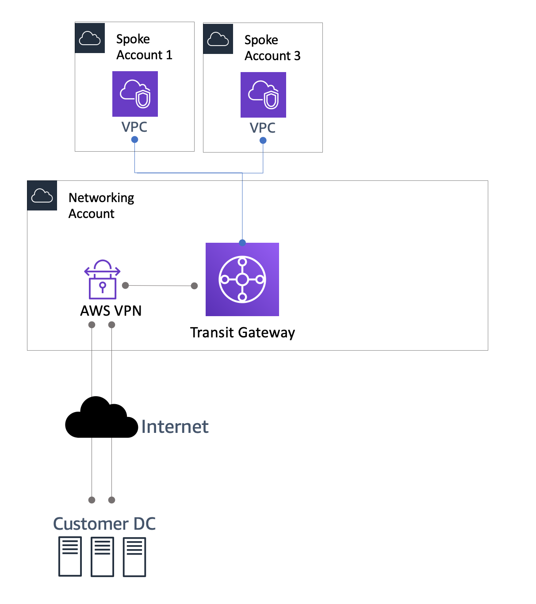

# Getting started with hybrid connectivity using Site-to-Site

VPN

The easiest way to get started with hybrid connectivity is to establish site-to-site VPN
over the internet. [AWS Site-to-Site
VPN](https://aws.amazon.com/vpn/site-to-site-vpn/ "https://aws.amazon.com/vpn/site-to-site-vpn/") extends your data center or branch office to the cloud using IP Security (IPsec)
tunnels. You can configure routing using Border Gateway Protocol (BGP) over the IPsec tunnel
or configure static routes. Traffic in the tunnel is encrypted with AES128 or AES256 and uses
Diffie-Hellman groups for key exchange, providing Perfect Forward Secrecy.

Each AWS Site-to-Site VPN connection consists of two VPN tunnel endpoints for
redundancy. For high-availability, it’s important to terminate a VPN tunnel to both of the
endpoints.  Each tunnel terminates in a different Availability zone within the AWS global
network, but must also terminate on the same equipment on-premises.  It’s also important that
you have a similar highly-available configuration set up at the on-premises equipment and
terminate the VPN on two different physical devices in your data center.

AWS Site-to-Site VPN supports terminating IPSEC tunnels to both virtual private gateway
and AWS Transit Gateway at the AWS end. When terminating a VPN on a virtual private
gateway, you can access the VPC that the gateway is attached to. For every other VPC that you
want to connect to, you must create a separate VPN tunnel to a separate virtual private
gateway attached to that VPC. With AWS Transit Gateway you get connectivity to thousands of
VPCs over a pair of VPN tunnels. Additionally, Transit Gateway supports Equal Cost Multipath
(ECMP routing strategy, allowing you to load balance traffic across multiple VPN tunnels for
high-availability and bandwidth aggregation.

When leveraging Transit Gateway, you can optionally enable acceleration for your
Site-to-Site VPN connection. An [accelerated Site-to-Site VPN connection](../../../vpn/latest/s2svpn/accelerated-vpn.md "../../../vpn/latest/s2svpn/accelerated-vpn.md")
uses AWS Global Accelerator to route traffic from your on-premises network to an AWS edge location that
is closest to your customer gateway device. AWS Global Accelerator optimizes the network path, using the
congestion-free AWS global network to route traffic to the endpoint that provides the best
application performance.

When using Site-to-Site VPN you are charged for each VPN connection-hour that your VPN
connection is provisioned and available. Data transfer out on AWS Site-to-Site VPN incurs
data transfer out charges. For more information, refer to the [EC2 On-Demand pricing page](https://aws.amazon.com/ec2/pricing/on-demand/ "https://aws.amazon.com/ec2/pricing/on-demand/"). When using Transit Gateway,
in addition to the AWS Site-to-Site VPN costs, you also pay for transit gateway VPN
attachment. For more information, refer to [AWS Transit Gateway pricing](https://aws.amazon.com/transit-gateway/pricing/ "https://aws.amazon.com/transit-gateway/pricing/"). To summarize,
terminating VPN at TGW gives you a lot more flexibility into the number of VPCs you can
connect to over single tunnel and provides added functionality like ECMP, accelerated VPN and
hence is a recommended default starting point for your architectures. That being said, for
some unique use cases involving large data transfers, leveraging the VGW termination endpoint
can be cheaper and hence can be a viable alternative.

_Site-to-Site VPN reference architecture_
