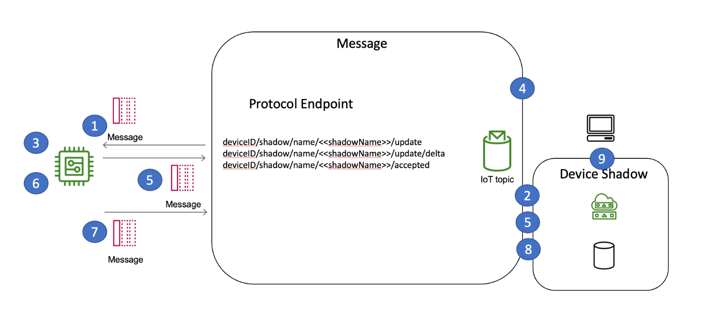

# AWS IoT Device Shadow service Service

AWS provides a feature called AWS IoT Device Shadow services to
implement command and control over MQTT using these best
practices. The Device Shadow has several benefits over using
standard MQTT topics, such as a clientToken, to track the origin
of a request, version numbers for managing conflict resolution,
and the ability to store commands in the cloud in the event that
a device is offline and unable to receive the command when it is
issued. The device's shadow is commonly used in cases where a
command needs to be persisted in the cloud even if the device is
currently not online. When the device is back online, the device
requests the latest shadow information and executes the command.

IoT solutions that use the Device Shadow service in AWS IoT Core
manage command requests in a reliable, scalable, and
straightforward fashion. The Device Shadow service follows a
prescriptive approach to both the management of device-related
state and how the state changes are communicated. This approach
describes how the Device Shadows service uses a JSON document to
store a device's current state, desired future state, and the
difference between current and desired states.

_Using Device Shadow with devices_

1. The device should check its desired state as soon as it
   comes online by subscribing to the
   $aws/things/<<thingName>>/shadow/name/<<shadowName>>/get
 topic. A device reports initial device state by publishing
 that state as a message to the update
 topic $aws/things/<<thingName>>/shadow/name/<<shadowName>>/update.
2. The Device Shadow reads the message from the topic and
   records the device state in a persistent data store.
3. A device subscribes to the delta messaging topic
   $aws/things/<<thingName>>/shadow/name/<<shadowName>>/update/delta
   upon which device-related state change messages will arrive.
4. A component of the solution publishes a desired state
   message to the topic
   $aws/things/<<thingName>>/shadow/name/<<shadowName>>/update
   and the Device Shadow tracking this device records the
   desired device state in a persistent data store.
5. The Device Shadow publishes a delta message to the topic
   $aws/things/<<thingName>>/shadow/name/<<shadowName>>/update/delta,
   and the Message Broker sends the message to the device.
6. A device receives the delta message and performs the desired
   state changes.
7. A device publishes an acknowledgment message reflecting the
   new state to the update topic
   $aws/things/<<thingName>>/shadow/name/<<shadowName>>/update
   and the Device Shadow tracking this device records the new
   state in a persistent data store.
8. The Device Shadow publishes a message to the
   $aws/things/<<thingName>>/shadow/name/<<shadowName>>/update/accepted topic.
9. A component of the solution can now request the updated
   state from the Device Shadow.

**AWS IoT Device Management Jobs for
device commands**

In addition to the features described above for device commands,
customers can also use AWS IoT Jobs to create a command
pipeline, where the device infers the command from the payload
of the MQTT message, as opposed to the topic. This enables
customers to perform new kinds of remote operations with minimal
device-side code changes. You can control the rate of roll-outs
using Jobs, and provide abort / retry / timeout criteria to
further customize the behavior of the job. AWS IoT Jobs
integrates with Fleet Indexing and Thing Groups, which allows
you to search your fleet and target devices in your fleet that
meet specific criteria. With Job Templates, you can pre-define
device-commands and create a library of reusable commands with
just a few clicks on the target of your choice.
