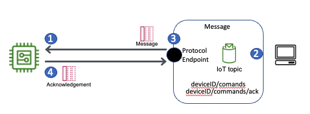

# Device commands

When you are building an IoT application, you need the ability to
interact with your device through commands remotely. For example:

- In the industrial vertical, remote commands are used to
  request specific data from a piece of equipment.
- In the smart home vertical, remote commands are used to
  schedule an alarm system remotely.

With AWS IoT Core, you can use the bi-directional MQTT protocol to
implement command and control of devices. The device subscribes to
a specific command MQTT topic. When the device receives a command
message, it should verify that the message arrived in the correct
order by implementing a sequential ID. The device should then
perform the action, and publish a message to the cloud with the
results of the command. This makes sure that commands are acted
upon in order, and the device's current state is consistently
known and maintained in the cloud.

_Using a message broker to send commands to a device._
