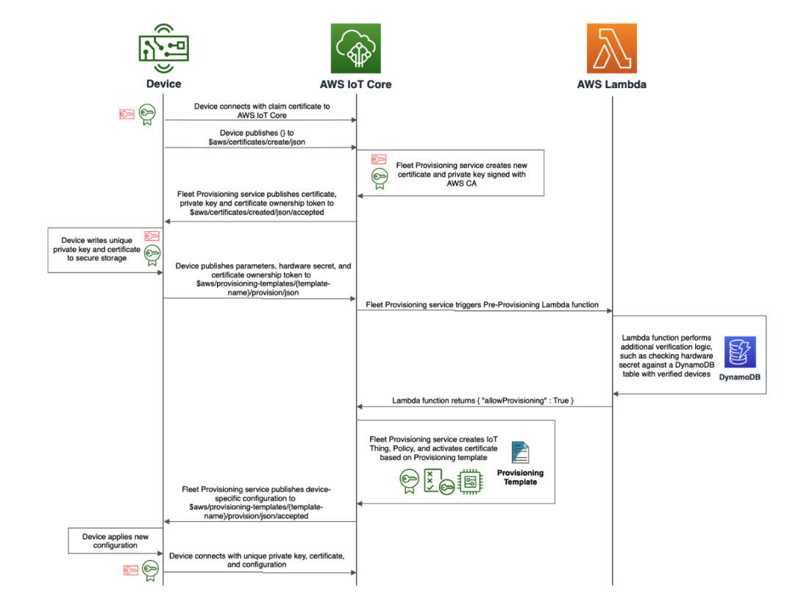

# Device provisioning

In IoT, device provisioning is composed of sequential steps. The
most important outcome is that each device must be given a unique
identity and authenticated by your IoT application using that
identity.

The first step to provisioning a device is to install an identity.
The decisions you make in device design and manufacturing
determines if the device has a production-ready firmware image
and unique client credential by the time it reaches the
customer. Your decisions determine whether there are additional
provisioning-time steps that must be performed before a production
device identity can be installed.

Use X.509 client certificates for your IoT devices — they are more
secure and easier to manage at scale than static passwords. In AWS IoT Core, the device is registered using its certificate along
with a unique thing identifier. The registered device is
associated with an IoT policy. An IoT policy allows you to create
fine-grained permissions per device. Fine-grained permissions make
sure that only the device has permissions to interact with the
right MQTT topics and messages.

The registration process makes sure that a device is recognized as
an IoT asset and that the data it generates can be consumed
through AWS IoT to the rest of the AWS landscape. One of the ways
to provision a device, is through Fleet Provisioning. AWS IoT can
generate and securely deliver device certificates and private keys
to your devices when they connect to AWS IoT for the first time.
AWS IoT provides client certificates that are signed by the Amazon
Root certificate authority (CA). Fleet Provisioning provides two
ways to implement this: by trusted user or by claim. Let us look
at the process flow for Fleet Provisioning by claim.

Some devices do not have the capability to accept credentials over
a secure transport, and the manufacturing supply chain is not
equipped to customize devices at manufacturing time. AWS IoT
provides a path for these devices to receive a unique identity
when they are deployed.

Device makers must load each device with a shared claim
certificate in firmware. This claim certificate should be unique
per batch of devices. The firmware containing the claim
certificate is loaded by the contract manufacturer without the
need to perform customization. When the device establishes a
connection with AWS IoT for the first time, it exchanges the claim
certificate for a unique X.509 certificate signed by the AWS
certificate authority and a private key. The device should send a
unique token, such as a serial number or embedded hardware secret
with its provisioning request that the fleet provisioning service
can use to verify against an allow list.

_Registration flow_

1. Device connects with claim certificate to AWS IoT Core
2. Fleet Provisioning service creates new certificate and private
   key assigned with AWS CA.
3. Device writes the unique private key and certificate to secure
   storage.
4. With the parameters published from the device, Fleet
   Provisioning service triggers Pre-Provisioning lambda
   function.
5. Lambda function performs additional verification logic such as
   checking the hardware secret against a DynamoDB table with
   verified devices.
6. Fleet provisioning service create IoT Thing, Policy, and
   activates certificate based on Provisioning template and
   publishes this to the device.
7. Device applies the new configuration and connects with the
   unique private key, certificates and configuration.
