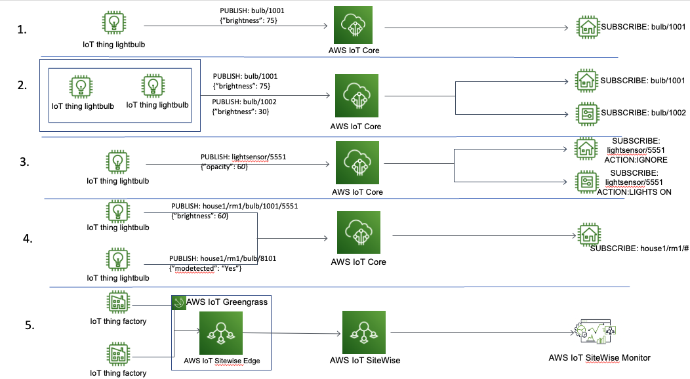

# Device telemetry

There are many uses cases where the value for IoT is in collecting
telemetry on how a machine or asset is performing. For example,
this data can be used to predict costly, unforeseen equipment
failures. Telemetry must be collected from the machine and sent to
an IoT application. Another benefit of sending telemetry is the
ability of your cloud applications to use this data for analysis
and to interpret optimizations that can be made to your firmware
over time.

Read-only telemetry data is collected and transmitted to the IoT
application. Telemetry data and command and control should be kept
on separate MQTT topic namespaces. Telemetry data topics should
start with a prefix such as 'data', for example
data/device/sensortype. Control plane topics should start with a
prefix such as 'command'.

From a logical perspective, we have defined several scenarios for
capturing and interacting with device data telemetry.

_Options for capturing telemetry_

1. One publishing topic and one subscriber. For example, a smart
   light bulb that publishes its brightness level to a single
   topic where only a single application can subscribe.
2. One publishing topic with variables and one subscriber. For
   example, a collection of smart bulbs publishing their
   brightness on similar but unique topics. Each subscriber can
   listen to a unique publish message.
3. Single publishing topic and multiple subscribers. In this
   case, a light sensor that publishes its values to a topic that
   all the light bulbs in a house subscribe to.
4. Multiple publishing topics and a single subscriber. For
   example, a collection of light bulbs with motion sensors. The
   smart home system subscribes to all of the light bulb topics,
   inclusive of motion sensors, and creates a composite view of
   brightness and motion sensor data.
5. AWS IoT Sitewise edge software running on an edge gateway is
   used to collect, organize, process, and monitor equipment data
   on-premises and sends it to AWS IoT Sitewise cloud service for
   data storage, organization and visualization.

Other AWS IoT services which can be used for device telemetry
data ingestion are AWS IoT Sitewise for industrial data and
AWS IoT FleetWise for vehicle data.
