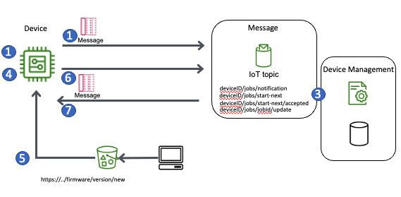

# Firmware updates

Supporting firmware upgrades without human intervention is
critical for security, scalability, and delivering new
capabilities.

AWS IoT Device Management provides a secure and straightforward
way for you to manage IoT deployments including executing and
tracking the status of firmware updates. AWS IoT Device Management uses the MQTT protocol with AWS IoT message broker
and AWS IoT Jobs to send firmware update commands to devices, as
well as to receive the status of those firmware updates over
time. AWS IoT Jobs also integrates with AWS Code Signer to
provide additional security to help prevent unauthorized
firmware updates and man in the middle attacks. Firmware images
can be signed with a private key in the cloud using the code
signing feature, and the device verifies the integrity of that
firmware image with the corresponding public key.

To implement firmware updates using AWS IoT Device Management
and AWS IoT Jobs, see the following diagram.

_Updating firmware on devices_

1. A device subscribes to the IoT job notification topic
   $aws/things/<<thingName>>/jobs/notify-next upon
   which IoT job notification messages will arrive.
2. A device publishes a message to
   $aws/things/<<thingName>>/jobs/start-next to
   start the next job and get the next job, its job document,
   and other details including states saved in statusDetails.
3. The AWS IoT Jobs service retrieves the next job document for
   the specific device and sends this document on the
   subscribed topic
   $aws/things/<<thingName>>/jobs/start-next/accepted.
4. A device performs the actions specified by the job document
   using the
   $aws/things/<<thingName>>/jobs/jobId/update MQTT
   topic to report on the progress of the job.
5. During the upgrade process, a device downloads firmware
   using a pre-signed URL for Amazon S3. Use code-signing to
   sign the firmware when uploading to Amazon S3. By
   code-signing your firmware the end-device can verify the
   authenticity of the firmware before installing. FreeRTOS
   devices can download the firmware image directly over MQTT
   to alleviate the need for a separate HTTPS connection.
6. The device publishes an update status message to the job
   topic $aws/things/<<thingName>>/jobs/jobId/update reporting
   success or failure.
7. Because this job's execution status has changed to final
   state, the next IoT job available for execution (if any)
   will change.
