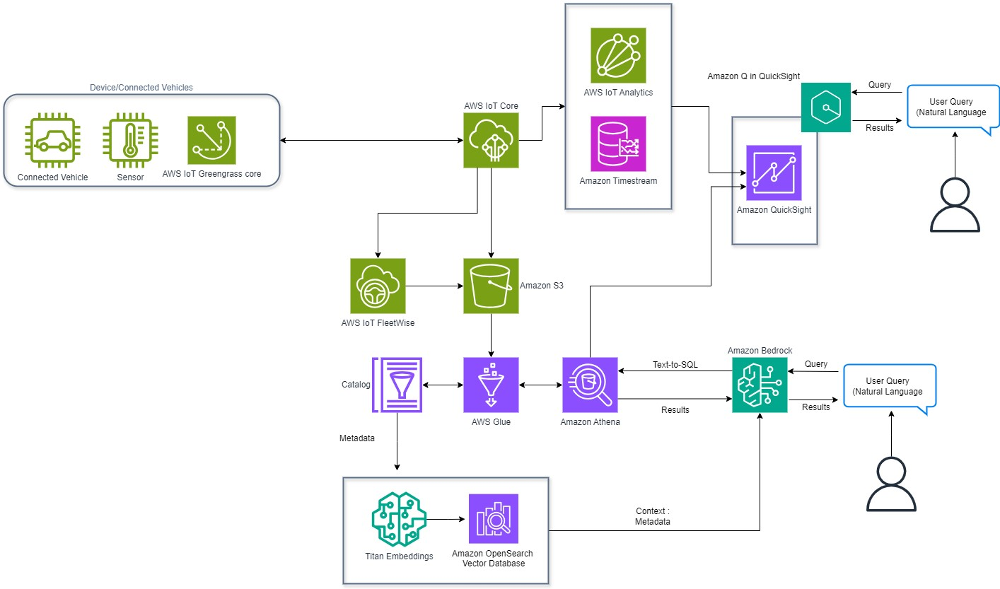

# Generative AI and IoT

[Generative
artificial intelligence (generative AI)](https://aws.amazon.com/what-is/generative-ai/ "https://aws.amazon.com/what-is/generative-ai/") is a type of AI
that can create new content and ideas, including conversations,
images and videos. AI technologies attempt to mimic human
intelligence in nontraditional computing tasks, such as image
recognition, natural language processing (NLP), and translation.
It reuses data that has been historically trained for better
accuracy to solve new problems. However, the generative AI must be
continuously fed with fresh, new data to move beyond its initial,
predetermined knowledge and adapt to future, unseen parameters.
This is where the IoT becomes pivotal in unlocking generative AI's
full potential by providing multi-modality data sources such as
sensor data, images and voice beyond just text. The combination of
IoT and generative AI offers enterprises the unique advantage of
creating meaningful impact for their business. Generative AI and
IoT can be used in a range of applications such as interactive
chatbots, IoT low code assistants, automated IoT data analysis and
reporting, IoT synthetic data generation for model trainings and
Generative AI at the edge for low latency and data privacy use
cases.

In this scenario we discuss integrating IoT and generative AI
using [AWS IoT Core](https://aws.amazon.com/iot-core/ "https://aws.amazon.com/iot-core/"),
[AWS IoT
Fleetwise](https://aws.amazon.com/iot-fleetwise/ "https://aws.amazon.com/iot-fleetwise/"),
[AWS IoT SiteWise](https://aws.amazon.com/iot-sitewise/ "https://aws.amazon.com/iot-sitewise/"),
[AWS IoT TwinMaker](https://aws.amazon.com/iot-twinmaker/ "https://aws.amazon.com/iot-twinmaker/"),
[AWS IoT Greengrass](https://aws.amazon.com/greengrass/ "https://aws.amazon.com/greengrass/") with AWS generative AI services such as Amazon Q
or Amazon Bedrock and other AWS services such as
[Amazon Simple Storage Service (S3)](https://aws.amazon.com/s3/ "https://aws.amazon.com/s3/"),
[AWS Glue](https://aws.amazon.com/glue/ "https://aws.amazon.com/glue/"),
[Amazon Timestream](https://aws.amazon.com/timestream/ "https://aws.amazon.com/timestream/"),
[Amazon OpenSearch Service](https://aws.amazon.com/opensearch-service/ "https://aws.amazon.com/opensearch-service/"),
[Amazon Kinesis](https://aws.amazon.com/kinesis/ "https://aws.amazon.com/kinesis/"), and
[Amazon Athena](https://aws.amazon.com/athena/ "https://aws.amazon.com/athena/") for data ingestion, storage, processing, analysis,
and querying to build automated IoT data analysis and reporting
applications. This allows capabilities like real-time monitoring,
advanced analytics, predictive maintenance, anomaly detection, and
customizations of dashboards.

[Amazon Q
in QuickSight](https://aws.amazon.com/quicksight/q/ "https://aws.amazon.com/quicksight/q/") improves business productivity using
generative BI (enable any user to ask questions of their data
using natural language) capabilities to accelerate decision making
in IoT scenarios. With new dashboard authoring capabilities made
possible by Amazon Q in QuickSight, IoT data analysts can use
natural language prompts to build, discover, and share meaningful
insights from IoT data. Amazon Q in QuickSight makes it easier for
business users to understand IoT data with executive summaries, a
context-aware data Q&A experience, and customizable,
interactive data stories. These workflows optimize IoT system
performance, troubleshoot issues, and enable real-time
decision-making.

For example, in an industrial setting, you can monitor equipment,
detect anomalies, provide recommendations to optimize production,
reduce energy consumption, and reduce equipment failures. By
combining IoT and generative AI, you will be able to gain
situational awareness and understand what happened? why it
happened? and what to do next? in your IoT applications.

In addition to collecting IoT data from devices, you can also send
commands to devices. In the industrial asset monitoring example,
if you find an abnormal situation from the asset IoT data
collected, you can send a command using the Generative AI
assistant to the device to collect more fine-granularity data for
further troubleshooting.

_IoT and generative AI for automated data analysis,
control and reporting_

For more information, see
[Emerging
Architecture Patterns for Integrating IoT and generative AI on
AWS](https://aws.amazon.com/blogs/iot/emerging-architecture-patterns-for-integrating-iot-and-generative-ai-on-aws/ "https://aws.amazon.com/blogs/iot/emerging-architecture-patterns-for-integrating-iot-and-generative-ai-on-aws/").
