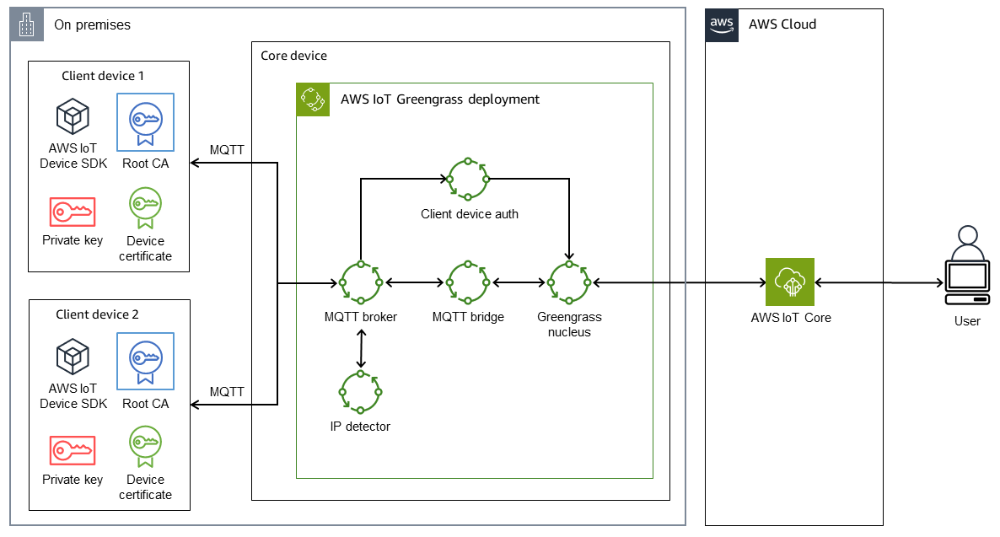

# IoT Edge computing

IoT Edge computing involves hardware and software technologies
that enable storage, computing, processing, and networking close
to the devices that generates or consumes data within a smart
home, connected vehicle, factory or other industrial environments.
IoT Edge computing moves processing and analysis closer to
endpoints where data is generated, delivering real-time
responsiveness and reducing costs associated with transferring
large amounts of data to cloud services.

With AWS IoT Greengrass, you can enable devices to take actions,
aggregate data, and filter it locally on the device. Some of the
use cases for AWS IoT Greengrass include:

- Smart homes where an AWS IoT Greengrass gateway is used as a
  hub for home automation
- Smart factories where AWS IoT Greengrass can facilitate
  ingestion and local processing of data from the shop floor
- In autonomous vehicles where AWS IoT Greengrass is used for
  sensor data collection and securely sending it to AWS

AWS IoT Greengrass can act as a secure, authenticated, MQTT
connection endpoint for other edge devices (also known as
_client devices_), which otherwise would
typically connect directly to AWS IoT Core. This capability is
useful when client devices do not have direct network access to
the AWS IoT Core endpoint.

In this IoT edge computing scenario, we describe using AWS IoT Greengrass with client devices for the following use cases:

- For client devices to send data to AWS IoT Greengrass
- For AWS IoT Greengrass to forward data to AWS IoT Core
- To take advantage of advanced AWS IoT Core rules engine
  features

These capabilities require installing and configuring the
following components on the AWS IoT Greengrass device:

- MQTT broker
- MQTT bridge
- Client device authentication
- IP detector

Note: The published messages from client devices must be in JSON
format or
[Protocol
Buffers (protobuf)Protocol Buffers](https://protobuf.dev/ "https://protobuf.dev/") format.

This architecture pattern describes how to set up AWS IoT Greengrass for IoT edge computing.

_IoT edge computing using AWS IoT Greengrass_

The architecture includes:

- Two client devices. Each device contains a private key, a
  device certificate, and a root certificate authority (CA)
  certificate. The AWS IoT Device SDK, which contains an MQTT
  client, is also installed on each client device.
- A core device that has AWS IoT Greengrass deployed with the
  following components:
  - MQTT broker
  - MQTT bridge
  - Client device authentication
  - IP detector

This architecture supports the following scenarios:

- Client devices can use their MQTT client to communicate with
  one another through the core device's MQTT broker.
- Client devices can also communicate with AWS IoT Core in the
  cloud through the core device's MQTT broker and the MQTT
  bridge.
- AWS IoT Core in the cloud can send messages to client devices
  through the MQTT test client and the core device's MQTT bridge
  and MQTT broker.

Best practice recommendations include:

- The payload of the messages from client devices should be in
  either JSON or Protobuf format in order to take advantage of
  the advanced features of the AWS IoT Core rules engine, such
  as transformation and conditional actions.
- Configure the MQTT bridge to allow bidirectional
  communication.
- Configure and deploy the IP detector component in AWS IoT Greengrass to make sure that the core device's IP addresses
  are included in the subject alternative name (SAN) field of
  the MQTT broker certificate. The subject alternative name
  (SAN) plays a critical role in the server name verification on
  the TLS client end. It helps the TLS client make sure that it
  connects to the correct server and helps avoid
  man-in-the-middle attacks during TLS session setup.

For more information, see
[Set
up and troubleshoot AWS IoT Greengrass with client devices](../../../prescriptive-guidance/latest/patterns/set-up-and-troubleshoot-aws-iot-greengrass-with-client-devices.md "../../../prescriptive-guidance/latest/patterns/set-up-and-troubleshoot-aws-iot-greengrass-with-client-devices.md").
