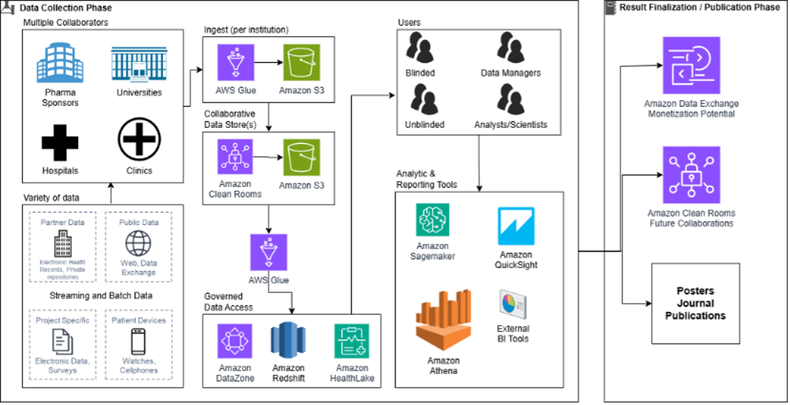

# LS-S02 Clinical development

Clinical trials stand as the bridge between scientific discovery and patient care. The
landscape of clinical trials has evolved dramatically, moving beyond simple surveys to
encompass vast, diverse datasets from multiple sources and decentralized participants.
Decentralized clinical trials (DCTs) enable patient-centric data collection through remote
monitoring via mobile devices, wearables, and telemedicine, allowing participants to
contribute from home while maintaining data quality and regulatory adherence. This aims to
address critical needs, providing a blueprint for a comprehensive data strategy that
accelerates research, enhances collaboration, and ultimately leads to more informed, impactful
results in patient healthcare.

## Use cases

- **LS-S02-UC01 Data collaboration:** Researchers face the
  challenge of collecting, managing, and analyzing complex data from various clinics,
  decentralized trial participants using mobile devices and wearables for remote
  monitoring, real-world observations, medical records, and public repositories. This
  shift demands a robust, flexible, and secure data solution that can empower even small
  technical teams to efficiently gather, process, and use this wealth of information. For
  multi-institution collaboration researchers need the ability to share identified and
  de-identified data.
- **LS-S02-UC02 Real time responsive studies:** Researchers
  need the ability to analyze incoming data upon ingestion, enabling them to identify
  patterns, adjust study parameters, and explore emerging questions promptly.
- **LS-S02-UC03 Secondary analysis:** Studies are often
  conducted using data from prior trials. Result sets and artifacts should be prepared to
  enable these sorts of studies by clearing out personal health information (PHI) and
  other proprietary data.
- **LS-S02-UC04 Extended duration:** Clinical trials can run
  for decades. Tooling built for extended durations should be adaptable to change as
  technology changes but still keep the data consistent, accurate and secure.

## Reference architecture

The following reference architecture aims to address the critical needs, providing a
blueprint for a comprehensive data strategy that accelerates research, enhances
collaboration, and ultimately leads to more informed, impactful results from clinical
trials.

1. Data ingestion:
   - Use AWS Glue for both batch and real-time data integration from various
     sources.
   - Schedule AWS Glue jobs to ingest streaming or batch data using an API based on
     events or a schedule.

2. Secure collaboration:
   - Use AWS Clean Rooms to build a secure environment for multi-party collaboration using
     the raw, identified data.
   - AWS Clean Rooms can be used while data is still being gathered to allow for faster
     insights.
   - Grant collaborating users granular access through query rules allowing for
     matching without risking PHI exposure.
   - Enable SQL queries on combined datasets without moving or exposing raw data.
   - Store raw data in a single Amazon S3 bucket per partner partitioned by patient to
     enable permission granting and simple right to forget for individual patients.

3. Transform and explore:
   - Create AWS Glue workflows managing AWS Glue jobs or scripts to transform and
     prepare the data
   - Insert data into AWS HealthLake for interoperability through the FHIR model.
   - Insert related structured data into Redshift for later complex analysis and
     internal collaboration.
   - Build a DataZone domain to assign the correct permissions allowing engineers,
     data scientists, product managers, analysts, and business users to access data so
     that they can discover, use, and collaborate to derive data-driven insights.
   - Data scientists, engineers and managers can access data using Quick Suite, Amazon
     Sagemaker, Aazon Athena, or other business intelligence (BI) tools for internal
     analysis, exploration, and visualization creation.

4. Results sharing:
   - Use AWS Data Exchange to make the study's findings available to the broader research
     community.
   - AWS Data Exchange can be used to monetized resulting data.
   - AWS Clean rooms can be used again at the end. Maintain identified copies of
     data for potential future research questions.
   - Create visualizations, reports, and posters from the same tools used for
     initial exploration with the finalized, enriched data.
