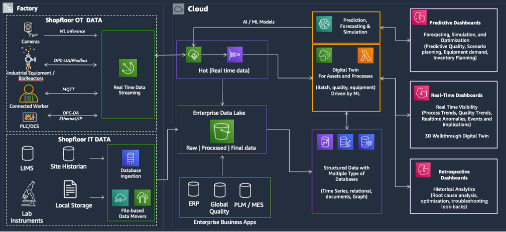

# LS-S03 Manufacturing and supply

chain

Life sciences manufacturing and supply chain is the critical bridge between scientific
discovery and the delivery of life-saving therapies and diagnostics. As companies work to
bring innovative treatments to market, they face increasing pressure to modernize their
operations and adapt to evolving patient needs. Key challenges include improving operational
equipment effectiveness (OEE) in an era of smaller batch production, transitioning from manual
spreadsheets to integrated production planning, and scaling quality checks with limited
manpower.

Additionally, the rise of personalized medicine, where drug shelf life is often just a
few days, demands a more predictable and agile supply chain. Manufacturers also seek holistic
visibility across drugs, dosage forms, and production plants, as well as optimized order
management to reduce locked-up capital in inventory. AWS has played a pivotal role in
enabling digital transformation across the industry, assisting companies to address these
challenges with cloud-based solutions that enhance efficiency, scalability, and real-time
analytics.

## Use cases

- **LS-S03-UC01 Smart factory for biopharma:**
  Biopharmaceutical manufacturers are embracing smart factory initiatives to enhance
  efficiency, quality, and scalability in drug production. These factories use automation,
  IoT-enabled equipment, and AI-driven analytics to optimize production processes, reduce
  downtime, and provide consistent product quality. By integrating real-time monitoring,
  predictive maintenance, and digital twins, manufacturers can improve operational
  equipment effectiveness (OEE), streamline batch production, and enhance adherence to
  regulatory standards. A smart factory approach enables data flow across production
  lines, accelerating decision-making and enabling a more agile response to evolving
  patient and market demands.
- **LS-S03-UC02 Digital twin for factory and lab:** Biopharma
  manufacturers and manufacturing labs need real-time visibility into their operations to
  optimize efficiency, reduce variability, and enhance quality control. A
  _digital twin_, a virtual replica of physical assets, processes,
  and systems, enables organizations to simulate, monitor, and predict outcomes across
  both factory and lab environments. By integrating IoT sensors, AI-driven analytics, and
  historical data, digital twins assist to identify bottlenecks, improve process
  optimization, and enhance predictive maintenance. This technology enables better
  decision-making, accelerates troubleshooting, and creates a more adaptive and resilient
  manufacturing and R&D solution.
- **LS-S03-UC03 AI for bioprocess development:** Biopharma
  companies are using AI to accelerate and optimize bioprocess development, reducing
  development time for new therapies. AI-driven models analyze complex datasets from
  experiments, sensor readings, and historical production runs to uncover patterns,
  predict optimal conditions, and refine bioprocess parameters. This enables researchers
  to improve yield, enhance product quality, and minimize variability in cell culture,
  fermentation, and purification processes. By integrating AI into bioprocess development,
  manufacturers can streamline scale-up efforts, enhance process robustness, and reduce
  costly trial-and-error experimentation, ultimately driving more efficient and reliable
  therapeutic production.
- **LS-S03-UC04 Computer vision for quality control:**
  Providing consistent product quality in life sciences manufacturing is critical, yet
  traditional quality control (QC) methods are often labor-intensive and prone to human
  error. Computer vision, powered by AI and machine learning, enables automated, real-time
  inspection of biopharma production lines, detecting defects, contamination, and
  deviations in packaging, labeling, and drug formulation. By integrating high-resolution
  imaging with deep learning models, manufacturers can enhance batch predictability,
  reduce waste, and improve adherence to stringent regulatory standards. This approach
  scales QC processes efficiently, even with limited manpower, improving overall
  manufacturing precision and product safety.
- **LS-S03-UC05 Supply chain forecasting:** Life sciences
  manufacturers face increasing complexity in managing supply chains, especially with the
  rise of personalized medicine and just-in-time production. AI-driven supply chain
  forecasting uses real-time data, historical trends, and external factors such as market
  demand and regulatory changes to predict material needs, optimize inventory levels, and
  minimize disruptions. By improving visibility across suppliers, manufacturing sites, and
  distribution networks, companies can reduce waste, free up locked capital, and speed up
  the delivery of critical therapies. This predictive approach enhances resilience,
  agility, and efficiency in life sciences manufacturing supply chains.

## Reference architecture

